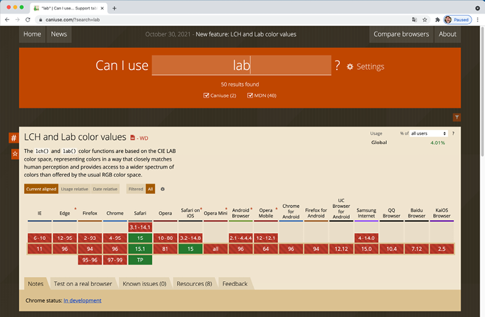
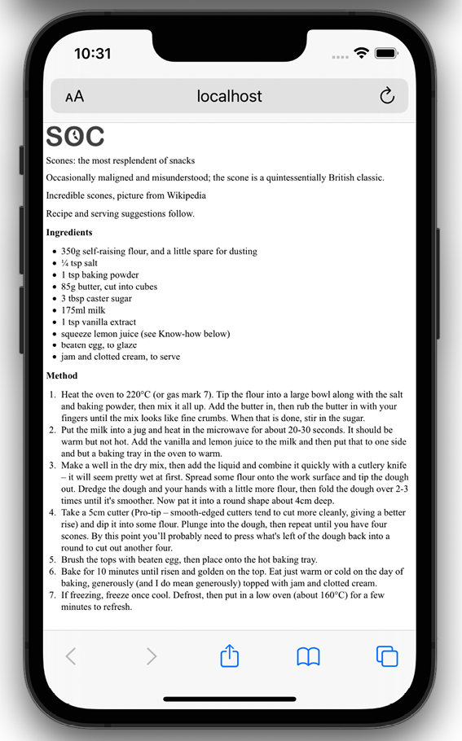
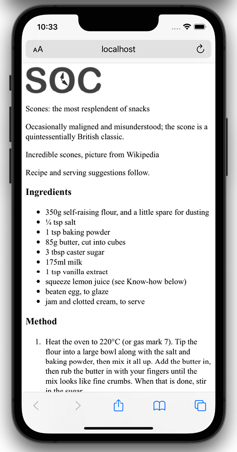
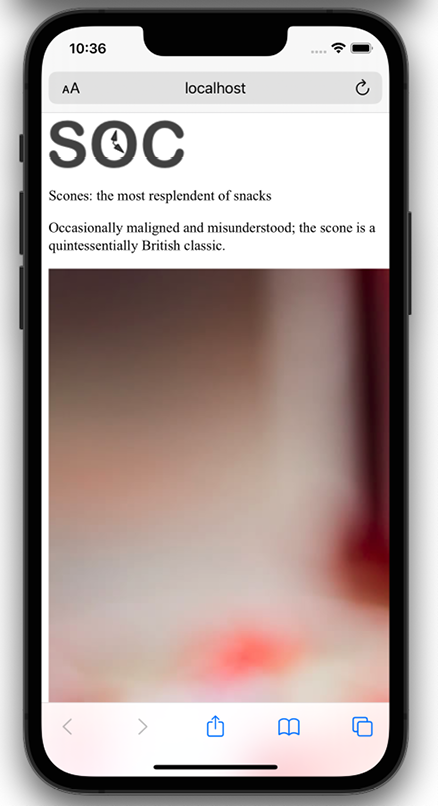
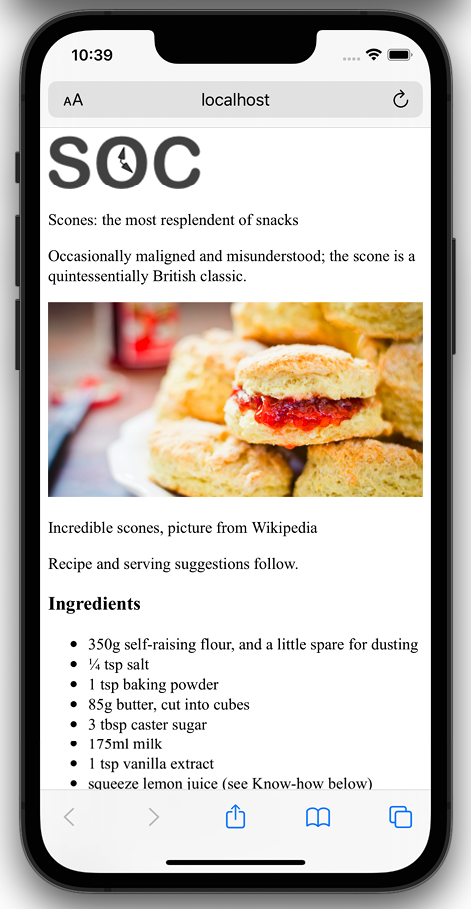
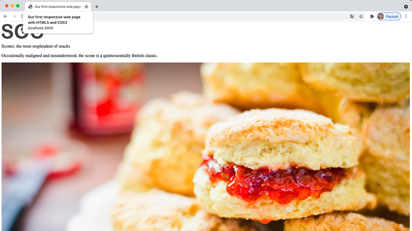
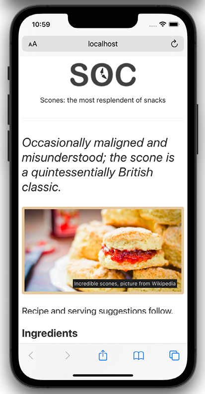
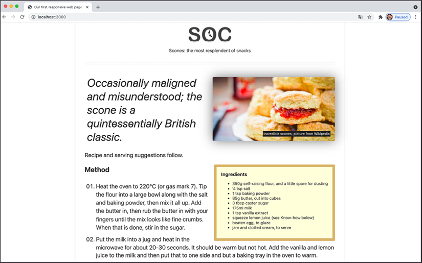

The Essentials of Responsive Web Design
=======================================


This first lab serves as a quick and basic refresher on building out
an extremely simple web design, responsively. By the end, we will have
covered everything needed to author a fully responsive web page.

Here's what we will cover in this first lab:

-   Our first responsive example: a simple HTML5 page
-   The viewport `meta` tag
-   Fluid images
-   Writing CSS3 media queries to make pages adapt


The browser and device landscape
--------------------------------


The latest data at
[[gs.statcounter.com]](http://gs.statcounter.com/)
shows an even more pronounced change with mobile at more than 60%, desktop at
greater than 30%.


Browser support
---------------


Before considering any web project it makes sense to decide, in advance,
what platforms you need to fully support and which you are happy to
concede visual/functional anomalies to.

For example, if you're unlucky enough to have 25% of your website
visitors stuck using old versions of iOS (for example), you'll need to
consider what features that browser supports and tailor your solution
accordingly.

To this end, if you aren't already, become familiar with websites such
as [[http://caniuse.com]](http://caniuse.com/). *Can I Use*
provides a simple interface for establishing the
browser support for each web platform feature.





Lab Solution
-------------

Lab solution for this lab is available in `Lab01` folder.


**Code samples**

You can download all the code samples from this course by visiting
[[https://github.com/fenago/html-css-javascript-jquery-course]](https://github.com/fenago/html-css-javascript-jquery-course). 
It's worth knowing that
where individual examples are built up throughout a lab, there will
typically be a "start" and "end" version for each. The start contains
just the essentials to start following along. The end contains the
completed exercise/example.


Our basic HTML file
-------------------

We will start with a simple HTML5 structure. Don't
worry at this point about what each of the lines does, especially the
content of the `<head>`, as we will cover that in detail in
*Lab 2*, *Writing HTML Markup*.

For now, concentrate on the elements inside the `<body>`
tag. There we have a few divs, a graphic for a logo, some text, and a
list of items. Although you can see more of that content in the
screengrabs, below is a shorter version of the code. For brevity I have
removed the paragraphs of text, as we only need to concern ourselves
with the core structure.

However, what you should know is that the text is
a recipe and description of how to make scones: a quintessentially
British dessert.


``` {.language-markup}
<!DOCTYPE html> 
<html class="no-js" lang="en"> 
    <head> 
        <meta charset="utf-8" /> 
        <title>Our first responsive web page with HTML5 and CSS3</title> 
        <meta 
            name="description" 
            content="A basic responsive web page – an example from Lab
            1" 
        /> 
        <link rel="stylesheet" href="css/styles.css" /> 
    </head> 
    <body> 
        <div class="Header"> 
            <a href="/" class="LogoWrapper" 
                ></a> 
            <h1 class="Strap">Scones: the most resplendent of snacks</h1> 
        </div> 
        <div class="IntroWrapper"> 
            <h2 class="IntroText"> 
                Occasionally maligned and misunderstood; the scone is a 
                quintessentially British classic. 
            </h2> 
            <div class="MoneyShot"> 
                <p class="ImageCaption"> 
                    Incredible scones, picture from Wikipedia 
                </p> 
            </div> 
        </div> 
        <p>Recipe and serving suggestions follow.</p> 
        <div class="Ingredients"> 
            <h3 class="SubHeader">Ingredients</h3> 
            <ul></ul> 
        </div> 
        <div class="HowToMake"> 
            <h3 class="SubHeader">Method</h3> 
            <ol class="MethodWrapper"></ol> 
        </div> 
    </body> 
</html>
```


By default, web pages are inherently flexible. If
I open the example page, even as it is at this point, with no special
work done to make it responsive, and resize the browser window, the text
re-flows as needed.

What about on different devices? Again, with no CSS whatsoever added to
the page, this is how that renders on an iPhone 13:



Figure 1.2: Not pretty, but by default all web pages are inherently
flexible

As you can see, it's rendering, but like a desktop page shrunken down to
fit the space available. The reason for that is that iOS renders web
pages at 980 px wide by default and shrinks them down into the
**viewport**.

Before responsive design was "a thing," it was
commonplace to see websites render like that on an iPhone. Nowadays,
thanks to the ubiquity of responsive web design, they are as rare as
rocking horse droppings!


The area of a browser window that a web page is allowed to be viewed in
is known technically as the **viewport**. To be clear, the viewport area
excludes the browser toolbars and URL bar etc. From now on, we will
generally use this more accurate term.


We can make the page more mobile friendly by adding this snippet in the
`<head>`:


``` {.language-markup}
<meta name="viewport" content="width=device-width,initial-scale=1.0" />
```


This viewport `meta` tag is the non-standard but *de facto*
way of telling the browser how to render the page. Although introduced
to the web by Apple, rather than a standard process, it remains
essential for responsive web design. We will cover the
`meta` tag and its various settings and permutations in
*Lab 3*, *Media Queries and Container Queries*.

For now, you just need to know that in this case, our viewport
`meta` tag is effectively saying "make the content render
at the width of the device."

In fact, it's probably easier to just show you the effect this line has
on applicable devices:



Figure 1.3: With just one line added, already things are improving
dramatically

Great! Another snag fixed; the text is now
rendering and flowing at a more "native" size. Let's move on to images.

Taming images
-------------

They say a picture speaks a thousand words. All
this writing about scones in our sample page and there's no image of the
beauties! I'm going to add in an image of a scone near the top of the
page; a sort of "hero" image to entice users to read the page.



Figure 1.4: There is a line or two of CSS that's always needed to make
images appear a sensible size

Oh! That nice big image (`2000px` wide) is forcing our page
to render more than a little wonky. We clearly need to fix that.

Ideas? Well, we could add a fixed width to the
image via CSS, but the problem there is that we want the image to scale
to different screen sizes. For example, in CSS, our iPhone XR is 414 px
wide by 896 px high. If we set a width of 414 px to that image, what
happens if a user rotates the screen? On this device, the 414 px-wide
viewport is now 896 px wide. Thankfully, it's pretty easy to achieve
fluid images with a single line of CSS.

I'm going to create the `css/styles.css` CSS file now
that's already linked in the head of the HTML page.

In our blank `styles.css` file, here is the first thing I'm
adding. Ordinarily I'd be setting a few other defaults, and we'll
discuss those defaults in later labs, but for our purposes I'm happy
to open with just this:


``` {.language-markup}
img { 
    max-width: 100%; 
}
```


With that file saved and the page refreshed, we see something more akin
to what we might expect:



Figure 1.5: With a little CSS, our images will never exceed their bounds

All this max width-based rule does is stipulate
that all images should grow to be a maximum of 100% of their size. Where
a containing element (such as the `body` or a
`div` it sits within) is less than the full intrinsic width
of the image, the image will simply scale up to display as large as it
can within that constraint.

### A brief tangent on width/max-width for images

To make images fluid, you could also use the more
widely used `width` property, for example,
`width:100%`, but this has a different effect. When a
property of `width` is used then the image will be
displayed at that width, relative to its container if using percentages,
regardless of its own inherent size. The result in our example would be
that the logo (also an image) would stretch beyond its intrinsic size to
fill 100% of its container. With a container far wider than the image,
as is the case with our logo, this leads to a massively oversized image.

Excellent. Everything is now laid out as expected. No matter the
viewport size, nothing is overflowing the page horizontally.

However, if we look at the page in larger viewports, the basic styles
start to get both literally and figuratively stretched. Take a look at
the example page at a size around 1400 px:



Figure 1.6: We clearly need to fix the size of this image for larger
viewports

Oh dear! In fact, at even around 800 px wide it's starting to suffer.
Around this point, it would be handy if we could rearrange a few things.
Maybe resize the image and position it off to one side. Perhaps alter
some font sizes and background colors of elements.

Thankfully, we can achieve all this functionality quite easily by
employing CSS media queries to bend things to our will.

Enter media queries
-------------------

As we have established, somewhere beyond the 800
px-wide point, our current layout starts to look stretched. We'll use
CSS media queries at this point to adjust the layout depending upon the
screen width. We will cover media queries in great depth in *Lab 3*,
but for now, all you need to appreciate is that media queries are
directives in CSS that allow us to isolate CSS rules to certain
environment conditions; size of screen, in this instance.

### Breakpoints

Before we proceed, it's worth familiarizing you
with the term "breakpoint."

The term **breakpoint** is web developer vernacular to define a viewport
width or height at which a responsive design should change
significantly.


For the purpose of whipping our basic example into shape, we will
concentrate on just one type of media query: a minimum-width media
query. CSS rules within this type of media query only get applied if the
viewport is or exceeds a certain width.

The exact minimum width can be specified using a raft of
different-length units including percent, `em`,
`rem`, and `px`. In CSS, a minimum-width media
query is written like this:


``` {.language-markup}
@media screen and (min-width: 800px) {  
    /* styles /*  
}
```


The `@media` directive tells the
browser we are starting a media query, the `screen` part
(declaring `screen` is technically not needed in this
situation, but we will deal with that in detail in *Lab 3*) tells
the browser these rules should be applied to all screen types, and we
then have the `and` keyword, which chains together another
set of conditionals, which in this case is the
`(min-width: 800px)`. That tells the browser that the rules
should also be limited to all viewports at least 800 px wide.


### Amending the example for a larger screen

We've already established that our design is
starting to suffer at around 800 px width. Therefore, let's mix things
up a little by way of a simple example of how we can lay things out
differently at different viewport sizes.

First off, we will stop that main "hero" image from getting too big and
keep it over on the right. Then the intro text can sit to the left.

We will then have the main portion of text (the "method" that describes
how to make the scones) on the left below, with a small boxed-out
section detailing the ingredients over on the right.

All these changes can be achieved relatively simply by encapsulating
these specific styles within a media query.


Here are the layout styles that were added:


``` {.language-markup}
@media screen and (min-width: 800px) { 
    body { 
        border-left: 4px solid #f9f9f9; 
        border-right: 4px solid #f9f9f9; 
        padding: 1rem 2rem; 
    } 
 
    .IntroWrapper { 
        display: flex; 
        gap: 0 20px; 
        flex: 1 1 auto; 
        align-items: center; 
    } 
 
    .MoneyShot, 
    .IntroText { 
        margin: 0; 
        flex: 1 1 50%; 
    } 
 
    .MoneyShotImg { 
        filter: drop-shadow(0 0 20px #0008); 
        border: 0; 
    } 
 
    .IntroText { 
        padding: 0.5rem; 
        font-size: 2.5rem; 
        text-align: left; 
        position: relative; 
    } 
     .Ingredients { 
        font-size: 0.9rem; 
        float: right; 
        padding: 1rem; 
        margin: 0 0 0.5rem 1rem; 
        border-radius: 3px; 
        background-color: #ffffdf; 
        border: 9px solid #debb71; 
    } 
 
    .Ingredients h3 { 
        margin: 0; 
    } 
}
```


That wasn't too bad, was it? With only minimal
code, we have built a page that responds to the viewport size and offers
a preferable layout as needed. By adding just a few more styles, things
look even easier on the eye.

With those in place, our basic responsive page now looks like this on an
iPhone:



Figure 1.7: A few more styles added and our basic page is palatable

And like this when the viewport is 800 px or
wider:



Figure 1.8: The same HTML and CSS provides a different layout for larger
viewports


The code samples provided throughout this course do not include "vendor
prefix" styles. Vendor prefixes have been employed historically to
prefix experimental CSS properties in different browsers. For example:
`-webkit-backface-visibility`. Including vendor prefixes in
CSS is often essential to achieve support for certain properties in
older browsers. There are now tools to automate this prefixing and, as
you might imagine, the tools perform the task faster and more accurately
than we can.

Therefore, I'm refraining from including any vendor-prefixed code in the
samples, in the hope you will adopt a similar painless approach.


This has been a very basic example but it has
encapsulated the essential methodology of building out responsive web
design.


Summary
=======


Well done, you now know and understand the essential elements needed to
create a fully responsive web page.


In the next lab, *Lab 2*, *Writing HTML Markup*, we are going to
take a deep dive into HTML5 markup. HTML is the very skeleton of any web
page or application, the bedrock on which to build anything meaningful,
the oxygen a website breathes, the... OK, I'm out of analogies --
suffice it to say, HTML is pretty important, so let's press on and get
stuck in.
