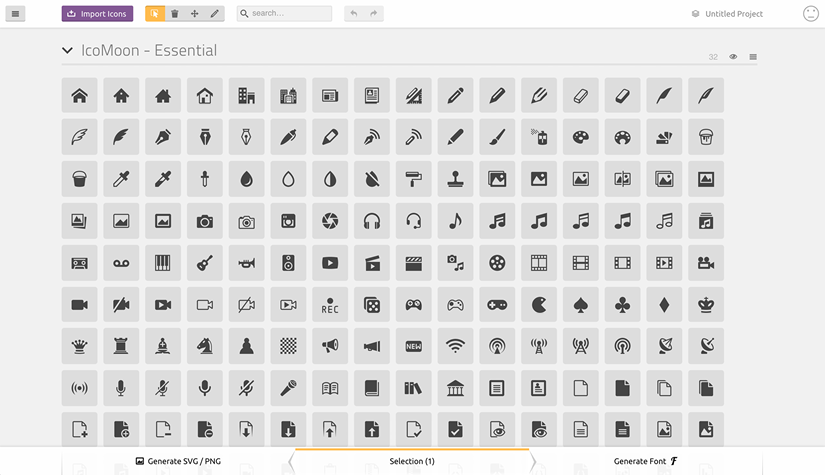
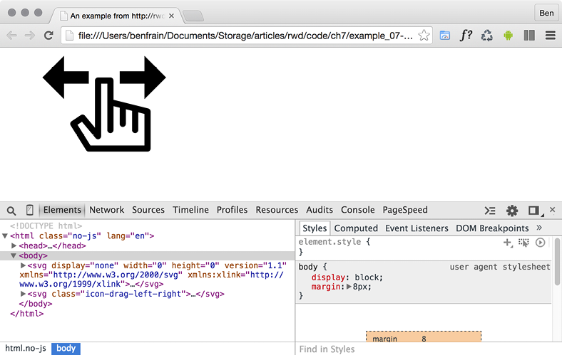
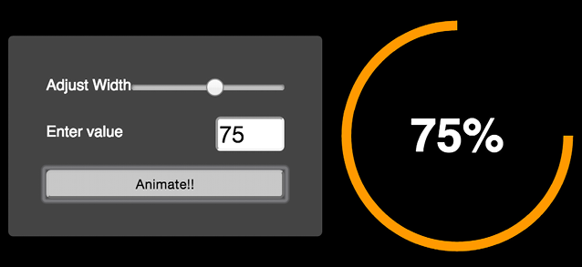

SVG
===


In this lab, we will cover:

-   SVG, a brief history, and an anatomy of a basic SVG document
-   Creating SVGs with popular image editing packages and services
-   Inserting SVGs into a page with `img` and
    `object` tags
-   Inserting SVGs as background images
-   Inserting SVGs directly (inline) into HTML
-   Reusing SVG symbols
-   Referencing external SVG symbols
-   What capabilities are possible with each insertion method
-   Animating SVGs with SMIL
-   Styling SVGs with an external style sheet
-   Styling SVGs with internal styles
-   Re-coloring and animating SVGs with CSS
-   Media queries and SVGs
-   Optimizing SVGs
-   Using SVGs to define filters for CSS
-   Manipulating SVGs with JavaScript and JavaScript libraries
-   Implementation tips
-   Further resources


Browser support for SVG is now widespread:
[[https://caniuse.com/\#search=svg]](https://caniuse.com/#search=svg).


An image that is also a readable web document
=============================================


Take a look at this star graphic:


This is an SVG graphic, called
`Star.svg`, inside `example_10-01`. You can
either open this example in the browser where it will appear as the
star, or you can open it in a text editor, and you can see the code that
generates it. Consider this:


``` {.language-markup}
<?xml version="1.0" encoding="UTF-8" standalone="no"?>
<svg
  width="198px"
  height="188px"
  viewBox="0 0 198 188"
  version="1.1"
  xmlns="http://www.w3.org/2000/svg"
  xmlns:xlink="http://www.w3.org/1999/xlink"
  xmlns:sketch="http://www.bohemiancoding.com/sketch/ns"
>
  <!-- Generator: Sketch 3.2.2 (9983) - http://www.bohemiancoding.com/
  sketch -->
  <title>Star 1</title>
  <desc>Created with Sketch.</desc>
  <defs></defs>
  <g
    id="Page-1"
    stroke="none"
    stroke-width="1"
    fill="none"
    fill-rule="evenodd"
    sketch:type="MSPage"
  >
    <polygon
      id="Star-1"
      stroke="#979797"
      stroke-width="3"
      fill="#F8E81C"
      sketch:type="MSShapeGroup"
      points="99 154 40.2214748 184.901699 51.4471742 119.45085 3.89434837
      73.0983006 69.6107374 63.5491503 99 4 128.389263 63.5491503
      194.105652 73.0983006 146.552826 119.45085 157.778525 184.901699 "
    ></polygon>
  </g>
</svg>
```


That is the entirety of the code needed to generate that
star as an SVG graphic.

Now, ordinarily, if you've never looked at the code of an SVG graphic
before, you may be wondering why you would ever want to. If all you want
is vector graphics displayed on the web, you certainly don't need to.
Just find a graphics application that will save your vector artwork as
an SVG and you're done.

So, let's take a closer look at that SVG markup and get an appreciation
of what exactly is going on in there. I'd like to draw your attention to
a few key things.

The root SVG element
--------------------

The root SVG element here has attributes for
`width`, `height`, and `viewBox`:


``` {.language-markup}
<svg width="198px" height="188px" viewBox="0 0 198 188"
```


Each of these plays an important role in how an SVG is displayed.


Namespace
---------

This SVG has an additional
namespace defined for the Sketch
graphics program that generated it
(`xmlns` is short for **XML namespace**):


``` {.language-markup}
xmlns:sketch="http://www.bohemiancoding.com/sketch/ns"
```


These namespace references tend to only be used by the program that
generated the SVG, so they are often not needed
when the SVG is bound for the web. Optimization
processes for reducing the size of SVGs will often strip them out.

The title and desc tags
-----------------------

There are `title` and `desc` tags that make an
SVG
accessible:


``` {.language-markup}
<title>Star 1</title>
    <desc>Created with Sketch.</desc>
```


These tags can be used to describe the contents of the graphics when
they cannot be seen. However, when SVG graphics are used for background
graphics, these tags can be stripped to further reduce the file size.

The defs tag
------------

There is an empty `defs` tag in our
example code:


``` {.language-markup}
<defs></defs>
```


Despite being empty in our example, this is an important element. It is
used to store definitions of all manner of reusable content, such as
gradients, symbols, paths, and more.

The g element
-------------

The `g` element is used to group
other elements together. For example, if you were drawing an SVG of a
car, you might group the shapes that make up an entire wheel inside a
`g` tag:


``` {.language-markup}
<g id="Page-1" stroke="none" stroke-width="1" fill="none" fill-rule="evenodd" sketch:type="MSPage">
```


In our `g` tag, we can see the earlier namespace of Sketch
being reused here. It will help that graphics application open this
graphic again, but it serves no further purpose should this image be
bound for elsewhere.

SVG shapes
----------

The innermost node in this example is a polygon:


``` {.language-markup}
<polygon id="Star-1" stroke="#979797" stroke-width="3" fill="#F8E81C" sketch:type="MSShapeGroup" points="99 154 40.2214748 184.901699 51.4471742 119.45085 3.89434837 73.0983006 69.6107374 63.5491503 99 4 128.389263 63.5491503 194.105652 73.0983006 146.552826 119.45085 157.778525 184.901699 "></polygon>
```


SVGs have a number of ready-made shapes available:
`path`, `rect`, `circle`,
`ellipse`, `line`, `polyline`,
and `polygon`.

SVG paths
---------

SVG paths differ from the shapes of SVGs as they
are composed of any number of connected points, giving you the freedom
to create any shape you like.

For example, take a look at this `path`, which describes
the same star as before but with the shape described as a
`path` instead of a `polygon`. Pay particular
attention to the `d` attribute:


``` {.language-markup}
<path d="M99 154l-58.78 30.902 11.227-65.45L3.894 73.097l65.717-9.55L99 4l29.39 59.55 65.716 9.548-47.553 46.353 11.226 65.452z" />
```


So, those are the guts of an SVG file, and hopefully now you have a
high-level understanding of what's going on. While some will relish the
opportunity to handwrite or edit SVG files in code, a great many more
would rather generate SVGs with a graphics package. Let's consider some
of the more popular choices.


Creating SVGs with popular image editing packages and services
==============================================================


While SVGs can be opened, edited, and written in a
text editor, there are plenty of applications
offering a **Graphical User Interface** (**GUI**) that make authoring
complex SVG graphics easier. Perhaps the most
obvious choice is Adobe's Illustrator (PC/Mac). However, it is expensive
for casual users, so my own preference is either
Bohemian Coding's Sketch (Mac only:
[[https://www.sketch.com/]](https://www.sketch.com/)), which still
isn't cheap at \$99 a year, or Figma, which is cross-platform and also
uses a subscription-based model that is currently free for the
starter plan. Check out Figma at
[[https://www.figma.com/]](https://www.figma.com/).

If you use Windows/Linux and/or are looking for cheap options, consider
the free and open source Inkscape
([[https://inkscape.org/en/]](https://inkscape.org/en/)). It's by
no means the prettiest tool to work with, but it
is very capable (if you want any proof, view the Inkscape gallery:
[[https://inkscape.org/en/community/gallery/]](https://inkscape.org/en/community/gallery/)).

Finally, there are a few online editors.
Google has svg-edit
([[https://github.com/SVG-Edit/svgedit]](https://github.com/SVG-Edit/svgedit)).
There is also DRAW SVG
([[https://www.drawsvg.org/]](https://www.drawsvg.org/)) and
Method Draw, an arguably better-looking fork of
svg-edit
([[https://editor.method.ac/]](https://editor.method.ac/)).

Saving time with SVG icon services
----------------------------------

The aforementioned applications all give you the
capability to create SVG graphics from scratch. However, if it's icons
you're after, you can probably save a lot of time (and, for me, get
better results) by downloading SVG versions of icons from an online icon
service.

My personal favorite is
[[https://icomoon.io]](https://icomoon.io/), although
[[https://fontastic.me]](https://fontastic.me/) is also great. To
quickly illustrate the
benefits of an online icon service, loading the
[[https://icomoon.io]](https://icomoon.io/) application gives you
a searchable library of icons (some free, some paid):



Figure 10.4: Online services can make it simple to get started
incorporating SVGs

You select the ones you want and then click **Download**. The resultant
file contains the icons as SVGs, PNGs, and also SVG
symbols for placement in the `defs`
element (remember that the `defs` element is a container
element for referenced elements).

To see for yourself, open `example_10-02`. You can see the
resultant downloaded files after I'd chosen five icons from
[[https://icomoon.io]](https://icomoon.io/).


Inserting SVGs into your web pages
==================================


There are a number of things that you can do with
SVG images that you can't do with normal image
formats (JPEG, GIF, and PNG). The range of what's possible is largely
dependent on the way that the SVG is inserted into the page.

So, before we get to what we can actually do with SVGs, we'll consider
the various ways we can actually get them on the page in the first
place.

Using an img tag
----------------

The most straightforward way to use an SVG graphic
is exactly how you would insert any image into an HTML document. We just
use a good ol' `img` tag:


``` {.language-markup}

```


This makes the SVG behave more or less like any other image. There isn't
much else to say about that.

Using an object tag
-------------------

The `object` tag is the container
recommended by the W3C for holding non-HTML content in a web page (the
specification for `object` is here:
`https://html.spec.whatwg.org/multipage/iframe-embed-object.html#the-object-element`).
We can make use of it to insert an SVG into our page like this:


``` {.language-markup}
<object data="img/svgfile.svg" type="image/svg+xml">
    <span class="fallback-info">Your browser doesn't support SVG</span>
</object>
```


Either a `data` or `type` attribute is
required, although I would always recommend adding both. The
`data` attribute is where you link out to the SVG asset in
the same manner you would link to any other asset. The
`type` attribute describes the MIME (internet media type)
type relevant to the content. In this instance,
`image/svg+xml` is the MIME type to indicate that the data
is SVG. You can add a `width` and `height`
attribute too if you want to constrain the size of the SVG with this
container.

An SVG inserted into the page via an `object` tag is also
accessible with JavaScript, so that's one reason to insert them this
way. However, an additional bonus of using the `object` tag
is that it provides a simple mechanism for when a browser doesn't
understand the data type.

For example, imagine a dreadful scenario where you have to support an
incredibly old browser like Internet Explorer 8, which has no support
for SVG. Opening that `object` there, the
`object` would simply see the message "Your browser doesn't
support SVG." You can use this space to provide a fallback image in an
`img` tag. However, be warned that from my cursory testing,
the browser will always download the fallback image, regardless of
whether it actually needs it. Therefore, if you want your site to load
in the shortest possible time (you do, trust me), this might not
actually be the best choice.

An alternative approach to providing a fallback would be to add a
`background-image` via the CSS. For example, in our
previous example, our fallback `span` has a
`class` of `.fallback-info`. We could
make use of this in CSS to link to a suitable
`background-image`. That way, the background image will
only be downloaded if required.

Inserting an SVG as a background image
--------------------------------------

SVGs can be used as background images in CSS, much
the same as any other image format (PNG, JPG, or
GIF). There's nothing special about the way you reference them:


``` {.language-markup}
.item {
  background-image: url('image.svg');
}
```


If you find yourself in the unlikely situation of needing to support
browsers that don't support SVG (Android 2 and Internet Explorer 8, for
example), you can use CSS feature queries, which we looked at in
*Lab 6*, *CSS Selectors*, *Typography, and More*:


``` {.language-markup}
.item {
  background-image: url('image.png');
}
@supports (fill: black) {
  .item {
    background-image: url('image.svg');
  }
}
```


The `@supports` rule works here because `fill`
is an SVG property, so if the browser understands that, it will take the
lower rule over the first.

If your needs for SVG are primarily static
background images, perhaps for icons and the like,
I highly recommend implementing SVGs as background images. That's
because there are a number of tools that will automatically create image
sprites or style sheet assets (which means including the SVGs as data
URIs), fallback PNG assets, and requisite style sheets from any
individual SVGs you create. Using SVGs this way is very well supported;
the images themselves cache well (so performance-wise, they work very
well), and it's simple to implement.

### A brief aside on data URIs

After reading the previous section, you might
wonder what on earth a **Data Uniform Resource Identifier** (**URI**)
is. In relation to CSS, it's a means of embedding what would ordinarily
be an external asset, such as an image, within the CSS file itself.

Therefore, where we might ordinarily do this to link to an external
image file:


``` {.language-markup}
.external {
  background-image: url('Star.svg');
}
```


We could include the image inside our style sheet with a data URI, like
this:


``` {.language-markup}
.data-uri {
  background-image: url(data:image/svg+xml,%3C%3Fxml%20
  version%3D%221.0%22%20encoding%3D%22UTF-8%22%20
  standalone%3D%22no%22%3F%3E%0A%3Csvg%20width%3D%22198px%22%20
  height%3D%22188px%22%20viewBox%3D%220%200%20198%20
  188%22%20version%3D%221.1%22%20xmlns%3D%22http%3A%2F%2Fwww.
  w3.org%2F2000%2Fsvg%22%20xmlns%3Axlink%3D%22http%3A%2F%2Fwww.
  w3.org%2F1999%2Fxlink%22%20xmlns%3Asketch%3D%22http%3A%2F%2Fwww.
  bohemiancoding.com%2Fsketch%2Fns%22%3E%0A%20%20%20%20%3C%21--%20
  Generator%3A%20Sketch%203.2.2%20%289983%29%20-%20http%3A%2F%2Fwww.
  bohemiancoding.com%2Fsketch%20--%3E%0A%20%20%20%20%3Ctitle%3EStar%20
  1%3C%2Ftitle%3E%0A%20%20%20%20%3Cdesc%3ECreated%20with%20
  Sketch.%3C%2Fdesc%3E%0A%20%20%20%20%3Cdefs%3E%3C%2Fdefs%3E%0A%20
  %20%20%20%3Cg%20id%3D%22Page-1%22%20stroke%3D%22none%22%20stroke-
  width%3D%221%22%20fill%3D%22none%22%20fill-rule%3D%22evenodd%22%20
  sketch%3Atype%3D%22MSPage%22%3E%0A%20%20%20%20%20%20%20%20%3Cpolygon%20
  id%3D%22Star-1%22%20stroke%3D%22%23979797%22%20stroke-width%3D%223%22%20
  fill%3D%22%23F8E81C%22%20sketch%3Atype%3D%22MSShapeGroup%22%20
  points%3D%2299%20154%2040.2214748%20184.901699%2051.4471742%20
  119.45085%203.89434837%2073.0983006%2069.6107374%2063.5491503%2099%20
  4%20128.389263%2063.5491503%20194.105652%2073.0983006%20146.552826%20
  119.45085%20157.778525%20184.901699%20%22%3E%3C%2Fpolygon%3E%0A%20%20%20
  %20%3C%2Fg%3E%0A%3C%2Fsvg%3E);
}
```


It's not pretty, but it provides us with a way to negate a separate
request over the network. There are different encoding methods for data
URIs and plenty of tools available to create data URIs from your assets.

If you're encoding SVGs in this manner, I would
suggest avoiding the Base64 method as it doesn't compress as well as
text for SVG content.

### Generating image sprites

My personal recommendation, tool-wise, for
generating
data URI assets, is iconizr
([[https://iconizr.com]](https://iconizr.com/)). It gives you
complete control over how you would like your resultant SVG and fallback
PNG assets. You can have the SVGs and fallback PNG files output as data
URIs or image sprites, and it even includes the requisite JavaScript
snippet for loading the correct asset if you opt for data URIs. This is
highly recommended.

While I'm a big fan of SVGs as background images, if you want to animate
them dynamically, or inject values into them via JavaScript, then it
will be best to opt for inserting SVG data "inline" into the HTML.

Inserting an SVG inline
-----------------------

As SVG is merely an XML document, you can insert
it directly into the HTML. For example:


``` {.language-markup}
<div>
    <h3>Inserted 'inline':</h3>
    <span class="inlineSVG">
        <svg id="svgInline" width="198" height="188" viewBox="0 0 198 188"
        xmlns="http://www.w3.org/2000/svg" xmlns:xlink="http://www.
        w3.org/1999/xlink">
        <title>Star 1</title>
            <g class="star_Wrapper" fill="none" fill-rule="evenodd">
                <path id="star_Path" stroke="#979797" stroke-width="3"
                fill="#F8E81C" d="M99 154l-58.78 30.902 11.227-65.45L3.894
                73.097l65.717-9.55L99 4l29.39 59.55 65.716 9.548-47.553
                46.353 11.226 65.452z" />
            </g>
        </svg>
    </span>
</div>
```


There is no special wrapping element needed; you literally just insert
the SVG markup inside the HTML markup. It's also worth noting that if
you remove any `width` and `height` attributes
on the `svg` element, the SVG will scale fluidly to fit the
containing element.

Inserting SVG as markup into your documents is
probably the most versatile option in terms of accessing the broadest
range of SVG features.

Let's consider some of those features that inserting SVGs inline allows
next.


Reusing graphical objects from symbols
======================================


Earlier in this lab, I mentioned that I had
picked and downloaded some icons from IcoMoon
([[https://icomoon.io]](https://icomoon.io/)). They were icons
depicting touch gestures: swipe, pinch, drag, and
more. Suppose, in a website you are building, you need to make use of
them multiple times. Remember I mentioned that there was a version of
those icons as SVG symbol definitions? That's what we will make use of
now.

In `example_10-03`, we insert the various symbol
definitions inside the `defs` element of an SVG in the
page. You'll notice that, on the `svg` element, an inline
style is used, `display:none`, and the
`height` and `width` attributes have both been
set to `0` (those styles could be set in CSS if you
prefer). This is so that this SVG takes up no
space. We are only using this SVG to house symbols
of the graphical objects we want to use elsewhere. So, our markup starts
like this:


``` {.language-markup}
<body>
    <svg display="none" width="0" height="0" version="1.1" xmlns="http://
    www.w3.org/2000/svg" xmlns:xlink="http://www.w3.org/1999/xlink">
    <defs>
    <symbol id="icon-drag-left-right" viewBox="0 0 1344 1024">
        <title>drag-left-right</title>
        <path class="path1" d="M256 192v-160l-224 224 224 224v-160h256v-
        128z"></path>
```


Notice the `symbol` element inside the `defs`
element? This is the element to use when we want to define a shape for
later reuse.


You can create `symbols` for use inside the
`defs` tag by taking an existing SVG, changing the
`svg` tag to `symbol`, removing the
`namespace` attribute, and then nesting it inside the
`defs` tag.


After the SVG has defined all necessary symbols for our work, we have
all our "normal" HTML markup. Then, when we want to make use of one of
those symbols, we can do this:


``` {.language-markup}
<svg class="icon-drag-left-right">
  <use xlink:href="#icon-drag-left-right"></use>
</svg>
```


That will display the drag left and right icon:



Figure 10.5: With SVGs inserted inline, it's possible to reuse graphics

The magic here is the `use` element. As
you might have guessed from the name, it's
used to make use of existing graphical objects
that have already been defined elsewhere. The mechanism for choosing
what to reference is the `xlink` attribute, which, in this
case, is referencing the symbol ID of the "drag left and right" icon
`(#icon-drag-left-right`) we have inline at the beginning
of the markup.

When you reuse a symbol, unless you explicitly set a size (either with
attributes on the element itself or with CSS), `use` will
be set to a width and height of 100%. So, to resize our icon, we could
do this:


``` {.language-markup}
.icon-drag-left-right {
  width: 2.5rem;
  height: 2.5rem;
}
```


The `use` element can be used to
reuse all sorts of SVG content: gradients, shapes,
symbols, and more.

Inline SVGs allow different colors in different contexts
--------------------------------------------------------

With inline SVGs, you can also do useful things
like change colors based on context, and that's great when you need
multiple versions of the same icon in different colors:


``` {.language-markup}
.icon-drag-left-right {
  fill: #f90;
}
.different-context .icon-drag-left-right {
  fill: #ddd;
}
```


Making dual-tone icons that inherit the color of their parent
-------------------------------------------------------------

With inline SVGs, you can also have some fun and
create two-tone effects from a single color icon
(as long as the SVG is made up of more than one path) with the use of
`currentColor`, the oldest CSS variable. To do this, inside
the SVG symbol, set the `fill` of the path you want to be
one color as `currentColor`. Then, use the
`color` value in your CSS to color the element. For the
paths in the SVG symbol without the fill, set them as
`currentColor`; they will receive the `fill`
value. To exemplify this:


``` {.language-markup}
.icon-drag-left-right {
  width: 2.5rem;
  height: 2.5rem;
  fill: #f90;
  color: #ccc; /* this gets applied to the path that has its fill
  attribute set to currentColor in the symbol */
}
```


Here's that same symbol reused three times, each with different colors
and sizes:


Figure 10.6: Making dual-color SVGs by inheriting colors

Remember, you can dig around the code in
`example_10-03`. It's also worth
noting that the `color` doesn't have to be set on that
element itself---it can be on any parent element;
`currentColor` will inherit a value from up the DOM tree to
the nearest parent with a `color` value set.

Re-coloring SVGs with CSS custom properties
-------------------------------------------

Nowadays, I find the most effective way to recolor
the same SVG or symbol is by using CSS custom
properties. We explore them fully in *Lab 12*, *Custom Properties
and CSS Functions*, but for now, we will just consider how they can help
us with SVG. The following example can be found at
`example_10-04`.

I have made a pentagon shape using two paths. Each path has a
`fill` and a `stroke` value. Here is the SVG:


``` {.language-markup}
<svg class="shape" width="268" height="254" xmlns="http://www.w3.org/2000/svg">
  <g fill="none" fill-rule="evenodd" stroke-width="10">
    <path d="M134 6.18L6.73 98.647l48.613 149.615h157.314L261.27 98.647
    134 6.18z" stroke="var(--stroke1)" fill="var(--fill1)"/>
    <path d="M134 36.18l-98.738 71.738 37.714 116.074h122.048l37.714-
    116.074L134 36.18z" stroke="var(--stroke2)" fill="var(--fill2)"/>
  </g>
</svg>
```


Notice how for each `path` element, both the
`stroke` and `fill` values have been set to a
CSS custom property. With those values in place, I can then set any
colors I want for that SVG with CSS, JavaScript, or a combination of the
two!

In our example, I have set default colors and hover colors, like this:


``` {.language-markup}
.shape {
  display: block;
  --stroke1: #ddd;
  --fill1: #444;
  --stroke2: #f90;
  --fill2: #663d00;
}
.shape:hover {
  --stroke1: #333;
  --fill1: #444;
  --stroke2: #fff;
  --fill2: #ffc266;
}
```


Sadly, grayscale images fail us a little here, but
this is the default coloring (I made the example
document background dark just to make it clearer):


Figure 10.7: CSS custom properties make recoloring SVGs simple

Then, to prove how easy it is to amend it further
still, if you open the example, you will see a
button that uses a tiny bit of JavaScript to toggle a class on the page,
adding or removing the `.amended` class. This allows us to
have two further sets of colors for this shape:


``` {.language-markup}
.amended .shape {
  --stroke1: #080b2b;
  --fill1: #141a67;
  --fill2: #192183;
  --stroke2: #2d3ad7;
}
.amended .shape:hover {
  --stroke1: #092b08;
  --fill1: #125610;
  --fill2: #2dd728;
  --stroke2: #1b8118;
}
```


This results in four blue colors ordinarily and four green colors when
hovered over:


Figure 10.8: CSS custom properties create near limitless possibilities

As you can see, there are a lot of positives to
placing SVGs inside the markup. The only downside
is that it's necessary to include the same SVG data on every page where
you want to use the icons. Sadly, this is bad for performance, as the
assets (the SVG data) aren't going to be cached easily. However, there
is another option.

Reusing graphical objects from external sources
-----------------------------------------------

Rather than paste an enormous set of SVG symbols
in each page, while still using the `use` element, it's
possible to link out to external SVG files and grab the portion of the
document you want to use. Take a look at `example_10-05`
and the same three icons as we had in `example_10-03`,
which are put on the page in this manner:


``` {.language-markup}
<svg class="icon-drag-left-right">
  <use xlink:href="defs.svg#icon-drag-left-right"></use>
</svg>
```


Be aware that some of these examples need running on a server. Two
simple solutions: either use something like BrowserSync or
`npx serve` to create a simple local server.


The important part to understand is `href`. We are linking
to an external SVG file (the `defs.svg` part) and then
specifying the ID of the symbol within that file we want to use (the
`#icon-drag-left-right` part). The benefits of this
approach are that the asset is cached by the browser (just like any
other external image would/could be) and it saves littering our markup
with an SVG full of symbol definitions. The
downside is that, unlike when `defs` are placed inline, any
dynamic changes to `defs.svg` (for example, if a path was
being manipulated by JavaScript) won't be updated in the
`use` tags.


SMIL animation
--------------

SMIL animations
([[https://www.w3.org/TR/smil-animation/]](https://www.w3.org/TR/smil-animation/))
are a way to define animations for an SVG within
the SVG document itself. SMIL (pronounced "smile,"
in case you were wondering) stands for Synchronized Multimedia
Integration Language and was developed as a method of defining
animations inside an XML document (remember, SVG is XML-based).

Here's an example of how to define a SMIL-based animation:


``` {.language-markup}
<g class="star_Wrapper" fill="none" fill-rule="evenodd">
  <animate
    xlink:href="#star_Path"
    attributeName="fill"
    attributeType="XML"
    begin="0s"
    dur="2s"
    fill="freeze"
    from="#F8E81C"
    to="#14805e"
  />
  <path
    id="star_Path"
    stroke="#979797"
    stroke-width="3"
    fill="#F8E81C"
    d="M99 154l-58.78 30.902 11.227-65.45L3.894 73.097l65.717-9.55L99
    4l29.39 59.55 65.716 9.548-47.553 46.353 11.226 65.452z"
  />
</g>
```


I've grabbed a section of the earlier SVG we
looked at. The `g` is a grouping element in SVG, and this
one includes both a star shape (the `path` element with
`id="star_Path"`) and the SMIL animation within the
`animate` element. That simple animation tweens the fill
color of the star from yellow to green in 2 seconds.


**Tweening**

In case you didn't already know (I didn't), "tweening" as a term is
simply a shortening of "inbetweening," as it
merely indicates all the in-between stages from one animation point to
another.


What's more, it does that whether the SVG is put on the page in an
`img`, `object`,
`background-image`, or inline (honestly, open up
`example_10-06` in any recent browser to see).

Wow! Great, right? Well, kind of. Despite being a standard for some
time, SMIL remains on shaky ground. In the second edition of this course,
released in August 2015, it looked like the Chrome browser was going to
deprecate SMIL in Chrome.

However, like a phoenix from the flames, Chrome provided a "stay of
execution" of their intention to deprecate SMIL in August 2016:
[[https://groups.google.com/a/chromium.org/d/msg/blink-dev/5o0yiO440LM/YGEJBsjUAwAJ]](https://groups.google.com/a/chromium.org/d/msg/blink-dev/5o0yiO440LM/YGEJBsjUAwAJ).

So, while theoretically, SMIL is good to use for some use cases, I tend
to quarantine it mentally in a "use as a last resort" technique.

However, if you still have a need to use SMIL,
Sara Soueidan wrote an excellent, in-depth article
about SMIL animations here:
[[https://css-tricks.com/guide-svg-animations-smil/]](https://css-tricks.com/guide-svg-animations-smil/).

Styling an SVG with an external style sheet
-------------------------------------------

It's possible to style an SVG with CSS. This can
be CSS enclosed in the SVG itself, or in the CSS
style sheets you would write all your "normal" CSS in.

Now, if you refer back to our features table from earlier in this
lab, you can see that styling SVG with external CSS isn't possible
when the SVG is included via an `img` tag or as a
`background-image `(apart from in Internet Explorer). It's
only possible when SVGs are inserted via an `object` tag or
inline.

There are two syntaxes for linking to an external style sheet from an
SVG. The most straightforward way is like this (you would typically add
this in the `defs` section):


``` {.language-markup}
<link href="styles.css" type="text/css" rel="stylesheet"/>
```


It's akin to the way we used to link to style sheets prior to HTML5 (for
example, note the `type` attribute is no longer necessary
in HTML5). However, despite this working in many browsers, it isn't the
way the specifications define how external style sheets should be linked
in SVG
([[https://www.w3.org/TR/SVG/styling.html\#ReferencingExternalStyleSheets]](https://www.w3.org/TR/SVG/styling.html#ReferencingExternalStyleSheets)).
Here is the correct/official way, actually defined for XML back in 1999
([[https://www.w3.org/1999/06/REC-xml-stylesheet-19990629/]](https://www.w3.org/1999/06/REC-xml-stylesheet-19990629/)):


``` {.language-markup}
<?xml-stylesheet href="styles.css" type="text/css"?>
```


You need to add this above the opening SVG element in your file. For
example:


``` {.language-markup}
<?xml-stylesheet href="styles.css" type="text/css"?>
<svg
  width="198"
  height="188"
  viewBox="0 0 198 188"
  xmlns="http://www.w3.org/2000/svg"
  xmlns:xlink="http://www.w3.org/1999/xlink"
></svg>
```


You don't have to use an external style sheet; you
can use inline styles directly in the SVG itself
if you would rather.

Styling an SVG with internal styles
-----------------------------------

You can place styles for an SVG within the SVG
itself. They should be placed within the
`defs` element. As SVG is XML-based,
it's safest to include the **Character Data marker** (**CDATA**). The
Character Data marker simply tells the browser that the
information within the Character Data delimited
section could ordinarily be interpreted as XML
markup, but should not be. The syntax is like this:


``` {.language-markup}
<defs>
  <style type="text/css">
    <![CDATA[
        #star_Path {
            stroke: red;
        }
    ]]>
  </style>
</defs>
```


### SVG properties and values within CSS

Notice the `stroke` property in the
prior code block? This isn't a CSS property; it's an
SVG property. There are quite a
few
you can use in styles (regardless of whether they are declared inline or
via an external style sheet). For example, with an SVG, as you have seen
in an earlier example, you don't specify a
`background-color`; instead, you specify a
`fill`. You don't specify a `border`; you
specify a `stroke-width`.

For the full list of SVG-specific properties, take
a look at the specification here:
[[https://www.w3.org/TR/SVG/styling.html]](https://www.w3.org/TR/SVG/styling.html).

With either inline or external CSS, it's possible to do all the "normal"
CSS things you would expect: change an element's appearance, animate and
transform elements, and so on.

Animating an SVG with CSS
-------------------------

Let's consider a quick example of adding a CSS
animation inside an SVG (remember, these styles
could just as easily be in an external style sheet too). Let's take the
star example we have looked at throughout this lab and make it spin.
You can look at the finished example in `example_10-07`:


``` {.language-markup}
<div class="wrapper">
  <svg
    width="198"
    height="188"
    viewBox="0 0 220 200"
    xmlns="http://www.w3.org/2000/svg"
    xmlns:xlink="http://www.w3.org/1999/xlink"
  >
    <title>Star 1</title>
    <defs>
      <style type="text/css">
        <![CDATA[
        @keyframes spin {
            0% {
                transform: rotate(0deg);
            }
            100% {
                transform: rotate(360deg);
            }
        }
        .star_Wrapper {
            animation: spin 2s 1s;
            transform-origin: 50% 50%;
        }
        .wrapper {
            padding: 2rem;
            margin: 2rem;
        }
        ]]>
      </style>
      <g id="shape">
        <path fill="#14805e" d="M50 50h50v50H50z" />
        <circle fill="#ebebeb" cx="50" cy="50" r="50" />
      </g>
    </defs>
    <g class="star_Wrapper" fill="none" fill-rule="evenodd">
      <path
        id="star_Path"
        stroke="#333"
        stroke-width="3"
        fill="#F8E81C"
        d="M99 154l-58.78 30.902 11.227-65.45L3.894 73.097l65.717-9.55L99
        4l29.39 59.55 65.716 9.548-47.553 46.353 11.226 65.453z"
      />
    </g>
  </svg>
</div>
```


If you load that example in the browser, after a
1-second delay, the star will spin a full circle
over the course of 2 seconds.

Notice how a `transform-origin` of `50% 50%`
has been set on the SVG? This is because, unlike CSS, the default
`transform-origin` of an SVG is not `50% 50%`
(center in both axis); it's actually `0 0` (top left).
Without that property set, the star would rotate around the top-left
point.

You can get quite far animating SVGs with CSS
animations. However, when you want to add
interactivity or synchronize several events, it's generally best to lean
on JavaScript. And the good news is that there are great libraries that
make animating SVGs really easy. Let's look at an example of that now.

Animating SVG with JavaScript
-----------------------------

With an SVG inserted into the page via an
`object` tag or inline, it's possible
to manipulate the SVG directly or indirectly with JavaScript. By
indirectly, I mean it's possible with JavaScript to change a class on or
above the SVG that would cause a CSS animation to start. For example:


``` {.language-markup}
svg {
  /* no animation */
}
.added-with-js svg {
  /* animation */
}
```


However, it's also possible to animate an SVG via JavaScript directly.

If you're animating just one or two things independently, it's probable
things would be lighter, code-wise, if you wrote the JavaScript by hand.
However, if you need to animate lots of elements or synchronize the
animation of elements as if on a timeline, JavaScript libraries can
really help. Ultimately, you will need to judge whether the weight of
including the library in your page can be justified for the goal you are
trying to achieve.

My recommendation for animating SVGs via
JavaScript is the GreenSock Animation Platform
([[https://greensock.com]](https://greensock.com/)). For the next
example, we'll cover a very simple example using GreenSock.

### A simple example of animating an SVG with GreenSock

Suppose we want to make an interface dial that
animates when we click a button from zero to
whatever value we input. We want not only the stroke of the dial to
animate in both length and color but also the number from zero to the
value we input. You can view the completed implementation in
`example_10-08`.

So, if we entered a value of `75` and clicked
**Animate!!**, the dial would fill around to look like this:



Figure 10.10: Animation libraries make animating SVGs simpler

Instead of listing out the entire JavaScript file (which is heavily
commented, so it should make some sense to read in isolation), for
brevity's sake, we'll just consider the key points.

The basic idea is that we have made a circle as an SVG
`<path>` (rather than a `<circle>` element).
As it's a path, it has a stroke. SVG has a property called
`stroke-dashoffset`. This value lets you control where the
dash applied to a path starts. Because of this, the
`stroke-dasharray`, which is the actual pattern of the
dash, can be offset an amount equal to the length of the path itself.

This allows us to animate those properties and the result is as if the
path is being drawn.

There's more info on this technique in the boxed-out section below.


In case you haven't come across the SVG "line drawing" technique before,
it was popularized by Polygon magazine when Vox Media animated a couple
of line drawings of the Xbox One and PlayStation 4
games consoles. You can read the original post here:
[[https://product.voxmedia.com/2013/11/25/5426880/polygon-feature-design-svg-animations-for-fun-and-profit]](https://product.voxmedia.com/2013/11/25/5426880/polygon-feature-design-svg-animations-for-fun-and-profit).

There's also an excellent and more thorough
explanation of the technique by Jake Archibald here:
[[https://jakearchibald.com/2013/animated-line-drawing-svg/]](https://jakearchibald.com/2013/animated-line-drawing-svg/).


If the value to animate `dasharray` was a static,
known value, this effect would be relatively
simple to achieve with a CSS animation and a
little trial and error (more on CSS animations in the next lab).
However, besides a dynamic value, at the same time as we are "drawing"
the line, we want to fade in the stroke color from one value to another
and visually count up to the input value in the text node. This is an
animation equivalent to patting our heads, rubbing our tummies, and
counting backward from 10,000. GreenSock makes those things easy (the
animation part; it won't rub your tummy or pat your head, although it
can count back from 10,000, should you need it to).

Here are the lines of JavaScript needed to make GreenSock do all three:


``` {.language-markup}
// Animate the drawing of the line and color change
TweenLite.to(circlePath, 1.5, {
  'stroke-dashoffset': '-' + amount,
  stroke: strokeEndColour,
});
// Set a counter to zero and animate to the input value
var counter = {var: 0};
TweenLite.to(counter, 1.5, {
  var: inputValue,
  onUpdate: function() {
    text.textContent = Math.ceil(counter.var) + '%';
  },
  ease: Circ.easeOut,
});
```


In essence, with the `TweenLite.to()` function, you pass in
the thing you want to animate, the time over which the animation should
occur, and then the values you want to change (and what you want them to
change to).

The GreenSock site has excellent documentation and
support forums, so if you find yourself needing to
synchronize a number of animations at once, be sure to clear a day from
your diary and familiarize yourself with GreenSock.

Using SVGs as filters
---------------------

In *Lab 8*, *Stunning Aesthetics with CSS*, we looked at the
CSS filter effects. With help from SVG, we can
create even more filters. In
`example_10-09`, we have a page with the following markup
inside the body:


``` {.language-markup}

```


It's an image of Queen Elizabeth II of the United Kingdom. Ordinarily,
it looks like this:


Figure 10.11: An image with no SVG filter applied

Now, also in that example folder, is an
SVG with a filter defined in the
`defs` elements. The SVG markup looks like this:


``` {.language-markup}
<svg xmlns="http://www.w3.org/2000/svg" version="1.1">
  <defs>
    <filter id="myfilter" x="0" y="0">
      <feColorMatrix
        in="SourceGraphic"
        type="hueRotate"
        values="90"
        result="A"
      />
      <feGaussianBlur in="A" stdDeviation="6" />
    </filter>
  </defs>
</svg>
```


Within the filter, we are first defining a hue rotation of 90 (using
`feColorMatrix`), and then passing that effect, via the
`result` attribute, to the next filter
(`feGaussianBlur`) with a blur value of 6. Be aware that
I've been deliberately heavy-handed here. This doesn't produce a nice
aesthetic, but it should leave you in no doubt that the effect has
worked!

Now, rather than add that SVG markup to the HTML,
we can leave it where it is and reference it using
the same CSS filter syntax we saw in the previous lab:


``` {.language-markup}
.HRH {
  filter: url('filter.svg#myfilter');
}
```


And this is the effect in the browser:


Figure 10.12: An image with an SVG filter applied

So, it's possible with SVG to
create yourself an entirely bespoke filter. Just
one more string to SVG's bow!

A note on media queries inside SVGs
-----------------------------------

All browsers that understand SVG should respect
the CSS media queries defined inside. However,
when it comes to media queries inside SVGs, there are a few things to
remember.

For example, suppose you insert a media query inside an SVG, like this:


``` {.language-markup}
<style type="text/css"><![CDATA[
    #star_Path {
        stroke: red;
    }
    @media (min-width: 800px) {
        #star_Path {
            stroke: violet;
        }
    }
]]></style>
```


And that SVG is displayed on the page at a width of 200 px, inside a
browser viewport that is 1,200 px wide.

We might expect the stroke of the star to be violet when the screen is
800 px and above. After all, that's what we have our media query set to.
However, when the SVG is placed on the page via an `img`
tag, as a background image, or inside an `object` tag, it
has no knowledge of the outer HTML document. Hence, in this situation,
`min-width` means the minimum width of the SVG itself. So,
unless the SVG itself is displayed on the page at a width of 800 px or
more, the stroke won't be violet.

Conversely, when you insert an SVG inline, it merges (in a manner of
speaking) with the outer HTML document. The `min-width`
media query here is looking to the viewport (as is the HTML) to decide
when the media query matches.

To solve this particular problem and make the same media query behave
consistently, we could amend our media query to this:


``` {.language-markup}
@media (min-device-width: 800px) {
  #star_Path {
    stroke: violet;
  }
}
```


That way, regardless of the SVG size or how it is
embedded, it is looking to the device width
(effectively the viewport).


Summary
=======

This has been a dense lab. We have covered a lot of the essential
information needed to start making sense of and implementing SVGs in a
responsive project. We have considered the different graphics
applications and online solutions available to create SVG assets, then
the various insertion methods possible and the capabilities each allows,
along with the various browser peculiarities to be aware of.


In the next lab, we'll be looking at CSS transitions, transforms,
and animations. It's also worth reading that lab in relation to SVG,
as many of the syntaxes and techniques can be used and applied in SVG
documents too.
