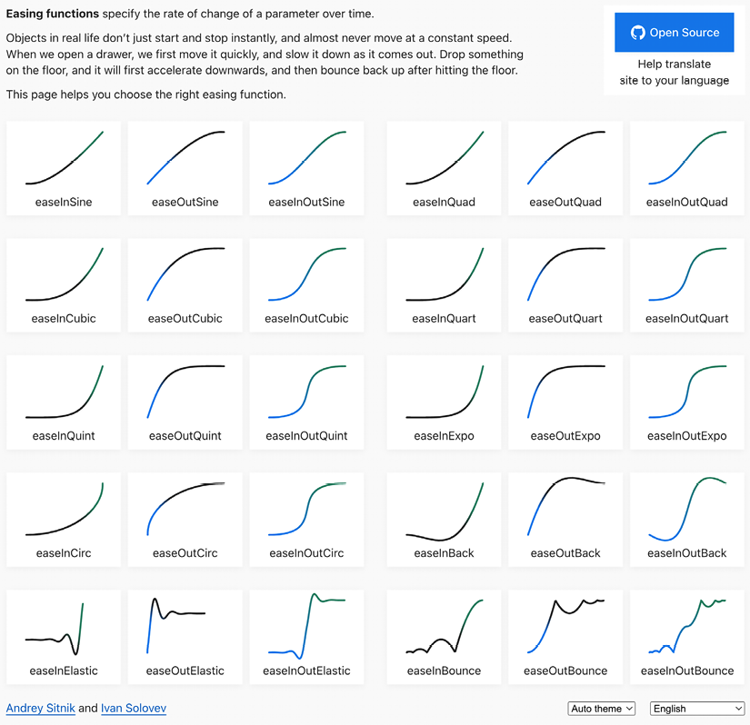
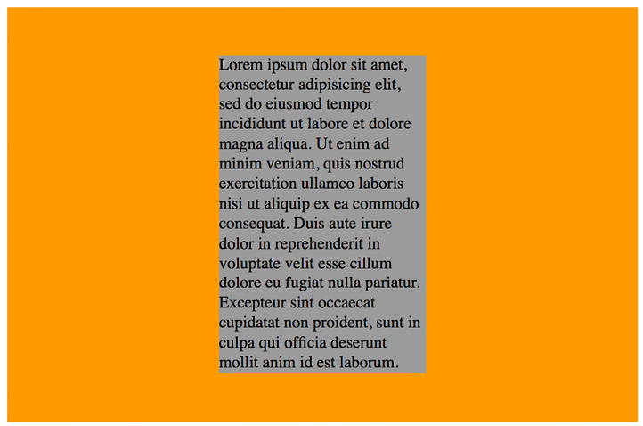
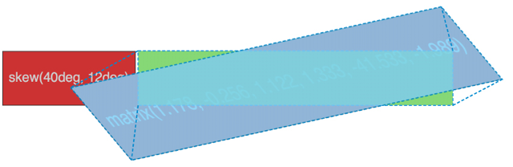

Transitions, Transformations, and Animations
============================================


In this lab, we'll cover:

-   What CSS transitions are and how to use them
-   Writing CSS transitions and understanding the shorthand syntax
-   CSS transition timing functions (`ease`,
    `cubic-bezier`, and so on)
-   What CSS transforms are and how to use them
-   Understanding different 2D transforms (`scale`,
    `rotate`, `skew`,
    `translate`, and `matrix`)
-   Understanding 3D transforms
-   How to animate with CSS using keyframes

Let's get started with an introduction to CSS transitions.


CSS transitions
===============


If you open up `example_11-01`, you'll see a few links in a
`nav`. Here's the relevant markup:


``` {.language-markup}
<nav>
  <a href="#">link1</a>
  <a href="#">link2</a>
  <a href="#">link3</a>
  <a href="#">link4</a>
  <a href="#">link5</a>
</nav>
```


And here's the relevant CSS:


``` {.language-markup}
a {
  font-family: sans-serif;
  color: #fff;
  text-indent: 1rem;
  background-color: #ccc;
  display: inline-flex;
  flex: 1 1 20%;
  align-self: stretch;
  align-items: center;
  text-decoration: none;
  transition: box-shadow 1s;
}
a + a {
  border-left: 1px solid #aaa;
}
a:hover {
  box-shadow: inset 0 -3px 0 #cc3232;
}
```


And here are the two states; first, the default:


Figure 11.1: Two links, in their default state

And then here's the `hover` state:


Figure 11.2: When hovered, we underline the link

Ordinarily, hovering over the link snaps from the first state (no red
line) to the second (red line); it's an on/off affair. However, this
line:


``` {.language-markup}
transition: box-shadow 1s;
```


adds a transition to the `box-shadow`
from the existing state to the `hover` state over 1 second.


You'll notice in the CSS of the preceding example that we're using the
adjacent sibling selector `+`. You'll remember this
selector from *Lab 6*, *CSS Selectors, Typography, and More*. This
means if an element (an anchor tag in our example) directly follows
another element (another anchor tag), then apply the enclosed styles.
It's useful here as we don't want a left border on the first element.


The `transition` property is applied on the "from" state,
not the "to" state of a selector. In our case, we add the
`transition` property and values on the element in its
default state, not the `hover` state. You could add a
`transition` property to the `hover` state
too, but this would apply when you transition away from the
`hover` state and back to default. This implementation is
so that multiple different states such as `:active`,
`:focus`, `:hover`, and more can also have
different styles set and enjoy the same transition to them.

The properties of a transition
------------------------------

A transition can be declared using up to four
properties:

-   `transition-property`: The name of the CSS property to
    be transitioned (such as `background-color`,
    `text-shadow`, or `all` to transition
    every possible property).
-   `transition-duration`: The length of time over which
    the transition should occur (defined in seconds, for example,
    `.3s`, `2s`, or `1.5s`).
-   `transition-timing-function`: How the transition
    changes speed during the duration (for example, `ease`,
    `linear`, `ease-in`,
    `ease-out`, `ease-in-out`, or
    `cubic-bezier`).
-   `transition-delay`: An optional value to determine a
    delay before the transition commences. Alternatively, a negative
    value can be used to commence a transition
    immediately but part way through its transition "journey." It's
    defined in seconds, for example, `.3s`,
    `1s`, or `2.5s`.
    
    For any duration defined in seconds with `s` in CSS,
    you can also define it in milliseconds, if you prefer. For example,
    instead of `0.5s` for half a second, you could write
    `500ms`. It's purely a preference thing, but for
    predictability, I would advise you to choose one or the other and
    stick to it throughout a project.
    

Used separately, the various transition properties can be used to create
a transition like this:


``` {.language-markup}
.style {
  /*...(more styles)...*/
  transition-property: all;
  transition-duration: 1s;
  transition-timing-function: ease;
  transition-delay: 0s;
}
```


This particular rule effectively says, "Transition any transitionable
property on this element over 1 second with no delay using the
`ease` timing function."

The transition shorthand property
---------------------------------

We can roll these individual declarations into a
single, shorthand version:


``` {.language-markup}
transition: all 1s ease 0s;
```


One important point to note when writing the shorthand version is that
the first time-related value provided is always parsed to be the
`transition-duration`. The second time-related value is
parsed to be the `transition-delay`. The shorthand version
is the one I favor, as I generally only need to define the duration of
the transition and the properties that should be transitioned.

To exemplify, suppose I wanted the `background-color` to
transition over 2 seconds:


``` {.language-markup}
transition: background-color 2s;
```


If no timing function is provided, the default
timing function of `ease` is applied.

I would also advise only defining the property or properties you
actually need to transition. It's really handy to just set
`all`, but, for example, if you only need to transition
`opacity`, then only define `opacity` as the
transition property. When you set `all`, there is a chance
you will be inadvertently transitioning properties you don't want to,
which can possibly lead to bugs for yourself or others down the line.

Transitioning different properties over different periods of time
-----------------------------------------------------------------

Where a rule has multiple properties declared, you
don't have to transition all of them in the same way. Consider this
rule:


``` {.language-markup}
.style {
  /* ...(more styles)... */
  transition-property: border, color, text-shadow;
  transition-duration: 2s, 3s, 8s;
}
```


Here, we have specified with `transition-property` that
we'd like to transition the `border`, `color`,
and `text-shadow`. Then, with the
`transition-duration` declaration, we are stating that the
`border` should transition over 2 seconds, the
`color` over 3 seconds, and the `text-shadow`
over 8 seconds. The comma-separated durations match the comma-separated
order of the transition properties.

You can also perform the same job with the shorthand syntax, and again
this is my preferred way to do it:


``` {.language-markup}
.style {
  transition: border 2s, color 3s, text-shadow 8s;
}
```


I think it is far easier to reason about each property and its timing
when they are written next to each other.

So far, we have dealt with transitioning different
properties over different durations. However, there is also a fairly
limitless number of timing functions that change how an element property
changes over a duration.

Understanding timing functions
------------------------------

When you declare a `transition`, the properties, durations,
and delays are relatively simple to understand.
However, understanding what each timing function does can be a little
trickier. Just what do `ease`, `linear`,
`ease-in`, `ease-out`,
`ease-in-out`, and `cubic-bezier` actually do?
Each of them is actually a predefined `cubic-bezier` curve,
essentially the same as an easing function. Or, more simplistically, a
mathematical description of how the transition should look. It's
generally easier to visualize these curves, so I recommend you head over
to [[https://cubic-bezier.com/]](https://cubic-bezier.com/) or
[[https://easings.net]](https://easings.net/).

Both these sites let you compare timing functions and see the difference
each one makes. Here is a screenshot of
[[https://easings.net]](https://easings.net/)---on the website,
you can hover over each line for a demonstration of the easing function:



Figure 11.3: Easings.net provides a handy visualization of a number of
different timing functions

However, even if you can write your own `cubic-bezier`
curves blindfolded, the likelihood is, for most
practical situations, it makes little difference.
The reason for this is that, like any visual flourish, it's necessary to
employ transition effects subtly. For real-world implementations,
transitions that occur over too great a period of time tend to make a
site feel slow. For example, navigation links that take 5 seconds to
transition are going to frustrate rather than wow your users. The
perception of speed is incredibly important for our users, and you and I
must concentrate on making websites and applications feel as fast as
possible.

Therefore, unless there is a compelling reason to do so, using the
default transition (`ease`) over a short
interval is often best; a maximum of 1 second is
my own preference, and usually as little as `0.2s`.


**Fun transitions for responsive websites**

Did you ever have one of those occasions growing up when one parent was
out for the day and the other parent said something to the effect of,
"OK, while your mom/dad is out, we're going to put sugar all over your
breakfast cereal, but you have to promise not to tell them when they
come back." I'm certainly guilty of that with my little ankle biters.
So, here's the thing. While no one is looking, let's have a bit of fun.
I don't recommend this for production, but try adding this to your
responsive project:


``` {.language-markup}
* {
  transition: all 1s;
}
```


Here, we are using the CSS universal selector `*` to select
everything and then setting a `transition` on
`all` properties for 1 second (`1s`). As we
have omitted to specify the timing function, `ease` will be
used by default and there will be no delay as, again, a default of 0 is
assumed if an alternative value is not added. The effect? Well, try
resizing your browser window and most things (links,
`hover` states, and the like) behave as you would expect.
However, because everything transitions, it also includes any rules
within media queries, so as the browser window is resized, elements sort
of flow from one state to the next. Is it essential? Absolutely not! Is
it fun to watch and play around with? Certainly! Now, remove that rule
before your mom sees it!


Right, hopefully, we have transitions licked. Now we can have some fun,
because we are going to learn how to effortlessly move elements around
the screen with transforms. There are 2D and 3D variants; we will start
with 2D and if that gets a bit flat (see what I did there? No? I'll see
myself out) then we will move on to 3D.


CSS 2D transforms
=================


Open `example_11-02` and you will see two sentences; the
first has `margin-left: 10px` applied to the bold word
**item** on hover, while the second sentence has
`transform: translateX(10px)` applied to the same word on
hover. Both have a transition of 1 second applied.

With nothing hovered over, they look like this:


Figure 11.4: Two paragraphs in their default state

Hover over **item** in the first paragraph and the following happens;
notice the text after that word has been shunted along?


Figure 11.5: When the first paragraph is hovered over, "item" gets a
margin applied, moving all the text after it too

Now, hover over **item** in the second paragraph and notice how just
that word moves. The words around it are
unaffected.


Figure 11.6: In the second paragraph, "item" is transformed, moving to
the right without affecting anything else

So, transforms, either 2D or 3D, do not affect document flow.

Let's try out the various 2D transforms. You can test each of these out
by opening `example_11-03` in the browser. There's a
transition applied to all of the transforms so that you get a better
idea of what's happening.

Scale
-----

Here's the syntax for `scale`:


``` {.language-markup}
.scale:hover {
  transform: scale(1.4);
}
```


Hovering over the **scale** link in our example produces this effect:


Figure 11.7: You can scale elements up or down in size

We've told the browser that when this element is
hovered over, we want the element to scale to 1.4 times its original
value.

Besides the values we've already used to enlarge elements, by using
values below 1, we can shrink elements; the following will shrink the
element to half its size:


``` {.language-markup}
transform: scale(0.5);
```


You can also apply a scale only on a single axis. Horizontal is
`scaleX` and vertical is `scaleY`. So, if you
wanted to scale something to twice its width, you'd use:


``` {.language-markup}
transform: scaleX(2);
```


Translate
---------

Here's syntax for
`translate`:


``` {.language-markup}
.translate:hover {
  transform: translate(-20px, -20px);
}
```


Here's the effect that rule has on our example:


Figure 11.8: translate lets you move an element anywhere on the *x* or
*y* axis

The `translate` property tells the browser to move an
element by an amount, defined by a length (for example,
`vw`, `px`, `%`, and so on). The
first value is the *x* axis and the second value is the *y* axis.
Positive values given within parentheses move the element right or down;
negative values move it left or up. If you only
pass one value, then it is applied to the *x*
axis.

If you want to specify just one axis to translate an element, you can
also use `translateX(-20px)`, which, in this instance,
would move the element left 20 px, or you could use
`translateY(-20px)`, which, in this case, would move the
element 20 px up.

### Using translate to center absolutely positioned elements

`translate` provides a really useful way to center
absolutely positioned elements within a relatively
positioned container. You can view this example at
`example_11-04`.

Consider this markup:


``` {.language-markup}
<div class="outer">
  <div class="inner"></div>
</div>
```


And then this CSS:


``` {.language-markup}
.outer {
  position: relative;
  height: 400px;
  background-color: #f90;
}
.inner {
  position: absolute;
  height: 200px;
  width: 200px;
  margin-top: -100px;
  margin-left: -100px;
  top: 50%;
  left: 50%;
}
```


You've perhaps done something similar to this yourself. When the
dimensions of the absolutely positioned element are known (200 px × 200
px in this case), we can use negative margins to "pull" the item back to
the center. However, what happens when you want to
include content and have no way of knowing how tall it will be?

For example, let's add some random content to the inner box:


Figure 11.9: Text overflowing our box can be fixed with transform

Yes, that problem! Right, let's use `transform` to sort
this mess out:


``` {.language-markup}
.inner {
  position: absolute;
  width: 200px;
  background-color: #999;
  top: 50%;
  left: 50%;
  transform: translate(-50%, -50%);
}
```


And here is the result:



Figure 11.10: With a smart application of transform, overflow issues are
avoided

Here, `top` and `left` are positioning the
inner box inside its container so that the top-left corner of the inner
box starts at a point 50% along and 50% down the outer box. Then,
`transform` is working on the inner element and positioning
it negatively in those axes by half (`-50%`) of
its own width and height. Nice!


One aspect of what we learned here bears repeating. When using
percentages in transforms, remember that they are a percentage of *the
element being transformed*, not its parent.


Rotate
------

The `rotate` transform allows you to
rotate an element. Here's the syntax:


``` {.language-markup}
.rotate:hover {
  transform: rotate(30deg);
}
```


In the browser, here's what happens:


Figure 11.11: Rotating elements is straightforward with a transform

The value in parentheses should always be an angle. The angle can be
expressed in degrees, gradians, radians, or turns. Personally, I default
to using degrees (for example, `90deg`), but all units are
equally valid. While positive angle values always apply clockwise, using
negative values will rotate the element counter-clockwise.

Pass an angle greater than a full revolution and the element will keep
turning until it has turned around to the required degree. Therefore,
you can also go crazy and make elements spin by specifying a value like
the following:


``` {.language-markup}
transform: rotate(3600deg);
```


This will rotate the element 10 times in a
complete circle. Practical uses for this
particular value are few and far between but, you know, if you ever find
yourself designing websites for a windmill company, it may come in
handy.

Skew
----

If you've spent any time working in Photoshop,
you'll have a good idea of what
`skew` does. It allows an element to be skewed on either or
both of its axes. Here's the code for our example:


``` {.language-markup}
.skew:hover {
  transform: skew(40deg, 12deg);
}
```


Setting this on the `hover` state produces the following
effect on hover:


Figure 11.12: Just like it sounds, a skew can produce some dramatic
effects

The first value is the `skew` applied to the *x* axis (in
our example, `40deg`), while the second
(`12deg`) is for the *y* axis. Omitting the second value
means any value will merely be applied to the *x* axis (horizontal). For
example:


``` {.language-markup}
transform: skew(10deg);
```


Just like with `translate`, you can apply skews to just one
axis with `skewX()` and `skewY()`.

Matrix
------

Did somebody mention a completely overrated film?
No? What's that? You want to know about the CSS
`matrix`, not the film? Oh, okay.

The `matrix` transform syntax looks rather impenetrable.
Here's our example code:


``` {.language-markup}
.matrix:hover {
  transform: matrix(1.178, -0.256, 1.122, 1.333, -41.533, -1.989);
}
```


The matrix is a mathematical description. It essentially allows you to
combine a number of other transforms (`scale`,
`rotate`, `skew`, and so on) and express it as
a single declaration. The preceding declaration results in the following
effect in the browser:


Figure 11.13: Not for the faint-hearted, the matrix value

If you find yourself doing work with animations in JavaScript without
the help of an animation library, you'll probably need to become a
little more acquainted with `matrix`. It's the syntax all
the other transforms get computed into behind the scenes, so if you're
grabbing the current state of an animation with JavaScript, it will be
the `matrix` value you will need to inspect and understand.

Now, I like a challenge (unless, you know, it's sitting through the
Marvel Cinematic Universe back catalog), but I think the majority of us
would agree that that syntax is a bit testing. The specification doesn't
exactly clear matters up:
[[https://www.w3.org/TR/css-transforms-1/\#mathematical-description]](https://www.w3.org/TR/css-transforms-1/#mathematical-description).

However, the truth is I can count on the fingers of one hand how many
times I've needed to write or understand a CSS transform described as a
`matrix`, so it likely isn't something to concern yourself
with.

If you do find yourself needing to create one, I'd suggest heading over
to
[[https://www.useragentman.com/matrix/]](https://www.useragentman.com/matrix/).
The Matrix Construction Set website allows you to drag and drop the
element exactly where you want it and includes good ol' copy-and-paste
code for your CSS file.

The transform-origin property
-----------------------------

Notice how, with CSS, the default transform origin---the point the
browser uses as the center for the transform---is
in the middle: 50% along the *x* axis and 50% along the *y* axis of the
element. This differs from SVG, which defaults to the top left (or
`0 0`).

Using the `transform-origin` property, we can amend the
point from which transforms originate.

Consider our earlier `matrix` transform. The default
`transform-origin` is `50% 50%` (the center of
the element). The Firefox developer tools show how the transform is
applied:


Figure 11.14: Default transform-origin applied

Now, if we adjust the `transform-origin` like this:


``` {.language-markup}
.matrix:hover {
  transform: matrix(1.678, -0.256, 1.522, 2.333, -51.533, -1.989);
  transform-origin: 270px 20px;
}
```


Then you can see the effect this has:



Figure 11.15: You can amend the origin of transforms as needed

The first value is the horizontal offset and the second value is the
vertical offset. You can use keywords. For example, `left`
is equal to 0% horizontal, `right` is equal to 100%
horizontal, `top` is equal to 0% vertical, and
`bottom` is equal to 100% vertical. Alternatively, you can
use a length, using any of the CSS length units.

If you use a percentage for the
`transform-origin` values, then the horizontal/vertical
offset is relative to the height/width of the element's bounding box. If
you use a length, then the values are measured from the top-left corner
of the element's bounding box.

The specification for CSS Transforms Module Level 1 can be found here:
[[https://www.w3.org/TR/css-transforms-1]](https://www.w3.org/TR/css-transforms-1).


For more on the benefits of moving elements with
`transform`, read this old but great post by Paul Irish,
[[https://www.paulirish.com/2012/why-moving-elements-with-translate-is-better-than-posabs-topleft/]](https://www.paulirish.com/2012/why-moving-elements-with-translate-is-better-than-posabs-topleft/),
which provides some good data.


So far, we have dealt with transforming in two dimensions, the *x* and
*y* axes. However, CSS can also handle elements in 3D space. Let's look
at what extra fun we can have with 3D transforms.


CSS 3D transformations
======================


As you've probably already realized, a 3D
transform allows us to manipulate an element in an imaginary 3D space.
Let's look at our first example. All we have in our example are two
elements that each flip in 3D when hovered over. I've used
`hover` here to invoke the flip, as it's a simple mechanism
to trigger the effect. However, the flipping action could just as easily
be initiated with any other state change---a class change (via
JavaScript) or when an element has received focus, for example.

The only difference between these two elements is that one flips
horizontally and the other vertically. You can view them in a browser by
opening `example_11-05`. Images fail to fully convey this
technique, but the idea is that the element flips from the green "face"
to the red "face," giving the illusion of doing so through 3D space with
the aid of perspective. Here's a grab partway
through the transition from green to red, which hopefully conveys some
of the effect:


Figure 11.16: Halfway through a 3D transform

It's also worth knowing that while positioning an element absolutely
with
`top`/`left`/`bottom`/`right`
values can only be calculated to whole pixels, a transform can
interpolate at subpixel positions.

Here's the markup for the flipping element:


``` {.language-markup}
<div class="flipper">
  <span class="flipper-object flipper-vertical">
    <span class="panel front">The Front</span>
    <span class="panel back">The Back</span>
  </span>
</div>
```


The only difference with the horizontal one, markup wise, is that the
`flipper-vertical` class is replaced with
`flipper-horizontal`.

As the majority of the styles relate to aesthetics, we'll merely look at
the essential ingredients in our styles to make the flipping effect
possible. Refer to the full style sheet in the example file for the
aesthetic styles.

When dealing with 3D transforms, the first essential ingredient is to
define some kind of 3D space.

For our example, we need to set some perspective for
`.flipper-object`, whether horizontal or vertical, to flip
within. For that, we use the `perspective` property. This
takes a length value, attempting to simulate the distance from the
viewer's screen to the edge of the elements' 3D space. We set this on
the outer-most element to provide the 3D context for our nested elements
to move within.

The value you assign to `perspective`
is arguably counter-intuitive---if you set a low number like 20 px for
the perspective value, the 3D space of the element will extend right out
to only 20 px from your screen, the result being a more pronounced 3D
effect.

Setting a high number, on the other hand, will mean the edge of that
imaginary 3D space will be further away, and therefore produce a less
pronounced 3D effect. I recommend opening the example in the browser and
playing with the perspective in the developer tools to get a feel for
it:


``` {.language-markup}
.flipper {
  perspective: 400px;
  position: relative;
}
```


We use `position: relative` on the outer
`flipper` element to provide a positioning context for
`flipper-object` to be absolutely positioned within:


``` {.language-markup}
.flipper-object {
  position: absolute;
  width: 100%;
  height: 100%;
  transition: transform 1s;
  transform-style: preserve-3d;
}
```


Besides positioning `.flipper-object` absolutely, we set
the `height` and `width` to
`100%` so that it fills the same space as the outer
container. We have also set a transition for the transform. If you
remember from earlier in this lab, when we dealt with transitions,
just setting the time for transition means the default timing function
(`ease`) will be used.

The key thing here, 3D wise, is
`transform-style: preserve-3d`. This declaration tells the
browser that when we transform this element, we want any child elements
to preserve any 3D effect.

If we didn't set `preserve-3d` on
`.flipper-object`, we would never get to see the back (the
red part) of the flipping element.


Each "panel" in our flipping element needs positioning at the top of its
container, but we also want to make sure that, if
rotated, we don't see the "rear" of it (otherwise we would never see the
green panel as it sits "behind" the red one). To do that, we use the
`backface-visibility` property. We set this to
`hidden` so that the back face of the element is, you
guessed it, hidden:


``` {.language-markup}
.panel {
  top: 0;
  position: absolute;
  backface-visibility: hidden;
}
```


Next, we want to make our back panel flipped by default (so that when we
flip the whole thing, it will actually be in the correct position). To
do that, we apply a `rotate` transform. Hopefully, having
covered these in the previous section, you'll understand what they are
doing here:


``` {.language-markup}
.flipper-vertical .back {
  transform: rotateX(180deg);
}
.flipper-horizontal .back {
  transform: rotateY(180deg);
}
```


Now that everything is in place, all we want to do is flip the entire
inner element when the outer one is hovered over:


``` {.language-markup}
.flipper:hover .flipper-vertical {
  transform: rotateX(180deg);
}
.flipper:hover .flipper-horizontal {
  transform: rotateY(180deg);
}
```


The translate3d property
------------------------

I've found great utility in the `translate3d` function.
With this single function, it is possible to move
an element in the *x* (left/right), *y* (up/down), and *z*
(forward/backward) axes.

Let's amend our previous example and make use of the
`translate3d()` function. You can view this example at
`example_11-06`.

Besides setting the elements into the page a little more with padding,
the only changes from our previous example can be seen here:


``` {.language-markup}
.flipper:hover .flipper-vertical {
  transform: rotateX(180deg) translate3d(0, 0, -120px);
}
.flipper:hover .flipper-horizontal {
  transform: rotateY(180deg) translate3d(0, 0, 120px);
}
```


We're still applying a transform, but this time, in addition to our
rotate, we have also made use of `translate3d()`. The
syntax for the comma-separated arguments you can pass into
`translate3d` are *x*-axis movement, *y*-axis movement, and
*z*-axis movement.

In our two examples, I'm not moving the element on the *x* or *y* axis
(left to right and up and down); instead, I'm moving it toward or
further away from you as you look at it.

If you look at the top example, you will see it flip behind the bottom
button and end 120 px closer to the screen (minus values effectively
pull it back toward you):


Figure 11.17: Elements can be moved forward and backward in the *Z*
plane

On the other hand, the bottom button flips around
horizontally and ends with the button 120 px further away from you:


Figure 11.18: Here, the element ends "further away"

Although `translate3d()`, like the other transforms, is
very well supported, it actually got pushed into the later CSS
Transforms Module Level 2 specification.


A progressive enhancement example using translate3d
---------------------------------------------------

An area where using `translate3d` is useful is
sliding panels on and off the screen, particularly "off-canvas"
navigation patterns. If you open `example_11-07`, you'll
see we have created a basic, progressively enhanced, off-canvas pattern.

Whenever you create interaction with JavaScript
and modern CSS features like transforms, it makes sense to consider
things from the lowest possible device you want to support. What about
the two people that don't have JavaScript (yes, those guys), or if there
is a problem with the JavaScript loading or executing? What if somebody
prefers reduced motion? Don't worry. It's possible, with a little
effort, to ensure a working interface for every eventuality.

When building these kinds of interface patterns, I find it most useful
to start with the lowest set of features and enhance from there. First,
establish what someone sees if they don't have JavaScript available.
After all, it's no use parking a menu off-screen when JavaScript isn't
available, if the method for displaying the menu relies on JavaScript.
Instead, in this case, we are relying on markup to place the navigation
area in the normal document flow. Worst case, whatever the viewport
width, they can merely scroll down the page and click a link:


Figure 11.19: A basic but usable default layout

If JavaScript is available, for smaller screens, we "pull" the menu off
to the left. When the menu button is clicked, we add a class to the
`body` tag (with JavaScript) and use this class as a hook
to move the navigation back into view with CSS
`transform3d()`.

This will provide the best visual performance, as
it's a process typically offloaded to the graphics processor, which
excels at such tasks:


Figure 11.20: With a click, we slide over our menu

For larger viewports, we hide the menu buttons and merely position the
navigation to the left and move the main content over to accommodate:


Figure 11.21: Where screen size allows, we can show the menu by default

Finally, to cater to anyone that prefers reduced
motion, we use a media query to prevent movement when the menu is opened
and closed:


``` {.language-markup}
@media (prefers-reduced-motion) {
    .navigation-menu {
        transition: none;
    }
}
```


If you open the example in the browser, you can simulate the different
eventualities with the developer tools by changing the `js`
class on the `html` element to `no-js` to see
how it would look without JavaScript. Also, you can emulate the
`prefers-reduced-motion` in Chrome by opening the Dev Tools
Command Palette and typing `prefers-reduced-motion`, and
then clicking the option to emulate it.

This is a simplified example, but hopefully it's apparent that embracing
a progressive enhancement approach ensures the widest possible audience
will get a workable experience from your design. Remember, your users
don't need visual parity, but they might appreciate functional parity.


Animating with CSS
==================

There are two components to a CSS animation; first, writing a set of
keyframes inside an `@keyframes` at-rule declaration, and
then employing that keyframe animation with the `animation`
property and associated values. Let's take a look.

In a previous example, we made a simple flip effect on elements that
combined transforms and transitions. Let's bring together all the
techniques we have learned in this lab and add an animation to the
previous example. In the following example,
`example_11-08`, let's add a pulsing animation effect
around our element once it has flipped.

Firstly, we will create a keyframes at-rule:


``` {.language-markup}
@keyframes pulse {
  100% {
    text-shadow: 0 0 5px #bbb;
    box-shadow: 0 0 3px 4px #bbb;
  }
}
```


As you can see, after writing `@keyframes` to define a new
keyframes at-rule, we name this particular animation
(`pulse`, in this instance). The `@keyframes`
at-rule describes what you want to happen for each cycle of your
animation loop.

It's generally best to use a name that represents what the animation
does, not where you intend to use the animation, as a single
`@keyframes` rule can be used as many times as you need
throughout a project.

We have used a single **keyframe selector** here: `100%`.
However, you can set as many keyframes (defined as percentage points) as
you like within a `@keyframes` at-rule. Think of these as
points along a timeline. For example, at 10%, make the background blue,
at 30%, make the background purple, and at 60%, make the element
semi-opaque. On and on as you need.


There is also the keyword `from`, which is equivalent to
0%, and `to`, which is equivalent to 100%. You can use the
keywords like this:


``` {.language-markup}
@keyframes pulse {
  to {
    text-shadow: 0 0 5px #bbb;
    box-shadow: 0 0 3px 4px #bbb;
  }
}
```


You'll notice here that we haven't bothered to
define a starting point. That's because the starting point is the state
each of those properties is already at.

*If a '0%' or 'from' keyframe is not specified, then the user agent
constructs a '0%' keyframe using the computed values of the properties
being animated. If a '100%' or 'to' keyframe is not specified, then the
user agent constructs a '100%' keyframe using the computed values of the
properties being animated.*

In this `@keyframes` at-rule, we've added a
`text-shadow` and `box-shadow` at
`100%`. We can then expect the keyframes, when applied to
an element, to animate the text shadow and box shadow to the defined
amount. But how long does the animation last? How do we make it repeat,
reverse, and more? This is how we actually apply a keyframes animation
to an element:


``` {.language-markup}
.flipper:hover .flipper-horizontal {
  transform: rotateY(180deg);
  animation: pulse 1s 1s infinite alternate both;
}
```


The `animation` property here is a shorthand for several
animation-related properties. In this example, we are declaring (in
order):

1.  The name of the keyframes declaration to use (`pulse`).
2.  The `animation-duration` (1 second).
3.  The `animation-delay` before the animation begins (1
    second, to allow time for our button to first flip).
4.  The number of times the animation will run (infinitely).
5.  The direction of the animation (`alternate`, so it
    animates first one way and then back the other).
6.  That we want the `animation-fill-mode`, which we will
    cover in detail momentarily, to retain the values that are defined
    in the keyframes, whether going forward or backward
    (`both`).

The shorthand property can actually accept all
seven animation properties. In addition to those used in the preceding
example, it's also possible to specify
`animation-play-state`. This can be set to
`running` or `paused` to effectively play and
pause an animation. Of course, you don't need to use the shorthand
property; sometimes, it can make more sense (and help when you revisit
the code in the future) to set each property separately. The following
are the individual properties and example values. Where appropriate,
alternate values have been listed with a comment:


``` {.language-markup}
.animation-properties {
  animation-name: warning;
  animation-duration: 1.5s;
  animation-timing-function: ease-in-out;
  animation-iteration-count: infinite;
  animation-play-state: running; /* could also be 'paused' */
  animation-delay: 0s;
  animation-fill-mode: none;
  /* could also be 'forwards', 'backwards' or 'both' */
  animation-direction: normal;
  /* could also be set to 'reverse', 'alternate' or 'alternate-reverse' */
}
```


You can run multiple animations on an element with the shorthand
property by comma separating them. For example:


``` {.language-markup}
animation: animOne 1s alternate both, animTwo 0.3s forwards
```


As mentioned previously, it's simple to reuse a declared
`keyframes` on other elements and with completely different
settings:


``` {.language-markup}
.flipper:hover .flipper-vertical {
  transform: rotateX(180deg);
  animation: pulse 2s 1s cubic-bezier(0.68, -0.55, 0.265, 1.55) 5
  alternate both;
}
```


Here, the `pulse` animation would run
over 2 seconds and uses an `ease-in-out-back` timing
function (defined as a `cubic-bezier` curve). It runs five
times in both directions. This declaration has been applied to the
vertically flipping element in the
`example_11-08/styles.css` file.

The animation-fill-mode property
--------------------------------

The `animation-fill-mode` property is worthy of a special
mention. Consider an animation that starts with a
yellow background and animates to a red background over 3 seconds. You
can view this in `example_11-09`.

We apply the animation like this:


``` {.language-markup}
.background-change {
  animation: fillBg 3s;
  height: 200px;
  width: 400px;
  border: 1px solid #ccc;
}
@keyframes fillBg {
  0% {
    background-color: yellow;
  }
  100% {
    background-color: red;
  }
}
```


However, once the animation completes, the background of the
`div` will return to nothing. That's because, by default,
when an animation ends, the element goes back to exactly how it was
before the animation ran. In order to override this behavior, we have
the `animation-fill-mode` property. In this instance, we
could apply this:


``` {.language-markup}
animation-fill-mode: forwards;
```


This makes the item retain any values that have
been applied by the animation end. In our case, the `div`
would retain the red background color that the animation ended on.


Figure 11.22: Without animation-fill-mode set to forwards, animations
run and then immediately reset


Summary
=======

In this lab, we've learned what CSS transitions are and how to write
them. We got a handle on timing functions like `ease` and
`linear`, and then used them to create simple but fun
effects. We then learned all about 2D transforms like
`scale` and `skew`, and how to use them in
tandem with transitions. We also looked briefly at 3D transformations
before learning all about the power and relative simplicity of CSS
animations. You'd better believe our CSS muscles are growing!

In the next lab, we are going to look in depth at CSS custom
properties and functions. These are recent additions to CSS, in
comparison to things like media queries, and we will see how in many
responsive situations, functions like `clamp()` provide
better responsive solutions.
