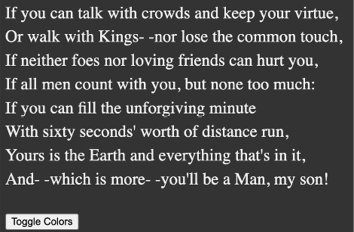

Custom Properties and CSS Functions
===================================

Here are the main areas we will cover in this lab:

-   Setting a custom property with CSS and JavaScript
-   Using a custom property with CSS and JavaScript
-   Understanding CSS functions
-   Reducing the need for media queries
-   `calc()`, `clamp()`, and
    `min()`
-   Examples of using custom properties with CSS functions


Simple theming
--------------

The ability to set a value in one place to be used in many other places
makes custom properties a great candidate for
theming. And we are not limited to CSS as a means of interacting with
them, as there is a JavaScript API to get and set the values of custom
properties.

Let's look at a simple example of using and switching custom properties
with JavaScript. You can find this in `example_12-01`. We
will make a page with the poem "If," by Rudyard Kipling. At the bottom
is a simple light/dark mode toggle button. All the button will do is
toggle the value of two CSS custom properties,
`--background` and` --foreground`.

Here is our CSS:


``` {.language-markup}
body {
    background-color: var(--background);
    color: var(--foreground);
}
```


Below is the snippet of JavaScript we are using. Essentially, it just
says that when someone clicks the toggle button, if the foreground
variable is currently `#eee` (nearly white), then
set it to `#333` (a dark gray);
otherwise, set it to `#eee`. And, if the background
variable is `#333`, set it to `#eee`;
otherwise, set it to `#333`:


``` {.language-markup}
var root = document.documentElement;
var btn = document.getElementById("colorToggle");
btn.addEventListener("click", (e) => {
    root.style.setProperty(
        "--background",
        getComputedStyle(root).getPropertyValue("--background") === "#333"
            ? "#eee"
            : "#333"
    );
    root.style.setProperty(
        "--foreground",
        getComputedStyle(root).getPropertyValue("--foreground") === "#eee"
            ? "#333"
            : "#eee"
    );
});
```


And here is a screenshot showing each state:



Figure 12.1: An example of each state side by side, colors easily
swapped with custom properties

Setting and getting custom property values with JavaScript
----------------------------------------------------------

If you only take two things from that prior
JavaScript snippet, it should be
can
both **get** and **set** custom properties. At first glance, it looks
like you should be able to set a custom property to any string value you
like. But it is a little stricter than that.

Suppose we have an element with a class of
`heading-information`. We could try and set a custom
property on that element with JavaScript like this:


``` {.language-markup}
const headerInfo = document.querySelector(".heading-information");
headerInfo.style.setProperty("--doILikeScones", "You bet I do!");
console.log(getComputedStyle(headerInfo).getPropertyValue("--doILikeScones")); // hoping it will log out "You bet I do!"
```


But that won't work. Why? Well, custom properties must have their value
set to a valid CSS value, so you can't use them to pass around any
arbitrary snippet of data. If we amended our code and set the value to,
say, "100px", we would then get that value logged out correctly.

So, that's the only real rule to be aware of. You *set* and *get* values
in JavaScript as strings, but in order for those strings to "work," they
must be valid CSS values.

Then, assuming you have set the property to something valid, when we
*get* a value, using the `getPropertyValue()` method like
this:


``` {.language-markup}
const headerInfo = document.querySelector(".heading-information");
const doILikeSconesValue =
getComputedStyle(headerInfo).getPropertyValue("--doILikeScones");
console.log(doILikeSconesValue); // would log out value of custom property
```


Everything will work as expected.

Custom properties and specificity
---------------------------------

Custom properties also behave like other
properties in terms of the cascade and specificity. And that can be
incredibly useful. For example, we set our custom properties at the root
level, but if they are redeclared closer to the element in question, the
more specific value will override the first, as they inherit values from
the closest ancestor. Consider this CSS:


``` {.language-markup}
:root {
    --backgroundColor: red;
}
header {
    --backgroundColor: goldenrod;
}
```


The `header` and any elements within it that make use of
the `--backgroundColor` custom property will have a
"goldenrod" background color, whereas other elements will have a red
background.

In our example we have just set a background
color, but it is possible to set all manner of defaults in one place for
items to inherit, and then override as necessary.

You could do something like this:


``` {.language-markup}
:root {
    --fontSize: 1.2em;
    --lineHeight: 1.4;
    --col1: #333;
    --col2: #f9f9f9;
    --fontFam: -apple-system, BlinkMacSystemFont, Helvetica Neue, Segoe
    UI, Tahoma, Roboto, Oxygen, Ubuntu, Cantarell, Fira Sans, Open Sans,
    sans-serif;
    --padInline: clamp(10px, 3vw, 25px);
    --padBlock: clamp(10px, 2vh, 20px);
}
```


And then anywhere you want a visual component that uses those
properties, you can pick and choose them:


``` {.language-markup}
.component {
    font-size: var(--fontSize);
    font-family: var(--fontFam);
    line-height: var(--lineHeight);
    color: var(--col1);
    background-color: var(--col2, #000);
    --padInline: 15px;
}
```


Remember that you can also reassign them for any child elements.

Some things to note from those code blocks. You may have noticed
`clamp()` in there. We haven't looked
at that yet, but we will later in the lab. We
have also done something a little different on that
`background-color`, and that's setting a fallback value.
Let's talk about that a little more next.

Setting a fallback value
------------------------

There may be a situation where you want to protect against a custom
property being unavailable. Perhaps the values are
set with JavaScript, and that has failed to load, or hasn't been
initialized yet. Whatever the reason, you can safeguard against the
eventuality by providing a fallback value. The syntax is
straightforward: simply provide your fallback value after the custom
property name and a comma.

For example, suppose I wanted to use the
`--backgroundColor` custom property, but default to a dark
gray color if that variable was unavailable. I could write it like this:


``` {.language-markup}
.my-Item {
    background-color: var(--backgroundColor, #555);
}
```


If you are ever unsure whether a custom property will be set, it makes a
lot of sense to get into the habit of supplying fallback values whenever
you use custom properties. That way, if the visual component you are
building finds itself in an area where the custom property is not set,
it will still render with the sensible default you provided.


Custom properties and web components
------------------------------------

Web components provide the web platform with native encapsulated
components. This means the styles within them are
contained, unable to access styles above them in
the DOM. However, one thing that can penetrate this boundary is -- you
guessed it -- custom properties.

This makes custom properties the perfect mechanism for passing around
values that you want to share among nested components.

You can set a custom property on the outermost part of a web component
using the `:host` pseudo-class, like this:


``` {.language-markup}
:host {
    --myCustomProperty: 100%;
}
```


And then that host component, and any nested components, can access that
custom property.

So now we are at a point where we know about custom properties, what
they look like, and how we can set them at different places and use
specificity to override them. We have also looked
at setting defaults, just in case a custom property isn't set elsewhere.
We have also looked at environment variables and where they may be a
consideration.

It's time now to start manipulating these values with functions.
Manipulating values provides a whole slew of additional capability and
flexibility. Let's take a look.


CSS functions
=============


When it comes to solving the challenges of
responsive web design, CSS functions are starting to replace and better
media queries in some instances.

Want to have text that is no smaller than 16 px, but then scales with
the size of the viewport, yet never gets bigger than 30 px?

With media queries, you would have to try to solve that problem
something like this:


``` {.language-markup}
.headline {
    font-size: 16px;
}
@media (min-width: 400px) {
    font-size: 6vw;
}
@media (min-width: 1000px) {
    font-size: 30px;
}
```


But the reality is, that's quite brittle. You'll find yourself adding
lots of little "tweak points" where you need to add another media query.
For example, when the viewport is 950 px wide, that 6 vw is looking a
little comically big.

Now we have a better tool for the job. You can do this instead:


``` {.language-markup}
.headline {
    font-size: clamp(16px, 4vw, 30px);
}
```


That's pretty powerful, right? The
`clamp()` function is just one of many CSS functions we now
have at our disposal. But hang on. I got a little excited then and
jumped ahead. Before we look in detail at functions like
`clamp()`, let's start by looking at a function you may
have already looked at, `calc()`.

calc()
------

The `calc()` function allows us to do
basic arithmetic in CSS. I purposefully said basic
because it only allows addition, subtraction, division, and
multiplication.

It's essential to put whitespace around the plus and minus symbols;
otherwise, the `calc()` won't, err... calc! It isn't
necessary to have whitespace around the division or multiplication
symbols, but I always add it there too just for consistency.

So, to illustrate, this is good:


``` {.language-markup}
.thing {
    width: calc(100vw - 30px);
}
```


But this is bad:


``` {.language-markup}
.thing {
    width: calc(100vw -30px);
}
```


As you can see in the example above, you can mix and match units in the
calculations. This is particularly useful in our responsive challenges.
Suppose we are building some piece of user interface, and we want
something the full height of the viewport but minus a fixed-height
header that is 50 px. We can solve this with ease with
`calc`:


``` {.language-markup}
.thing {
    height: calc(100vh - 50px);
}
```


Actually, that is not so dissimilar to the first example. So, how about
we up the ante and factor in environment variables? That would look like
this:


``` {.language-markup}
.thing {
    height: calc(
        100vh - env(safe-area-inset-top) - env(safe-area-inset-bottom) -
        50px
    );
}
```


And now our UI is the full height of viewport
(`100vh`), minus any safe area the
device has set, minus the height of our fixed height header. Now that is
a responsive piece of interface!

And as you might imagine, you can use custom properties inside a
`calc()` too.


Now, as we go ahead and look at some of the "comparison" functions of
CSS, notice that they have the `calc()` capability baked
in. You don't need to use `calc()` in them explicitly; you
can just use the basic math operations (addition, subtraction,
multiplication, and division) in there directly. We will make use of
this capability as we look at each function in turn. First up,
`min()`.

min()
-----

The `min()` function accepts any
number of comma-separated arguments, and resolves
to the minimum.

Consider this:


``` {.language-markup}
.my-responsive-component {
    width: min(100vw, 700px);
}
```


Let's suppose we have our browser window 800 px wide. Looking at the
code above, can you guess how wide our element will be? In that
scenario, it will be 700 px because 100 vw would be 800 px. However, if
we reduced our browser window width to say 600 px, it would resolve to
600 px (100 vw) as that would now be the minimum value of the two.

Remember we have basic math functionality in
`min()` too, so if we wanted to make
allowance for some responsive part, we can do that too. Here is the
example amended to use a combination of hard and dynamic values:


``` {.language-markup}
.my-responsive-component {
    width: min(100vw, 700px - 5%);
}
```


And remember, we are not limited to just two arguments:


``` {.language-markup}
.thing {
    width: min(50vw, 400px, 100% - 10px);
}
```


max()
-----

Having just looked at `min()`, I'm
sure you have a fair idea of how `max()` works. It takes
any number of arguments and resolves to the
largest.

Much like `clamp()`, which we will look at in more detail
next, I find it most useful when I want text to smoothly scale in a
responsive scenario but still have a minimum size for accessibility. For
example, if I never want the text in a `label` to be less
than 18 px:


``` {.language-markup}
label {
    font-size: max(4vw, 18px);
}
```


It can be confusing using these functions at first, as often you are
using the math function that seems to have a name that is the opposite
of what you are using it for! Here we are using `max()` to
set a minimum size for something.

If the same happens for you, you'll just have to
trust me that it gets less confusing the more you
use them.


If it's still making your brain hurt, just make sure that whatever value
you want as a minimum is chucked inside a `max()` function,
as the value is never going to resolve to less than that.


clamp()
-------

Beside `calc()`, the CSS function I
tend to reach for the most in responsive work is
`clamp()`.

It came to browsers slightly later than `min()` or
`max()` but made up for its tardy arrival by solving a
classic design conundrum. You know, the "I want the headline text to be
flexible in size, but it can't go too small. And it can't go too big
either." Yes, that "Goldilocks" one!

The `clamp()` function lets us specify, in the order we
pass them into the function, a minimum, variable, and maximum size for
any length. For example, we can address our Goldilocks text sizing
problem with `clamp` like this:


``` {.language-markup}
.hero-text {
    font-size: clamp(32px, 40vw, 80px);
}
```


And while our headline text might vary in size, depending on the
viewport, it will never be less than 32 px or larger than 80 px.
Beautiful!

And like all the mathematical functions we have looked at, you can use
custom properties in there too. Something like this would allow you to
have a site-wide min and max text size set with a custom property, with
any kind of responsive friendly unit in the middle:


``` {.language-markup}
.hero-text {
    font-size: clamp(var(--textMin), 40vw, var(--textMax));
}
```


And we can nest some calculations in there too if needed:


``` {.language-markup}
.hero-text {
    font-size: clamp(var(--textMin), 40vw + 5rem, var(--textMax));
}
```


And keep in mind that `clamp()` isn't
just for text; you can use it any place that
accepts a length value.


Putting it all together
=======================


Let's make a fun example, bringing together some of the things we have
looked at in previous labs.

With just a couple of elements, let's simulate the basics of a
basketball court, and the ball bouncing and being passed around.

Here is the markup. Probably the least important part of this example:


``` {.language-markup}
<div class="court">
    <div class="ball"></div>
</div>
```


Let's make a vague court shape and give it a background color something
like a basketball court:


``` {.language-markup}
.court {
    width: 400px;
    height: 200px;
    background-color: rgb(197, 150, 86);
    position: relative;
}
```


Now we want to add a ball to our court. This ball will simulate a bounce
with an animation and transition its position, which we will set with
custom properties. Now, if for some reason you haven't read *Lab
11*, *Transitions, Transformations, and Animations*, yet (shame on you),
all you need to know is that this animation makes a circle appear as if
it is bouncing by making it scale up in size and then back down:


``` {.language-markup}
.ball {
    --ballSize: 18px;
    --ball-border: #fff;
    --ball-color: #df4a23;
    position: absolute;
    left: calc(var(--x) - var(--ballSize));
    top: calc(var(--y) - var(--ballSize));
    width: var(--ballSize);
    height: var(--ballSize);
    background-color: var(--ball-color);
    border-radius: 50%;
    transition: all 0.3s ease-in-out;
    border: 1px solid var(--ball-border);
    animation: 0.5s ease infinite alternate forwards bounce;
}
@keyframes bounce {
    0% {
        transform: scale(1);
    }
    100% {
        transform: scale(1.3);
    }
}
```


You can see that we are setting some custom properties on the ball.
Particularly useful is `--ballSize`. We reference that a
few times, which means that tweaking that value automatically changes
both the width and height of the ball, and also factors in to the
calculations being made to the left and top positions. In those
`calc()` functions, you can also see there is a custom
property for `--x` and `--y`, which we are
setting every so often with JavaScript. Here is the snippet of
JavaScript that powers our ball movement:


``` {.language-markup}
// Get the ball from the DOM
const ball = document.querySelector(".ball");
// Get a random number between the Min and the Max
const getRand = (min, max) => Math.floor(Math.random() * (max - min + 1) + min);
// Set the values into the custom property
const setCoords = () => {
    ball.style.setProperty("--x", '${getRand(0, 100)}%');
    ball.style.setProperty("--y", '${getRand(0, 100)}%');
};
setCoords();
// Every so often, set the position of the ball
setInterval(() => {
    setCoords();
}, getRand(1000, 3000));
```


If you look at the DOM in `example_12-02`, you can see that
the value is updated every 1-3 seconds. Because we have a transition set
on `all`, when the ball gets its left and top position
updated, we see the ball move to its new position.

Now, that's where I have parked the example. What about you? Perhaps you
could take it further and use `background-image` to set and
position a basketball court? Or use an image of a basketball for the
ball?

If you are confident adding more JavaScript and markup, perhaps add some
sliders to interactively resize the court with custom properties? Or
perhaps a color picker to change the court or ball? Or perhaps tweak the
animation to use custom properties based on screen width to alter the
scale of the ball? Be creative; see what fun you can have!


Summary
=======


We've had a good look at custom properties in this lab, and
considered ways in which they can be set and read. We have learned how
custom properties respect the cascade, inheriting values from their
parents, a feature that can be leveraged to our advantage. We have also
considered the fact that if we find ourselves working with web
components, custom properties provide a means of crossing the usually
impenetrable style boundary inside a component.

In the second half of the lab, we also looked at CSS mathematical
functions. From ones you have perhaps looked at before, such as
`calc()`, to real time-saving functions like
`clamp()`, a function that is tailor-made to solve
responsive sizing challenges.
