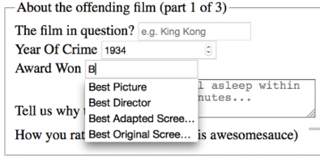

Forms
=====

We have two main aims in this lab. Firstly, to understand HTML5 form
features and, secondly, to understand how we can lay out forms more
simply for multiple devices with the latest CSS features. In this
lab, we will learn how to:

-   Easily add placeholder text into relevant form input fields
-   Disable autocompletion of form fields where necessary
-   Set certain fields to be required before submission
-   Specify different input types such as email, telephone number, and
    URL
-   Create number range sliders for easy value selection
-   Place date and color pickers into a form
-   Use a regular expression to define an allowed form value
-   Style forms using Flexbox
-   Change caret color


HTML5 forms
===========

The easiest way to get to grips with HTML5
forms is to work our way through an example form.

We will start with an HTML5 form. It's made up of a few `fieldset` elements, within which we
are including a raft of the HTML5 form input types
and attributes. Besides standard form input fields and text areas, we
have a number spinner, a range slider, and placeholder text for many of
the fields.

The HTML for this form can be found in the `example_13-01`
code. Here's how it looks, with no styles applied, in Chrome:


Figure 13.1: A basic form with no styling

If we "focus" on the first field and start inputting text, the
placeholder text is removed. If we blur focus without entering anything
(by clicking outside of the input box again), the placeholder text
reappears. If we submit the form (without entering anything), the
following happens:


Figure 13.2: A standard browser warning from a required field

The great news is that all these user interface
elements, including the aforementioned slider, placeholder text,
spinner, and the input validation, are being handled natively by the
browser via HTML5, and no JavaScript.

Let's begin by getting a handle on all the capabilities of HTML5 that
relate to forms and make all this possible. Once we understand all the
mechanics, we can get to work styling it up.

Understanding the component parts of HTML5 forms
------------------------------------------------

There's a lot going on in our HTML5-powered form, so let's break it
down. The three sections of the form are each
wrapped in a `fieldset`, which semantically groups the
related sets of form fields, and a `legend`, which provides
the textual explanation of what that `fieldset` is:


``` {.language-markup}
<fieldset>
  <legend>About the offending film (part 1 of 3)</legend>
  <div>
    <label for="film">The film in question?</label>
    <input
      id="film"
      name="film"
      type="text"
      placeholder="e.g. King Kong"
      required
      aria-required="true"
    />
  </div>
</fieldset>
```


You can see from the previous code snippet that
each `input` element of the form is also wrapped in a
`div` with a `label` associated with each
`input` (we could have wrapped the `input`
with the `label` element if we'd wanted to, too). So far,
so normal. However, within this first `input`, we've just
stumbled upon our first HTML5 form feature. After the common attributes
of `id`, `name`, and `type`, we
have `placeholder`.

The placeholder attribute
-------------------------

In our example, the `placeholder` attribute is filled in
like this:


``` {.language-markup}
placeholder="e.g. King Kong"
```


### Styling the placeholder text

You can style the `placeholder`
attribute with the `:placeholder-shown` pseudo-selector:


``` {.language-markup}
input:placeholder-shown {
  color: #333;
}
```


You can also change the text size of the placeholder text; it doesn't
need to be the same as the values. As ever, be mindful of accessibility.
Although it is only placeholder text, I still try to ensure the text is
16 px or greater.


When it comes to color accessibility, ensure you
use appropriate contrast. If you don't already have a tool to check
acceptable contrast levels, I'd recommend bookmarking
[[https://webaim.org/resources/contrastchecker/]](https://webaim.org/resources/contrastchecker/).

Styling the input caret with the caret-color CSS property
---------------------------------------------------------

**Caret**, in our context here, refers to the
insertion point in an input area. You might think of that typically
blinking vertical line as a "cursor," but it is purposefully named
to make
the distinction from other cursors, such as the
one produced by mouse input.

By the way, it's generally pronounced like your favorite orange
vegetable, "carrot," but depending on your accent, you might need to
alter your pronunciation to "carrit," such as we have to in the UK,
which is fine as long as the Queen doesn't hear you!

The `caret-color` property is a fairly recent addition to
CSS that allows us to change the color of the caret.

Suppose we wanted an orange input insert point; we could style it like
this:


``` {.language-markup}
.my-Input {
  caret-color: #f90;
}
```


Sadly, apart from color, we don't get any real control over how the
caret appears. We can't change the shape, thickness, or blink rate and
style, for example. Hopefully, by the next edition of this course, all
that will be possible!


In case you weren't aware, there is an attribute called
`contenteditable` that can make the contents of an everyday
element, such as a `div` or `span`, editable.
You can also make use of `:caret-color` in those situations
too.


The required attribute
----------------------

`required` is a Boolean attribute,
with "Boolean" meaning it has only two
possibilities. In this case, you either include it or not.

When it is present, like this:


``` {.language-markup}
<input type="text" value="" placeholder="hal@2001.com" required />
```


It means that adding a value to this input will be required before the
form can be submitted.

If the form submission is attempted without the input containing a
requisite value, a warning message is displayed. The message itself
differs both in content and styling depending on the browser and the
input type used.

To be absolutely clear, the bad news here is that you can't change the
message that the browser displays. But the good news is that it will
provide the correct language version of the message for your users to
match their language preference.

We've already seen what the `required` field browser
message looks like in Chrome. The following screenshot shows the same
message in Firefox:


Figure 13.3: Errors when submitting a form in Firefox without the
required fields complete

The `required` value can be used
alongside many input types to ensure a value is
entered. Notable exceptions are the `range`,
`color`, `button`, and `hidden`
input types, as they almost always have a default value.

The autofocus attribute
-----------------------

The HTML5 `autofocus` attribute
a
field focused, ready for user input, as soon as the page loads. The
following code is an example of an input field wrapped in a
`div` with the `autofocus` attribute added at
the end:


``` {.language-markup}
<div>
  <label for="search">Search the site...</label>
  <input
    id="search"
    name="search"
    type="search"
    placeholder="Wyatt Earp"
    autofocus
  />
</div>
```


Tread carefully with `autofocus` for a few reasons.

Firstly, if multiple fields have `autofocus` added, only
the first autofocused field will be focused. It's
not hard to imagine a scenario where you
accidentally added autofocus to one field, and
some time later added autofocus to another. Your user may not get the
experience you expected, and you might have yourself a bug to
troubleshoot.

Secondly, it's also worth considering that some users use the spacebar
to quickly skip down the content of a web page. On a page where a form
has an autofocused input field, this capability is negated; instead, a
space is added to the focused input field. It's easy to see how that
could be a source of frustration for users.

In addition, users of assistive technology will be instantly transported
to a location on the page they have no control of---not exactly the best
user experience!

If using the `autofocus` attribute, be certain it's only
used once in a form and be sure you understand the implications.

The autocomplete attribute
--------------------------

The following is a code example of a field
with the `autocomplete` attribute set to `off`:


``` {.language-markup}
<div>
  <label for="tel">Telephone (so we can berate you if you're wrong)
  </label>
  <input
    id="tel"
    name="tel"
    type="tel"
    placeholder="1-234-546758"
    autocomplete="off"
    required
  />
</div>
```


It's not possible to stop autocompletion on entire fieldsets in one go,
but you can stop autocompletion on entire forms. Just add the
`autocomplete` attribute to the `form` element
itself. Here's an example:


``` {.language-markup}
<form id="redemption" method="post" autocomplete="off">
  <!-- content -->
</form>
```


The list attribute and the associated datalist element
------------------------------------------------------

This `list` attribute and the
associated `datalist` element allow
a number of selections to be presented to a user
once they start entering a value in the field.

The following is a code example of the
`list` attribute in use with an associated
`datalist`, all wrapped in a `div`:


``` {.language-markup}
<div>
  <label for="awardWon">Award Won</label>
  <input id="awardWon" name="awardWon" type="text" list="awards" />
  <datalist id="awards">
    <select>
      <option value="Best Picture"></option>
      <option value="Best Director"></option>
      <option value="Best Adapted Screenplay"></option>
      <option value="Best Original Screenplay"></option>
    </select>
  </datalist>
</div>
```


`datalist` contains the list of possible values for the
`input`. To connect the `datalist` to the
`input`, you have to set the value of the
`list` attribute on the `input` to the
`id` of the `datalist`.

In our example, we have added an `id` of
`"awards"` to the `datalist` element and then
set the value of the `list` attribute on the
`input` to that.

Although wrapping the options with a
`select` element isn't strictly
necessary, it helps when applying scripts to add
comparable functionality for browsers that haven't
implemented the feature.

With our `list` and `datalist` wired up, the
input field still appears initially to be just a normal text input
field. However, when typing in the input, a selection box appears below
it with matching results from the `datalist`. In the
following screenshot, we can see the `list` in action
(Firefox).

In this instance, as "B" is present in all options within the
`datalist`, all the values are shown for the user to select
from:



Figure 13.4: The datalist element showing the matching possible choices

However, when typing "D" instead, only the matching suggestions appear,
as shown in the following screenshot:


Figure 13.5: The datalist narrows based on input

`list` and `datalist` don't
prevent a user from entering different
text in the input box, but they do provide
another great way of adding common functionality
and user enhancement through HTML5 markup alone.

When we started this lab, I mentioned that there are ways of hinting
to the user and, depending on the device, aiding the user in entering
the appropriate data for the input at hand. We can do that with HTML5
input types. Let me show you how.


HTML5 input types
=================


HTML5 has a number of extra `input`
types. These have been a great addition because when they are supported,
they offer great additional functionality and, when not supported, they
still behave like a standard text type input. Let's take a look at them.

The email input type
--------------------

You an
`input` to the type of `email` like this:


``` {.language-markup}
type="email"
```


Supporting browsers will expect a user input that matches the syntax of
an email address. In the following code example,
`type="email"` is used alongside `required`
and `placeholder`:


``` {.language-markup}
<div>
  <label for="email">Your Email address</label>
  <input
    type="email"
    id="email"
    name="email"
    placeholder="dwight.schultz@gmail.com"
    required
  />
</div>
```


When used in conjunction with
`required`, trying to input a non-conforming
value will generate a warning message:


Figure 13.6: An error shows when incorrect data is entered

Perhaps most usefully, most touchscreen devices (Android, iPhone, and so
on) change the software keyboard presented to the user based on this
input type. The following screenshot shows how the software keyboard on
an iPad is shown when focusing an input with
`type="email"`.

Notice the "@" symbol has been added for easy email address completion:


Figure 13.7: Software keyboards will often adapt to the input type

The number input type
---------------------

You can set an input field to expect a number
like this:


``` {.language-markup}
type="number"
```


With the type of input set to
`number`, browsers also sometimes add pieces of UI called
"spinner" controls. These are tiny pieces of user interface that allow
users to easily click up or down to alter the value input.

The following is a code example:


``` {.language-markup}
<div>
  <label for="yearOfCrime">Year Of Crime</label>
  <input
    id="yearOfCrime"
    name="yearOfCrime"
    type="number"
    min="1929"
    max="2015"
    required
  />
</div>
```


The following screenshot shows how it looks in
Chrome, complete with spinners:


Figure 13.8: On desktop browsers, "spinners" are shown for number inputs

And here is how `type="number"` makes the software keyboard
appear on an iPad. Notice how all the numerical keys display by default:


Figure 13.9: Software keyboards default to showing numbers for number
inputs

What happens if you don't enter a number? This
can vary subtly between browser implementations.
For example, Firefox does nothing until the form is submitted, at which
point it displays a warning, **Please enter a number**. Safari, on the
other hand, gives the vaguer message of **Fill out this field**.

### Using min and max to create number ranges

You'll in the
previous code example that we
set a minimum and maximum allowed range:


``` {.language-markup}
type="number" min="1929" max="2015"
```


If you try to submit the form with numbers
of this
range, the browser will show a warning that the
value should be within the specified range.

### Changing the step increments

You can alter the step increments (granularity)
for the spinner controls of numerical input types with the use of the
`step` attribute. For example, to step 10 units at a time:


``` {.language-markup}
<input type="number" step="10" />
```


The url input type
------------------

You can set an input field to expect a URL like
this:


``` {.language-markup}
type="url"
```


As you might expect, the `url` input
type is for URL values. Similar to the `tel` and
`email` input types, it behaves almost identically to a
standard text input. However, some browsers add specific information to
the warning message provided when submitted with incorrect values. The
following is a code example that includes the `placeholder`
attribute:


``` {.language-markup}
<div>
  <label for="web">Your Web address</label>
  <input id="web" name="web" type="url" placeholder="https://www.mysite.
  com" />
</div>
```


The following screenshot shows what happens when an incorrectly entered
URL field is submitted in Chrome:


Figure 13.10: Chrome will show a warning when the input doesn't match
the type

Like `type="email"`, touchscreen devices often amend the
software keyboard based on this input type. The
following screenshot shows how the software
keyboard of an iPad is changed with an input type
set to `url`:


Figure 13.11: Software keyboard adapting for url input

Notice the ".com" key? Because we've used a `url` input
type, the software keyboard provides a key for
easy top-level domain completion.

On iOS, if you're not going to a
`.com` site, you can press and hold that button for a few
other popular top-level domains.

The tel input type
------------------

You can set an input field to expect a telephone
number type of value, like this:


``` {.language-markup}
type="tel"
```


Here's a more complete example:


``` {.language-markup}
<div>
  <label for="tel">Telephone (so we can berate you if you're wrong)
  </label>
  <input
    id="tel"
    name="tel"
    type="tel"
    placeholder="1-234-546758"
    autocomplete="off"
    required
  />
</div>
```


Browsers do little validation on the `tel` input type. When
an incorrect value is input, they fail to provide a suitable warning
message.

However, some better news is that, like the `email` and
`url` input types, touchscreen devices often thoughtfully
accommodate this kind of input with an amended software keyboard for
easy completion; here's the `tel` input type when accessed
with an iPad (running iOS 13.3):


Figure 13.12: Software keyboard adapting to telephone input

Notice the lack of alphabet characters in the
keyboard area? This makes it much faster for
users to enter a value in the correct format.

If the default blue color of telephone numbers in iOS Safari annoys you
when you use a `tel` input, you can amend it with the
following selector:


``` {.language-markup}
a[href^=tel] { color: inherit; }
```


That will set them to the color of the parent element.

The search input type
---------------------

You an input as a
`search` type like this:


``` {.language-markup}
type="search"
```


The `search` input type works like a standard text input.
Here's an example:


``` {.language-markup}
<div>
  <label for="search">Search the site...</label>
  <input id="search" name="search" type="search" placeholder="Wyatt Earp">
</div>
```


As with many of the prior input types, software
keyboards (such as those found on mobile devices)
often provide a more tailored keyboard. Note the "go" button in iOS 15.5
when focused in a search box:


Figure 13.13: A keyboard subtly tailored for searching

The pattern input attribute
---------------------------

You can set an input to expect a certain
pattern input like this:


``` {.language-markup}
pattern=""
```


Note that this isn't an input type. However, it is a means of
communicating to the browser that we expect input of a certain pattern.

The `pattern` attribute allows you
to specify, via a **regular expression**, the syntax of data that should
be allowed in a given input field.


The following code is an example:


``` {.language-markup}
<div>
  <label for="name">Your Name (first and last)</label>
  <input
    id="name"
    name="name"
    pattern="^([\D]{2,30}\s+)+([a-zA-Z]{2,30})$"
    placeholder="Dwight Schultz"
    required
  />
</div>
```

By entering the regular expression value within the
`pattern` attribute, it makes supporting browsers expect a
matching input syntax. Then, when used in conjunction with the
`required` attribute, incorrect entries get the following
treatment in supporting browsers. In this instance, I tried submitting
the form without providing a last name:


Figure 13.14: The pattern type provides a vaguer warning but allows you
to create bespoke requirements

As with other browser-generated form
messages, it's not possible to amend it, so
depending on your use case, it may be beneficial to state in your label
text the kind of input you require.

The color type input
--------------------

Want to set an input field to receive a color
value?


``` {.language-markup}
input type="color"
```


The `color` input type invokes the
host operating system's color picker, allowing users to select a color.
The following code is an example:


``` {.language-markup}
<div>
  <label for="color">Your favorite color</label>
  <input id="color" name="color" type="color" />
</div>
```


I'll be honest, it's not a type I've yet to need in practice, but it's
not hard to imagine scenarios where it would be very handy.


### The date input type

The following code is an example:


``` {.language-markup}
<input id="date" type="date" name="date" value="2024-01-16"/>
```


Notice that it isn't just a matter of changing
the `type` attribute; you might also want to use the
`value` attribute to set the starting date for the picker.
If you don't set your own date, the picker will default to today's date.
If, however, you set a date in ISO8601 format (YYYY-MM-DD), inside the
value, the start date will be set to that. Despite the value being
written in code as YYYY-MM-DD, the browser will actually display the
picker in a format better suited (arguably) to your own locale in the
browser UI.

Here is the UI that is generated in a supporting browser. Note that as a
UK user, I get that date displayed in a slightly more UK-friendly format
(MM-DD-YYYY):


Figure 13.15: A date-picking interface provided by the browser

There are a variety of different date- and time-related input types
available. What follows is a brief overview of the others.

### The month input type

The following code is an example:


``` {.language-markup}
<input id="month" type="month" name="month" />
```


The interface allows the user to select a single
month and sets the value of the input to a year and month, should you
want to access it via scripting; for example, `"2023-06"`.
Here is a grab of the user interface that iOS displays:


Figure 13.16: Remember, different operating systems often have their own
UIs to achieve the same goal

### The week input type

The following code is an example:


``` {.language-markup}
<input id="week" type="week" name="week" />
```


When the `week` input type is used,
the picker allows the user to select a single week within a year and
sets the value of the input in `"``2025-W28"`
format.

This is currently only supported in Chromium-based browsers. The
following screenshot shows how it looks in Chrome:


Figure 13.17: The week input type gets its own data picker style in
supporting browsers

### The time input type

The following code is an example:


``` {.language-markup}
<input id="time" type="time" name="time" />
```


The `time` input type allows a value
to be set to a 24-hour format; for example, `"20:26"`.

It displays like a standard input in supporting browsers but with
additional spinner controls, and it only allows relevant time values.

Touch devices show their own UIs. Here's how it looks on iOS:


Figure 13.18: The time input type produces specific pieces of interface
in supporting browsers

The range input type
--------------------

The `range` input type creates a
slider interface element. Here's an example:


``` {.language-markup}
<input type="range" min="1" max="10" value="5" />
```


And the following screenshot shows how it looks in Firefox:


Figure 13.19: A range slider doesn't show numerical values by default

The default range is from 0 to 100. However, by specifying a
`min` and `max` value, in our example, we have
limited it to between 1 and 10.

One big problem I've encountered with the `range` input
type is that the current value is never displayed to the user. Although
the range slider is only intended for vague number selections, I've
often wanted to display the value as it changes. Currently, there is no
way to do this using HTML5. However, if you
absolutely must display the current value of the
slider, it can be achieved easily with some simple JavaScript. Amend the
previous example to the following code:


``` {.language-markup}
<input
  id="howYouRateIt"
  name="howYouRateIt"
  type="range"
  min="1"
  max="10"
  value="5"
  onchange="showValue(this.value)"
/>
<span id="range">5</span>
```


We've added two things, an `onchange` attribute and also a
`span` element with the `id` of
`"``range"`. Now, we'll add the following tiny
piece of JavaScript:


``` {.language-markup}
<script>
  function showValue(newValue)
  {
    document.getElementById("range").innerHTML=newValue;
  }
</script>
```


All this does is get the current value of the range slider and display
it in the element with an `id` of `"range"`
(our `span` tag). You can then use whatever CSS you deem
appropriate to change the appearance of the value. We will do that
ourselves in a moment once we start styling our form.


Styling HTML5 forms with CSS
============================


We have our HTML5-powered form built now, and understand the various
input types and associated attributes. However,
we need to make it a little more visually
appealing across different viewport sizes. By applying some of the
techniques we've learned throughout the previous labs, I think we
can improve the aesthetics of our form considerably.

I've taken my own stab at styling the form; you can check that version
out at `example_13-02`.

Here's how the form looks in a small viewport with that basic styling
applied:


Figure 13.20: Our form on mobile with basic styling applied

And here a
larger viewport:


Figure 13.21: Our same form styled for wider viewports

If you look at the CSS in the example, you'll see many of the techniques
we've looked at throughout previous labs applied. For example,
Flexbox (*Lab 4*) is used to create uniform spacing and flexibility
for elements.

Transforms and transitions (*Lab 11*) are used so that the focused
input fields grow and the ready/submit button flips vertically when it
gains focus. Box shadows and gradients (*Lab 8*) are used to
emphasize different areas of the form. Media queries (*Lab 3*) are
used to switch the Flexbox direction for different viewport sizes, and
more recent CSS selectors (*Lab 6*) are used for selector negation.

But look, here's a thought. I'm no hotshot designer. How about you take
the markup from `example_13-01` and have a shot at styling
it up yourself? If it all goes horribly wrong, you can
always continue with the styled version, but this
would be a solid exercise to put into practice
the considerable styling skills you have learned so far.

With that in mind, I won't be going over the techniques I chose in
detail here again. Instead, I just want to focus on a couple of
form-specific peculiarities. Firstly, how to visually indicate required
fields (and for bonus points, indicate a value has been entered) and,
secondly, how to create a "fill" effect when a field gets user focus.

Indicating required fields
--------------------------

We can indicate required input fields to a user
using CSS alone. For example:


``` {.language-markup}
input:required {
  /* styles */
}
```


With that selector, we could add a border or
outline to the required fields or add a `background-image`
inside the field. Basically, the sky's the limit! We could also use a
specific selector to target an input field that is required, but only
when it gains focus. For example:


``` {.language-markup}
input:focus:required {
  /* styles */
}
```


However, that would apply styles to the `input` itself.
What if we want to amend styles on the associated `label`
element? I've decided I'd like to indicate required fields with a little
asterisk symbol at the side of the label:


Figure 13.22: An asterisk to indicate a required field is a common
pattern

But this presents a problem. Generally, CSS only
lets us effect a change on elements if they are
children of an element, the element itself, or a general or adjacent
sibling of an element that receives "state" (when I say state, I'm
talking about `hover`, `focus`,
`active`, `checked`, and so on). In the
following examples, I'm using `hover`, but that would
obviously be problematic for touch-based devices:


``` {.language-markup}
.item:hover .item-child {
}
```


With the preceding selector, styles are applied to
`item-child` when the item is hovered over. Now consider:


``` {.language-markup}
.item:hover ~ .item-general-sibling {
}
```


With this selector, when the item is hovered over, styles are applied to
`item-general-sibling` if it is at the same DOM level as
`item` and follows it. Next up:


``` {.language-markup}
.item:hover + .item-adjacent-sibling {
}
```


Here, when the item is hovered over, styles are applied to
`item-adjacent-sibling` if it is the adjacent sibling
element of `item` (straight after it in the DOM).

So, back to our issue. If we have a form with labels and fields like
this, with the `label` above the `input` (to
give us the requisite basic layout), it leaves us a little stuck:


``` {.language-markup}
<div class="form-Input_Wrapper">
  <label for="film">The film in question?</label>
  <input
    id="film"
    name="film"
    type="text"
    placeholder="e.g. King Kong"
    required
  />
</div>
```


In this situation, until recently in CSS, there was no way to change the
style of the `label` based on whether the
`input` is required or not (as it comes after the
`label` in the markup). So, let's look at two ways to solve
the issue. The code for both is in the `example_13-02`
files.

In recent browsers, which support the `:has` selector that
we looked at in *Lab 6*, *CSS Selectors, Typography, and More*, we
can easily use a selector like this:


``` {.language-markup}
.form-Input_Wrapper:has(input:required) label::after {}
```


And then style the `::after` pseudo-element accordingly.
This looks at the element that contains the label
and the label and says, "If I have a required
input in here, select the label inside."

But as support for that isn't great, let's consider how to work around
the problem for older browsers.

We could switch the order of those two elements in the markup, but then
we would end up with the label underneath the input.

However, have you remembered that both Flexbox and Grid give us the
ability to visually reverse the order of elements (read all about them
in *Lab 4* and *Lab 5* if you haven't done so already) with
ease?

That allows us to use the following markup to create a direct sibling
association we can use in CSS:


``` {.language-markup}
<div class="form-Input_Wrapper">
  <input
    id="film"
    name="film"
    type="text"
    placeholder="e.g. King Kong"
    required
  />
  <label for="film">The film in question?</label>
</div>
```


And then simply apply `flex-direction: row-reverse` or
`flex-direction: column-reverse` to the parent. These
declarations reverse the visual order of their child elements, allowing
the desired aesthetic of the label above (smaller viewports) or to the
left (larger viewports) of the input.

Now, we can get on with actually providing some indication of required
fields and when they have received input.

Thanks to our revised markup, the adjacent sibling selector now makes
this possible:


``` {.language-markup}
input:required + label:after {
}
```


This selector essentially says, "For every label
that follows an input with a
`required` attribute, apply the enclosed rules." Here is
the CSS for that section:


``` {.language-markup}
input:required + label:after {
  content: '*';
  font-size: 2.1em;
  position: relative;
  top: 6px;
  display: inline-flex;
  margin-left: 0.2ch;
  transition: color 1s;
}
input:required:invalid + label:after {
  color: red;
}
input:required:valid + label:after {
  color: green;
}
```


Then, if you focus on a required input and enter a relevant value, the
asterisk changes color to green. It's a subtle but helpful touch.

At this point, it seems appropriate to tell you that the
`content` value is not read out by all screen readers,
which makes the point once more that using the right elements, labels,
and attributes is always the best policy. In this case, the presence of
the `required` attribute should provide a screen reader
with the relevant prompt to communicate this need to the user.

Creating a background fill effect
---------------------------------

Back in *Lab 8*, *Stunning Aesthetics with CSS*, we learned how to
generate linear and radial gradients as
background images. Sadly, it isn't possible to
transition between two background images (which makes sense, as the
browser effectively rasterizes the declaration into an image). However,
we can transition between values of associated properties like
`background-position` and `background-size`.
We'll use this capability to create a fill effect when an
`input` or `textarea` receives focus.

Here are the properties and values added to the `input`:


``` {.language-markup}
input:not([type='range']),
textarea {
  min-height: 40px;
  padding: 2px;
  font-size: 17px;
  border: 1px solid #ebebeb;
  outline: none;
  transition: transform 0.4s, box-shadow 0.4s, background-position 0.2s;
  background: radial-gradient(400px circle, #fff 99%, transparent 99%),
  #f1f1f1;
  background-position: -400px 90px, 0 0;
  background-repeat: no-repeat, no-repeat;
  border-radius: 0;
  position: relative;
}
input:not([type='range']):focus,
textarea:focus {
  background-position: 0 0, 0 0;
}
```


In the first rule, a solid white radial gradient is being generated but
positioned out of view. The background color that sits behind (the hex
value after `radial-gradient`) is not offset and so
provides a default color. When `input` gains focus,
`background-position` on `radial-gradient` is
set back to the default and because we have a `transition`
on `background-image` set, we get a nice transition between
the two. The visual result of this is the appearance of the input being
"filled" with a different color when it gains focus.

It's an effect better used than viewed
as a screenshot, so be sure to try out the
example code.


Summary
=======

In this lab, we learned how to use a host of HTML5 form input types
and attributes. They have enabled us to make forms more usable and
helpful, and in turn, allow us to capture better quality information.
