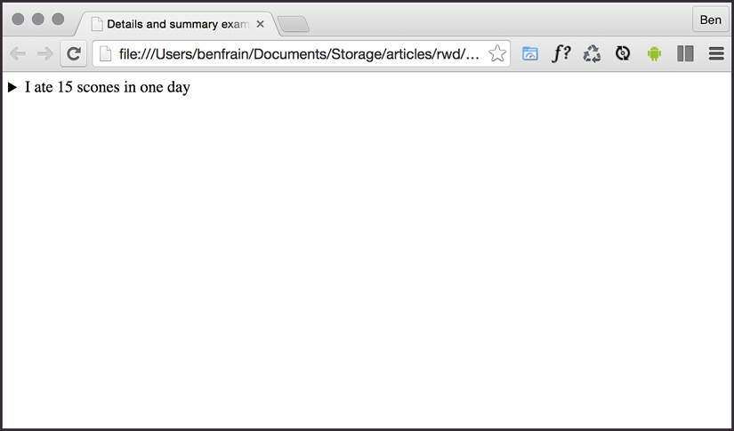
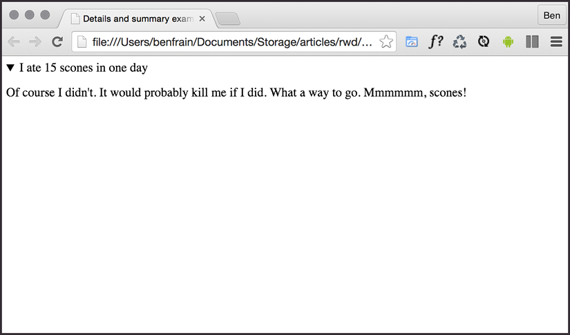

Writing HTML Markup - Part 1
============================


HTML stands for *HyperText Markup Language*. It is a language that
allows content to be marked up in a manner that makes it more
understandable to technology, and then, in turn, humans. You can have
content on the web without CSS or without JavaScript. But you can't have
human-friendly content without HTML.


The topics we will cover in this lab are:

-   Starting HTML pages correctly
-   Possible economies from using HTML that you should avoid
-   Sectioning, grouping, and text-level HTML elements
-   Putting HTML elements to use


HTML also provides specific tools for handling forms and user input.
This set of features takes much of the burden away from more
resource-heavy scripting for form validation. However, we're going to
look at HTML forms separately in *Lab 13*, *Forms*.

Lab Solution
-------------

Lab solution for this lab is available in `Lab02` folder.


The basic structure of an HTML page looks like this:


``` {.language-markup}
<!DOCTYPE html>
<html lang="en">
    <head>
        <meta charset="utf-8" />
        <title>Web Page Structure</title>
    </head>
    <body></body>
</html>
```


Although we are about to start our understanding of HTML by covering the
head section, which is the content between the opening
`<head>` and closing `</head>` tags, be aware
that the lion's share of HTML authoring is done in the body section.


Getting the start of HTML pages right
=====================================


Let's consider the opening elements of an HTML page and ensure we fully
understand all the essential component parts.

Like so many things with the web, remembering the
exact syntax of each thing inside the `head` section is not
particularly important. Understanding what each thing is for, is. I
generally copy and paste the opening code each time, or have it saved in
a text snippet, and I would recommend you do too. The first few lines in
an HTML page should look something like this:


``` {.language-markup}
<!DOCTYPE html>
<html lang="en">
    <head>
        <meta charset="utf-8" />
```


Want a shortcut to great HTML5 code? Consider the
HTML5 Boilerplate
([[https://html5boilerplate.com]](https://html5boilerplate.com/)).
It's a pre-made "best practice" HTML5 file. You can also custom-build
the template to match your specific needs.


Despite HTML5's looser syntax, it's always worth checking whether your
markup is valid. Checking that markup validates catches basic human
errors like missing or mismatched tags, missing `alt`
attributes on images, incorrectly nested elements,
and so on. The W3C validator was created for just this reason:
[[https://validator.w3.org/]](https://validator.w3.org/).


All hail the mighty \<a\> element
=================================

A welcome benefit of HTML5 is that we can wrap multiple elements in an
`a` tag. In prior versions of HTML, if you wanted your
markup to validate, it was necessary to wrap each element in its own
`a` tag. For example, look at the following code:


``` {.language-markup}
<h2><a href="index.html">The home page</a></h2>
<p><a href="index.html">This paragraph also links to the home page</a></p>
<a href="index.html">
    
</a>
```


Nowadays, we can ditch all the individual
`a` tags and instead wrap the group, as demonstrated in the
following code:


``` {.language-markup}
<a href="index.html">
    <h2>The home page</h2>
    <p>This paragraph also links to the home page</p>
    
</a>
```


The only limitations to keep in mind with `a` tags are
that, understandably, you can't wrap one `a` tag within
another `a` tag or other interactive element (such as a
`button`) and you can't wrap a `form` in an
`a` tag either.

That's not to say you can't physically do it; I doubt your text editor
is going to start a fight with you about it, but don't be surprised if
things don't work as expected in the browser if you do!


The HTML5 outline algorithm
---------------------------

Ordinarily, for an HTML document, headings would begin with an
`h1` for the main page title and then
progress to using lower hierarchy title tags as needed for sub-headings
and the like.

However, HTML5 introduced the ability for each
sectioning container to have its own self-contained outline. That means
it is not necessary to think about which level of heading tag you're at
in terms of the entire document. You could just concentrate on the
sectioning container you were currently working in. To illustrate why
this might be preferable, within a blog, post titles could be set to use
`h1` tags, while the title of the blog itself could also
have an `h1` tag. For example, consider the following
structure:


``` {.language-markup}
<h1>Ben's site</h1>
<section>
    <h1>Ben's blog</h1>
    <p>All about what I do</p>
</section>
<article>
    <header>
        <h1>A post about something</h1>
        <p>Trust me this is a great read</p>
        <p>No, not really</p>
        <p>See. Told you.</p>
    </header>
</article>
```


Despite having multiple `h1` headings, the outline still
appears as follows:

**1.** Ben's site

1.  Ben's blog
2.  A post about something

As such, theoretically, you shouldn't need to keep track of the heading
tag you need to use in terms of the whole document. It should be
possible to use whatever appropriate level of
heading tag is needed within each piece of
sectioned content and the HTML5 outline algorithm
will order it accordingly.

You can test the outline of your documents using
HTML5 outliners at one of the following URLs:

-   [[https://gsnedders.html5.org/outliner/]](https://gsnedders.html5.org/outliner/)
-   [[https://hoyois.github.io/html5outliner/]](https://hoyois.github.io/html5outliner/)

However, the reality is that search engines and the like make no use of
the HTML5 outliner at present. Therefore, from a pragmatic viewpoint, it
probably makes more sense to continue thinking about headings in terms
of the whole document. That will make your documents easier to read for
search engines and also aid assistive technology to infer the correct
meaning.

A note on h1-h6 and the \<hgroup\> element
------------------------------------------

Be aware that using `h1`-`h6` tags to mark up
groups of headings and their associated sub-headings/taglines is
discouraged. I'm talking about this kind of thing:


``` {.language-markup}
<h1>Scones:</h1>
<h2>The most resplendent of snacks</h2>
```


Instead, try and reserve `h1`-`h6` elements
for when sections of content require a distinct heading.

So, how should we author such content? It is recommended to group it in
an `hgroup` element like this:


``` {.language-markup}
<hgroup>
    <h1>Scones:</h1>
    <p>The most resplendent of snacks</p>
</hgroup>
```


You should use an `hgroup` element with a
`h1`-`h6` tag inside, along with any number of
`p` tags before or after.


The \<blockquote\> element
--------------------------

A blockquote is used to mark up text that is quoted from somewhere else.
You don't have to wrap the text inside with
any other element, but you can. For example,
knowing what we now do about the `p` tag, we can use that
inside a `blockquote`, too, if we wish. Here is a simple
example using `blockquote`. First, an introductory section
of text in a `p` tag, and then a blockquote:


``` {.language-markup}
<p>I did like Fenago's book, but he kept going on about Scones. For example:</p>
<blockquote>
    All this writing about scones in our sample page and there's no image
    of the beauties! I'm going to add in an image of a scone near the top
    of the page; a sort of 'hero' image to entice users to read the page.
</blockquote>
```


The \<figure\> and \<figcaption\> elements
------------------------------------------

The HTML specification relates that the `figure` element:

*...can thus be used to annotate illustrations, diagrams, photos, code
listings, etc.*

So, we use it as an element to call out visuals of
any sort and the accompanying
`figcaption` provides the means to add some text supporting
the visuals. Now, it is worth pointing out here that while we
should always provide text
in the `alt` attribute of an `img` tag to
support assistive technology or to mitigate problems if an image fails
to load, it isn't a requirement to provide a `figcaption`
with a `figure`. The `figcaption` is added if
you want to add a visual description alongside the visuals. Here's how
we could use it to revise a portion of markup from the first lab:


``` {.language-markup}
<figure class="MoneyShot">
    
    <figcaption class="ImageCaption">
        This image isn't of scones I have made, instead it's a stock photo
        from Wikipedia
    </figcaption>
</figure>
```


You can see that the `figure` element
is used to wrap this little self-contained block.
Inside, the `figcaption` is used to provide a caption for
the parent `figure` element. It's perfect when
images or code need a little caption alongside
(that wouldn't be suitable in the main text of the
content).


\<details\> and \<summary\> elements
------------------------------------

How many times have you wanted
to create a simple open and close "widget" on your
page? A piece of summary text that, when clicked, opens a
panel with additional information.

Modern HTML facilitates this pattern with the
`details` and `summary` elements. Consider
this markup (you can open `example_02-03.html` from this
lab's code to play with it for yourself):


``` {.language-markup}
<details>
    <summary>I ate 15 scones in one day</summary>
    <p>
        Of course I didn't. It would probably kill me if I did. What a way
        to go. Mmmmmm, scones!
    </p>
</details>
```


Opening this in Chrome, with no added styling, shows only the summary
text by default:



Figure 2.1: details and summary attempt to solve a common problem but
their implementation is limited

Clicking anywhere on the `summary`
text opens the panel. Clicking it again toggles it
shut. If you want the panel open by default, you
can add the `open` attribute to the
`details` element:


``` {.language-markup}
<details open>
    <summary>I ate 15 scones in one day</summary>
    <p>
        Of course I didn't. It would probably kill me if I did. What a way
        to go. Mmmmmm, scones!
    </p>
</details>
```




Figure 2.2: By adding the open attribute, the content is shown by default


HTML text-level semantics
=========================


Before HTML5, text-level semantic elements were
referred to in the specifications as `inline` elements.
Therefore, if you are familiar with that description, be aware that we
are talking about the same thing here.

Let's take a look at the most common and useful text-level elements.

The \<span\> element
--------------------

A `span` element is the text-level
equivalent of a `div`. It is
unopinionated and is the perfect element to reach for when you merely
want to wrap text in an element for styling purposes.

The \<b\> element
-----------------

You should also be aware that because it was historically used to bold
text, you'll typically have to reset the font weight in CSS if you want
content within a `b` tag to not appear bold.

For example:


``` {.language-markup}
b {
    font-weight: normal;
}
```


The \<strong\> element
----------------------

If you do want to emphasize something for
strength, urgency, or importance,
`strong` is the element for you. Here is how the
specification defines these use cases:

*Importance: The strong element can be used in a heading, caption, or
paragraph to distinguish the part that really matters from other parts
that might be more detailed, more jovial, or merely boilerplate.
Seriousness: The strong element can be used to mark up a warning or
caution notice. Urgency: The strong element can be used to denote
content that the user needs to see sooner than other parts of the
document.*


The \<i\> element
-----------------

The HTML5 specification describes the
`i` as:

*A span of text in an alternate voice or mood, or otherwise offset from
the normal prose in a manner indicating a different quality of text.*

Suffice to say, it's not to be used to merely
italicize something. For example, we could use it to mark up the odd
name in this line of text:


``` {.language-markup}
<p>
    However, discussion on the frameset element is now frustraneous as
    it's now gone the way of the <i>Raphus cucullatus</i>.
</p>
```


Or, perhaps if you were marking up a button in a
food ordering web application, you might do this:


``` {.language-markup}
<button type="button">French Fries <i>No Salt Added</i></button>
```


Putting HTML elements to use
============================


It's time to practice using some of the elements
we have just looked at. Let's revisit the example from *Lab 1*. If
we compare the markup below to the original markup in *Lab 1*, you
can see where the new elements we've looked at have been employed below:


``` {.language-markup}
<article>
    <header class="Header">
        <a href="/" class="LogoWrapper"
            ></a>
        <h1 class="Strap">Scones: the most resplendent of snacks</h1>
    </header>
    <section class="IntroWrapper">
        <p class="IntroText">
            Occasionally maligned and misunderstood; the scone is a
            quintessentially British classic.
        </p>
        <figure class="MoneyShot">
            
            <figcaption class="ImageCaption">
                Incredible scones, picture from Wikipedia
            </figcaption>
        </figure>
    </section>
    <p>Recipe and serving suggestions follow.</p>
    <section class="Ingredients">
        <h3 class="SubHeader">Ingredients</h3>
    </section>
    <section class="HowToMake"><h3 class="SubHeader">Method</h3></section>
    <footer>
        Made for the course,
        <a href="https://github.com/fenago/html-css-javascript-jquery-course">
            'Web Design with HTML5 and CSS3'
        </a>
        by
        <address><a href="https://google.com">Femago</a></address>
    </footer>
</article>
```


We have removed a good portion of the inner content so we can concentrate
on the structure. Hopefully you will agree that it's easy to discern
different sections of markup from one another. However, at this point,
I'd also like to offer some pragmatic advice; it isn't the end of the
world if you don't always pick the correct element for every single
given situation.

For example, whether or not I used a `section` or
`div` in the above example is of little real consequence.

If we use an `em` when we should actually be using an
`i`, I certainly don't feel it's a
crime against humanity; the folks at the W3C won't
hunt you down and feather and tar you for making the wrong choice. Just
apply a little common sense. That said, if you can use elements like the
`header` and `footer` when relevant, there are
inherent accessibility benefits in doing so. I certainly think it's
better than using nothing but divs in your markup!

