Fluid Layout and Flexbox
========================


In this lab, we will:

-   Learn how to convert fixed pixel layouts into proportional sizes
-   Recognize Flexbox as a practical path beyond these limitations
-   Understand the Flexible Box Layout Module and the benefits it offers

Let's crack on with our first task: converting fixed designs into fluid
relationships. This is a task that you'll need to perform constantly
when building responsive web designs.


Converting a fixed pixel design into a fluid proportional layout
================================================================


Graphic composites, or **comps**, as
they are often called, exported from a program
such as Photoshop, Illustrator, Figma, or Sketch all have fixed
pixel dimensions. At some point, the designs need
to be converted into proportional dimensions when recreating the design
as a fluid layout for the browser.


`target / context = result`

Put another way, divide the units of the thing you want by the thing it
lives in. Let's put that into practice. Understanding it will enable you
to convert any fixed dimension layouts into responsive/fluid
equivalents.

Consider a very basic page layout intended for desktop. In an ideal
world, we would always be moving to a desktop layout from a smaller
screen layout; however, for the sake of illustrating the proportions, we
will look at the two situations back to front.

Here's an image of the layout:

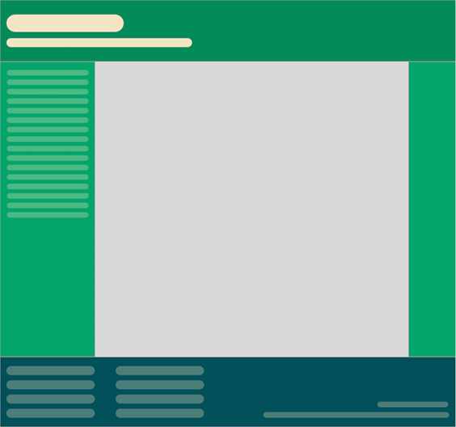

Figure 4.1: A basic "desktop" layout

The layout is 960 px wide. Both the header and
footer are the full widths of the layout. The left-hand area is 200 px
wide, and the right-hand area is 100 px wide. That
leaves 660 px for the main content area. Our job is to convert this
fixed-width design into a fluid layout that retains its proportions as
it is resized. For our first task, we need to convert the middle and
side sections into proportional dimensions.

We will begin by converting the left-hand side. The left-hand side is
200 units wide. This value is our target value. We will divide that
target size by 960 units, our context, and we have a result: .208333333.
Now, whenever we get our result with this formula, we need to shift the
decimal point two points to the right. This gives us a value that is the
target value described as a percentage of its parent. In this case, the
left-hand section is 20.8333333% of its parent.

Let's practice the formula again on the middle section. Our target value
is 660. Divide that by our context of 960 and we get .6875. Move the
decimal two points to the right and we have 68.75%.

Finally, let's look at the right-hand section.
Our target is 100. We divide that by the context
of 960 and we get .104166667. Move the decimal point and we have a value
of 10.4166667%.

That's as difficult as it gets. Say it with me: target, divided by
context, equals result.


You can use values with long decimal values with no issues in CSS. Or,
if you would rather see more palatable numbers in your code, rounding
them to two decimal points will work just as well for the browser.


To prove the point, let's quickly build that basic layout as blocks in
the browser. To make it easier to follow along, I have added a class to
the various elements that describes which piece of the **comp** they are
referring to. Ordinarily, it's not a good idea to name things based on
their location. The location can change, especially with a responsive
design. In short, do as I say and not as I do here!

You can view the layout as `example_04-01`. Here is the
HTML:


``` {.language-markup}
<div class="Wrap">
    <header class="Header"></header>
    <div class="WrapMiddle">
        <aside class="Left"></aside>
        <main class="Middle"></main>
        <aside class="Right"></aside>
    </div>
    <footer class="Footer"></footer>
</div>
```


And here is the CSS:


``` {.language-markup}
html,
body {
    margin: 0;
    padding: 0;
}
.Wrap {
    max-width: 1400px;
    margin: 0 auto;
}
.Header {
    width: 100%;
    height: 130px;
    background-color: #038c5a;
}
.WrapMiddle {
    width: 100%;
    font-size: 0;
}
.Left {
    height: 625px;
    width: 20.83%;
    background-color: #03a66a;
    display: inline-block;
}
.Middle {
    height: 625px;
    width: 68.75%;
    background-color: #bbbf90;
    display: inline-block;
}
.Right {
    height: 625px;
    width: 10.41%;
    background-color: #03a66a;
    display: inline-block;
}
.Footer {
    height: 200px;
    width: 100%;
    background-color: #025059;
}
```


If you open the example code in a
browser and resize the page, you will see that the
dimensions of the `.Left`, `.Middle`, and
`.Right` sections remain proportional to one another. You
can also play around with the `max-width` of the
`.Wrap` values to make the bounding dimensions for the
layout bigger or smaller (in the example, it's set to 1400 px).

Now, let's consider how we would have the same content on a smaller
screen that flexes to a point and then changes to the layout we have
already seen. You can view the final code of this layout in
`example_04-02`.

The idea is that, for smaller screens, we will
have a single "tube" of content. The left-hand area will only
be viewable as an "off-canvas" area---typically,
an area for a menu or similar, which sits off the viewable screen area
and slides in when a menu button is pressed. The main content sits below
the header, then the right-hand section below that, and finally the
footer area. In our example, we can expose the left-hand menu area by
clicking anywhere on the header. Typically, when making this kind of
design pattern for real, a menu button would be used to activate the
side menu.

As you would expect, when combining this with our newly mastered media
query skills, we can adjust the viewport and the design just
"responds"---effortlessly moving from one layout to another and
stretching between the two. I'm not going to list all the CSS properties
here; it's all in `example_04-02`. However, here's an
example---the left-hand section:


``` {.language-markup}
.Left {
    height: 625px;
    background-color: #03a66a;
    display: inline-block;
    position: absolute;
    left: -200px;
    width: 200px;
    font-size: 0.9rem;
    transition: transform 0.3s;
}
@media (min-width: 40rem) {
    .Left {
        width: 20.83%;
        left: 0;
        position: relative;
    }
}
```


You can see that, up first, without a media query, is the small screen
layout. Then, at larger screen sizes, the width becomes proportional,
the positioning relative, and the left value is set to zero.

We don't need to rewrite properties such as `height`,
`display`, or `background-color` as we aren't
changing them.

This seems as good a point as any to talk about
Flexbox---a layout system designed with fluid layouts in mind.


Getting Flexy
-------------

Flexbox has four key characteristics: direction, alignment, ordering,
and flexibility. We'll cover all of these
characteristics and how they relate to each other
by way of a few examples.

The examples are deliberately simplistic; we are just moving some boxes
and their content around so that we can understand the principles of how
Flexbox works.

### Perfect vertically centered text

Note that this first Flexbox example is
`example_04-03`:

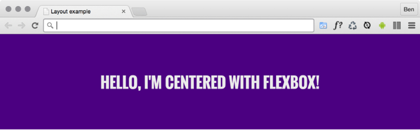

Figure 4.2: Centering is simple with Flexbox

Here's the markup:


``` {.language-markup}
<div class="CenterMe">Hello, I'm centered with Flexbox!</div>
```


Here is the entire CSS rule that's styling that markup:


``` {.language-markup}
.CenterMe {
    background-color: indigo;
    color: #ebebeb;
    font-family: "Oswald", sans-serif;
    font-size: 2rem;
    text-transform: uppercase;
    height: 200px;
    display: flex;
    align-items: center;
    justify-content: center;
}
```


The majority of the property/value pairs in that
rule are merely setting the colors and font sizes. The three properties
we are interested in are:


``` {.language-markup}
.CenterMe {
    /* other declarations */
    display: flex;
    align-items: center;
    justify-content: center;
}
```


If you have not used Flexbox or any of the properties in the related Box
Alignment specification
([[https://www.w3.org/TR/css-align-3/]](https://www.w3.org/TR/css-align-3/)),
these properties probably seem a little alien. Let's consider what each
one does:

-   `display: flex`: This is the bread and butter of
    Flexbox. This merely sets the item to be a Flexbox, as opposed to a
    block or inline-block.
-   `align-items`: This aligns the items within a Flexbox
    in the cross axis, vertically centering the text in our example.
-   `justify-content`: This sets the main axis, centering
    the content. With a Flexbox row, you can think of it as the button
    in a word processor that sets the text to the left, right, or center
    (although there are additional `justify-content` values
    that we will look at shortly).


Flexbox has an even more convenient way of positioning items and that's
with `place-items`. This provides a shorthand for setting
align and justify items. As you become familiar with the alignment
properties in this lab, you can try setting them at once with
`place-items`. The first value is for the align value, and
the second is for the justify value. If you just pass one value, it gets
used for both. So to center both, it is just
`place-items: center`.


OK, before we get further into the properties of
Flexbox, we will consider a few more examples.


In some of these examples, I'm making use of the Google-hosted font
"Oswald," with a fallback to a sans serif font. In *Lab 6*, *CSS
Selectors, Typography, and More*, we will look at how we can use the
`@font-face` rule to link to custom font files.


### Offset items

How about a simple list of navigation items, but
with one offset to one side?

Here's what it looks like:

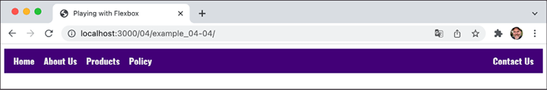

Figure 4.3: Flexbox makes it simple to offset one link in a list

You can play about with this in the `example_04-04` code.
Here's the markup:


``` {.language-markup}
<div class="container">
    <a href="#" class="item">Home</a>
    <a href="#" class="item">About Us</a>
    <a href="#" class="item">Products</a>
    <a href="#" class="item">Policy</a>
    <a href="#" class="last-item">Contact Us</a>
</div>
```


And here is the CSS:


``` {.language-markup}
.container {
    background-color: indigo;
    font-family: "Oswald", sans-serif;
    font-size: 1rem;
    min-height: 2.75rem;
    display: flex;
    align-items: center;
    padding: 0 1rem;
}
.item,
.last-item {
    color: #ebebeb;
    text-decoration: none;
}
.item {
    margin-right: 1rem;
}
.last-item {
    margin-left: auto;
}
```


When you set `display: flex;` on a
wrapping element, the children of that element become flex items, which
then get laid out using the flex layout model. The magical property here
is `margin-left: auto;`, which makes that item use all of
the available margin on that side.

### Reverse the order of items

Want to reverse the order of the items?

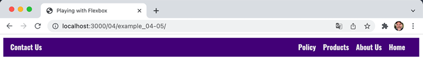

Figure 4.4: Reversing the visual order with Flexbox

It's as easy as adding `flex-direction: row-reverse;` to
the wrapping element and changing `margin-left: auto;` to
`margin-right: auto;` on the offset item:


``` {.language-markup}
.container {
    background-color: indigo;
    font-family: "Oswald", sans-serif;
    font-size: 1rem;
    min-height: 2.75rem;
    display: flex;
    flex-direction: row-reverse;
    align-items: center;
    padding: 0 1rem;
}
.item,
.last-item {
    color: #ebebeb;
    text-decoration: none;
}
.item {
    margin-right: 1rem;
}
.last-item {
    margin-right: auto;
}
```


You can find that as `example_04-05`.


Be aware that when using the `reverse`-based properties,
you are only changing the order in presentation. This won't change the
order of the content for people using a screen reader, for example. If
the order of the items is essential to the understanding of the content,
ensure you make the changes in the DOM to benefit all users.


### How about if we want them laid out vertically instead?

Simple. Change to `flex-direction: column;` on
the wrapping element and remove the auto margin:

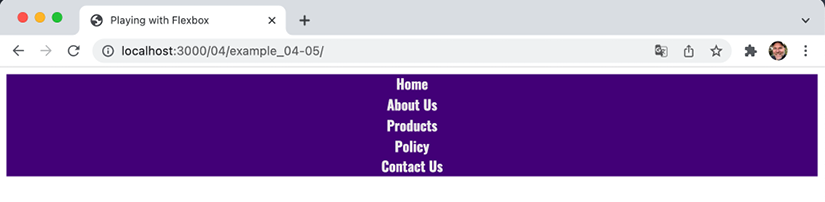

Figure 4.5: Items laid out vertically instead

Here's the code for it:


``` {.language-markup}
.container {
    background-color: indigo;
    font-family: "Oswald", sans-serif;
    font-size: 1rem;
    min-height: 2.75rem;
    display: flex;
    flex-direction: column;
    align-items: center;
    padding: 0 1rem;
}
.item,
.last-item {
    color: #ebebeb;
    text-decoration: none;
}
```


### Column reverse

Want them stacked in the opposite direction? Just
change to `flex-direction: column-reverse;` and you're
done.


There is a `flex-flow` property that is shorthand for
setting `flex-direction` and `flex-wrap` in
one go. For example, `flex-flow: row wrap;` would set the
direction to a row and set the wrapping on. However, at least initially,
I find it easier to specify the two settings separately.


Inline-flex
===========


Flexbox has an inline variant:
`display: inline-flex;`. Thanks to its beautiful centering
abilities, you can do some wacky things with very little effort:

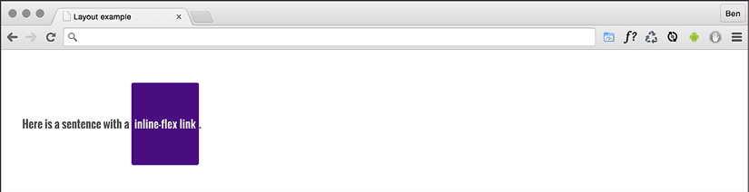

Figure 4.6: The inline equivalent of flex is the aptly named
"inline-flex"

Here's the markup:


``` {.language-markup}
<p>
    Here is a sentence with an
    <em class="InlineFlex">inline-flex</em>.
</p>
```


And, using the same basic styles as the previous examples for the fonts,
font sizes, and colors, here is the CSS needed:


``` {.language-markup}
.InlineFlex {
    display: inline-flex;
    align-items: center;
    height: 120px;
    padding: 0 4px;
    background-color: indigo;
    text-decoration: none;
    border-radius: 3px;
    color: #ddd;
}
```


When items are set as `inline-flex` anonymously, which
happens if their parent element is not set to
`display: flex`, then they retain whitespace (which can
often manifest as an unwanted gap between elements), just like
`inline-block` or `inline-table` do. However,
if they are within a flex container, then whitespace is removed. Of
course, you don't always have to center items
within a Flexbox. There are a number of different options. Let's look at
those now.


Flexbox alignment properties
============================


If you want to play along with this example, start
with `example_04-06s`.

The important thing to understand with Flexbox
alignment is the concept of the axis. There are
two axes to consider, the **main axis** and the **cross axis**. What
each of these represents depends on the direction
the Flexbox is set to. For example, if the direction of your Flexbox is
set to row, the main axis will be the horizontal axis and the cross axis
will be the vertical axis.

Conversely, if your Flexbox direction is set to column, the main axis
will be the vertical axis and the cross axis will be the horizontal
axis. The specification
([[https://www.w3.org/TR/css-flexbox-1/\#box-model]](https://www.w3.org/TR/css-flexbox-1/#box-model))
provides the following illustration to aid authors:

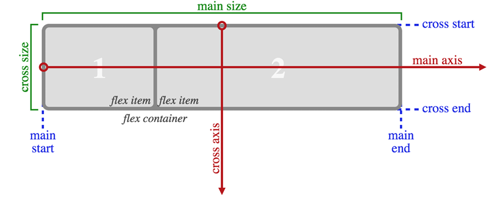

Figure 4.7: This image from the specification shows that the main axis
always relates to the direction the flex container is heading

Here's the basic markup of our example you'll need to add into the
example file:


``` {.language-markup}
<div class="container">
    <div class="item one">Item One</div>
</div>
```


Let's set a few basic Flexbox-related styles:


``` {.language-markup}
.container {
    background-color: indigo;
    display: flex;
    height: 200px;
    width: 400px;
}
.item {
    background-color: #34005b;
    display: flex;
    height: 100px;
    width: 200px;
}
```


In the browser, that produces this:

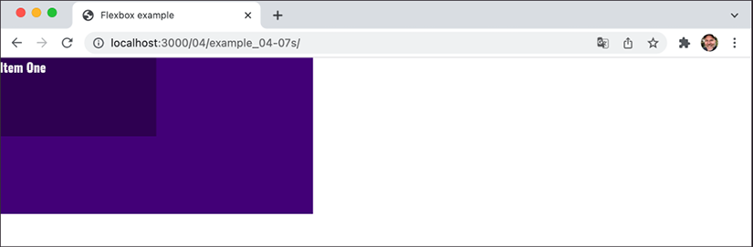

Figure 4.8: With no alignment set, child elements default to the top
left

Right, let's test drive the effects of some of these properties.

align-items
-----------

The `align-items` property positions
items in the cross axis. Let's apply this property to our wrapping
element, like so:


``` {.language-markup}
.container {
    background-color: indigo;
    display: flex;
    height: 200px;
    width: 400px;
    align-items: center;
}
```


As you would imagine, the item within that box gets centered vertically:

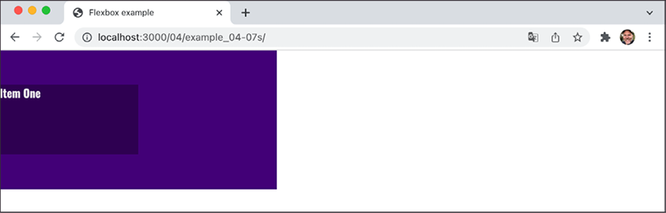

Figure 4.9: A one-liner provides cross-axis centering

The same effect would be applied to any number of children within.

align-self
----------

Sometimes, you may want to pull just one item into
a different alignment. Individual flex items can use the
`align-self` property to align themselves.

At this point, let's *remove the previous alignment properties* in the
CSS and also add another two `div` elements to the markup,
both also with a class of `item`. In the middle one of
these three items, we will add an additional class of
`AlignSelf`. We'll use that class in the CSS to add the
`align-self` property. So here's the HTML:


``` {.language-markup}
<div class="container">
    <div class="item">Item One</div>
    <div class="item AlignSelf">Item Two</div>
    <div class="item">Item Three</div>
</div>
```


And here is the CSS for that one item we want to move:


``` {.language-markup}
.AlignSelf {
    align-self: flex-end;
}
```


Here is the effect in the browser:

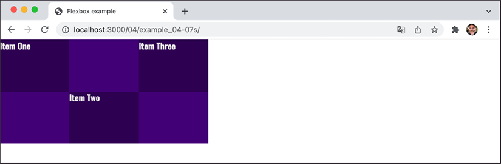

Figure 4.10: Individual items can be aligned in a different manner

Wow! Flexbox really makes these kinds of changes trivial. In the
example, the value of `align-self` was set to
`flex-end`. Let's consider the possible values we could use
on the cross axis before looking at alignment in the main axis.

Possible alignment values
-------------------------

For cross-axis alignment, Flexbox has the
following possible values:

-   `flex-start`: Setting an element to
    `flex-start` makes it begin at the "starting" edge of
    its flex container.
-   `flex-end`: Setting to `flex-end` aligns
    the element at the end of the flex container.
-   `center`: This puts it in the middle of the flex
    container.
-   `baseline`: This sets all the flex items in the
    container so that their baselines align.
-   `stretch`: This makes the items stretch to the size of
    their flex container (in the cross axis).

There are some particulars inherent to using these properties, so if
something isn't playing happily, always refer to the specification for
any edge case scenarios:
[[https://www.w3.org/TR/css-flexbox-1/\#align-items-property]](https://www.w3.org/TR/css-flexbox-1/#align-items-property).

### justify-content

Alignment in the main axis is controlled with
`justify-content`. Possible values for
`justify-content` are:

-   `flex-start`
-   `flex-end`
-   `center`
-   `space-between`
-   `space-around`
-   `space-evenly`

The first three do exactly what you would now expect. However, let's
take a look at what the last three do. Consider this markup:


``` {.language-markup}
<div class="container">
    <div class="item">Item One</div>
    <div class="item">Item Two</div>
    <div class="item">Item Three</div>
</div>
```


And then consider the following CSS. We are setting the three
`div` elements with a class of `item` to each
be 25% width, wrapped by a flex container, with a class of
`container`, set to be 100% width:


``` {.language-markup}
.container {
    background-color: indigo;
    display: flex;
    justify-content: space-between;
    height: 200px;
    width: 100%;
}
.item {
    background-color: #34005b;
    display: flex;
    height: 100px;
    width: 25%;
}
```


As the three items will only take up 75% of the
available space, `justify-content` explains what we would
like the browser to do with the remaining space. A value of
`space-between` puts an equal amount of space between the
items, and `space-around` puts it around the items. Perhaps
a screenshot, or two, here will help---this is
`space-between`:

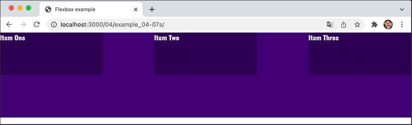

Figure 4.11: Main axis alignment is carried out with the justify-content
property

And here is what happens if we switch to `space-around`:

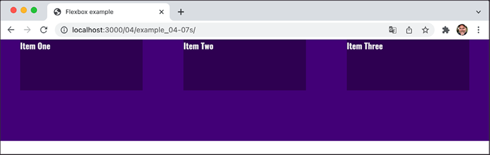

Figure 4.12: Subtly different, but notice the space around, not just
between, items

Finally, let's look at what
`space-evenly` does. This takes the available space and
adds an equal amount to every gap:

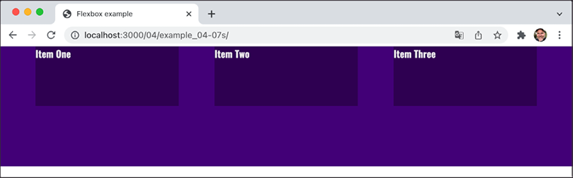

Figure 4.13: An even space between items with space-evenly


The various alignment properties of Flexbox are currently being
specified in CSS Box Alignment Module Level 3. This should give the same
fundamental alignment powers to other display properties, such as
`display: block;` and `display: table`. The
specification is still being worked on, so you can keep checking the
status at
[[https://www.w3.org/TR/css3-align/]](https://www.w3.org/TR/css3-align/).


The flex property
-----------------

We've used the `width` property on
those flex items, but it's also possible and preferable to define the
width, or "flexiness," if you will, with the `flex`
property. To illustrate, consider an example with the same markup as the
last, but with an amended CSS for the items:


``` {.language-markup}
.item {
    background-color: #34005b;
    display: flex;
    height: 100px;
    flex: 1;
    border: 1px solid #ebebeb;
}
```


And here is what we get in the browser:

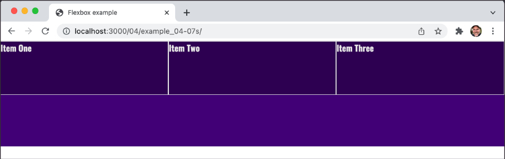

Figure 4.14: Our first foray into using the flex shorthand

Those three items have gobbled up all the space. So what's going on?

The `flex` property is actually a shorthand way of
specifying three separate properties: `flex-grow`,
`flex-shrink`, and `flex-basis`. The
specification covers these individual properties in more detail here:
[[https://www.w3.org/TR/css-flexbox-1/\#flex-components]](https://www.w3.org/TR/css-flexbox-1/#flex-components).
However, the specification recommends that authors use the
`flex` shorthand property, so that's what we will be
learning here, capiche?

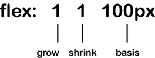

Figure 4.15: Understanding the three possible values of the flex
property

For items within a flex container, if a
`flex` property is present, it is used to size the item
rather than a `width` or `height` value (if
also present). Even if the `width` or `height`
value is specified after the `flex` property, it will still
have no effect.


However, it is important to note that if the item you are adding the
`flex` property to is not a flex item, the
`flex` property will have no effect.


Now, let's look at what each of these flex properties actually does:

-   `flex-grow` is the first value you can pass to
    `flex`. It is the amount, in relation to the other flex
    items, that the flex item can grow when free space is available.
-   `flex-shrink` is the second value you can pass. It is
    the amount the flex item can shrink, in relation to the other flex
    items, when there is not enough space available.
-   `flex-basis` is the final value you can pass to
    `flex`. It is the basis size the flex item is sized to.
    If you don't set an item to shrink, you can use
    `flex-basis` like a `min-width`.

Although it's possible to just write `flex: 1` and have
that interpreted to mean `flex: 1 1 0`, I recommend writing
all the values into a `flex` shorthand property yourself. I
think it's clearer to understand what you intend to happen that way.

For example, `flex: 1 1 auto` means that the item will grow
into one part of the available space. It will also shrink one part when
space is lacking, and the basis size for the flexing is the intrinsic
width of the content, that is, the size the content would be if
`flex` wasn't involved.

Let's try another: `flex: 0 0 50px` means this item will
neither grow nor shrink, and its basis is 50 px (so it will be 50 px
regardless of any free space).

What about `flex: 2 0 50%`? That's
going to take two "lots" of available space, it
won't shrink, and its basis size is 50%. What do you think will happen
if you have three items all set to that width in a fixed-width
container? Well, let's think this through. Our shorthand has the
`flex-basis` set to 50%, so each item is going to start out
at 50% of the container. And as there are three of them, one is going to
overflow. Now, we don't have any `flex-shrink` set, so none
of them are going to get any smaller. And although we have
`flex-grow` set to `2`, there is no room to
grow, so we get this:

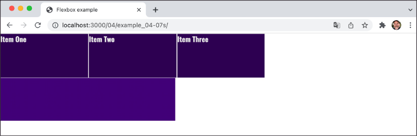

Figure 4.16: If items don't fit, like anything else they overflow, wrap,
or scroll if you set them to do so

Hopefully, these brief examples have demystified the `flex`
property a little, and this incredibly powerful property is starting to
make a little sense. If you take a look at
`example_04-06e`, the first item is set to
`flex: 1.5 0 auto;`. Hopefully, you can imagine what that
will look like before opening it in the browser to find out.


Simple sticky footer
--------------------

Suppose you want a footer to sit at the bottom of the viewport when
there is not enough content to push it there. Historically, this
has been a pain to achieve, but with Flexbox it's
simple. Consider this markup, which is `example_04-07`:


``` {.language-markup}
<body>
    <main>
        Here is a bunch of text but not enough to push the footer to the
        bottom of the page.
    </main>
    <footer>
        I'd like this to be at the bottom and thanks to Flexbox I can be
        put in my place!
    </footer>
</body>
```


And here's the CSS:


``` {.language-markup}
html,
body {
    margin: 0;
    padding: 0;
    font-family: "Oswald", sans-serif;
    color: #ebebeb;
}
html {
    height: 100%;
}
body {
    background-color: #ebebeb;
    display: flex;
    flex-direction: column;
    min-height: 100%;
}
main {
    flex: 1 0 auto;
    color: #333;
    padding: 0600rem;
}
footer {
    background-color: violet;
    color: #fff;
    padding: 1.5rem;
}
```


Take a look at that in the browser, and test it by adding more content
into `main`. You'll see that when there is not enough
content, the `footer` is stuck to the bottom of the
viewport. When there is enough, it sits below the content.

This works because our `flex`
property is set to grow where space is available. As our
`body` is a flex container of 100% minimum height, the main
content can grow into all of that available space. Beautiful!


Changing the source order
=========================


Flexbox has the ability to re-order items. Prior
to Flexbox, if you wanted to have something that came after something
else in the DOM appear before it instead, you were in for a rough time.
However, Flexbox makes such work trivial. Let's have a look at how it
works.

Consider this markup, which you can build along with in
`example_04-08`:


``` {.language-markup}
<div class="container">
    <header class="item">Header</header>
    <aside class="item">Side one</aside>
    <main class="item">Content</main>
    <aside class="item aside-two">Side Two</aside>
    <footer class="item">Footer</footer>
</div>
```


We will add some simple colors to more easily differentiate the
sections, and stack them one under another in the same order they appear
in the markup:


``` {.language-markup}
.container {
    background-color: indigo;
    display: flex;
    flex-direction: column;
}
.item {
    display: flex;
    align-items: center;
    min-height: 6.25rem;
    padding: 1rem;
}
header {
    background-color: #105b63;
}
main {
    background-color: #fffad5;
}
aside {
    background-color: #ffd34e;
}
aside.aside-two {
    background-color: #db9e36;
}
footer {
    background-color: #bd4932;
}
```


That renders in the browser like this:

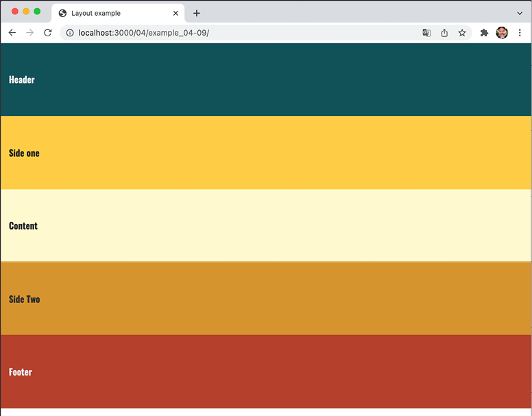

Figure 4.17: Here, our boxes are displayed in source order

Now, suppose we want to switch the order of
`main` to be the first item, visually, without touching the
markup. With Flexbox, it's as simple as adding a single property/value
pair:


``` {.language-markup}
main {
    order: -1;
}
```


The `order` property lets us revise the order of items
within a Flexbox simply and sanely. In this example, a value of
`-1` means that we want it to be before all the others.

If you want to switch items around quite a bit, I'd recommend being a
little more declarative and adding an order number for each item. This
makes things a little easier to understand when you combine them with
media queries.

Let's combine our new source order-changing powers
with some media queries to produce not just a different layout at
different screen widths but different ordering.

Let's suppose we want our main content at the beginning of a document.
Let's amend the content of our earlier example:


``` {.language-markup}
<div class="container">
    <main class="item">Content</main>
    <aside class="item">Side one</aside>
    <aside class="item aside-two">Side Two</aside>
    <header class="item">Header</header>
    <footer class="item">Footer</footer>
</div>
```


First is the page content, then our two sidebar areas, then the header,
and finally the footer. As we'll be using Flexbox, we can structure the
HTML in the order that makes sense for the document, regardless of how
things need to be laid out visually.

After some basic styling for each flex item, for the smallest screens
(outside of any media query), I'll go with the following order:


``` {.language-markup}
header {
    background-color: #105b63;
    order: 1;
}
main {
    background-color: #fffad5;
    color: #333;
    order: 2;
}
aside {
    background-color: #ffd34e;
    color: #222;
    order: 3;
}
aside.aside-two {
    background-color: #db9e36;
    color: #333;
    order: 4;
}
footer {
    background-color: #bd4932;
    order: 5;
}
```


That gives us this in the browser:

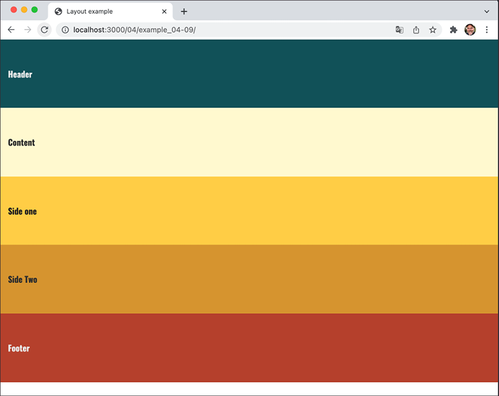

Figure 4.18: We can move the items in visual order with a single
property

And then, at a breakpoint, I'm switching to this:


``` {.language-markup}
@media (min-width: 600px) {
    .container {
        flex-flow: row wrap;
    }
    header {
        flex: 0 0 100%;
    }
    main {
        flex: 1 0 auto;
        order: 3;
    }
    aside {
        flex: 0 0 150px;
        order: 2;
    }
    aside.aside-two {
        flex: 0 0 150px;
        order: 4;
    }
    footer {
        flex: 1 0 100%;
    }
}
```


That gives us this in the browser:

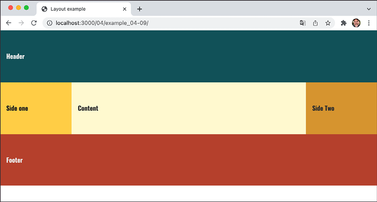

Figure 4.19: With a media query, we can change the visual order again

In that example, the shortcut
`flex-flow: row wrap` has been used.
`flex-flow` is actually a shorthand property of sorts that
lets you set two properties in one: `flex-direction` and
`flex-wrap`.

We've used `flex-direction` already to switch between rows
and columns and to reverse elements. However, we haven't looked at
`flex-wrap` yet.


Wrapping with flex
==================


By default, items in a flex container will shrink
to fit and, if they can't, they will overflow the container. For
example, consider this markup:


``` {.language-markup}
<div class="container">
    <div class="item">Item 1</div>
    <div class="item">Item 2</div>
    <div class="item">Item 3</div>
    <div class="item">Item 4</div>
</div>
```


And this CSS:


``` {.language-markup}
.container {
    display: flex;
    width: 500px;
    background-color: #bbb;
    align-items: center;
    border: 1px solid #111;
}
.item {
    color: #111;
    display: inline-flex;
    align-items: center;
    justify-content: center;
    font-size: 23px;
    flex: 0 0 160px;
    height: 40px;
    border: 1px dashed #545454;
}
```


You may be wondering why the outer container is set with a
`width` and not the `flex` shorthand property
we looked at before. Remember, this is because unless the element is a
flex item (inside a Flexbox itself), `flex` has no effect.


Because there is a width of only 500 px on the
flex container, those four elements don't fit:

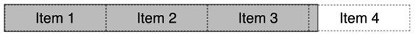

Figure 4.20: By default, Flexbox will always keep child elements from
wrapping


### Wrapping up Flexbox

There are near endless possibilities when using
the Flexbox layout system and, due to its inherent "flex-ability," it's
a perfect match for responsive design. If you've never built anything
with Flexbox before, all the new properties and values can seem a little
odd, and it's sometimes disconcertingly easy to achieve layouts that
have previously taken far more work.


Summary
=======


We've covered a lot of ground in this lab. We started by
understanding how to create fluid layouts that can flex between the
media queries we set. We then spent considerable time getting acquainted
with Flexbox, learning how to solve common layout problems with relative
ease. We learned all about how to easily align content in containers,
how to visually re-order things, and how to define the way we want our
content to grow and shrink within its context.
