Layout with CSS Grid
====================


In this lab, we will learn the following:

-   The essential concepts to understand when dealing with Grid Layout
-   Grid-specific terminology
-   How to set up a Grid
-   How to position items in a Grid
-   How to create powerful responsive patterns with minimal code
-   How to understand and write the `grid` shorthand syntax
-   The latest Grid addition, `subgrid`

Basic Grid syntax
-----------------

In the most simple terms, to use Grid, we need to
tell the browser:

-   How many rows and columns our grid should have
-   How those rows and columns should be sized
-   Where we want to place the items of our grid
-   What should happen when the size of the grid changes or more items
    are added to the grid


Setting up a Grid Layout
========================

Let's start our Grid journey in code with a very simple example. First, the
world's easiest Grid Layout: four numbered boxes.

It will look like this in the browser and you can find it in the lab
code as `example_05-01`:

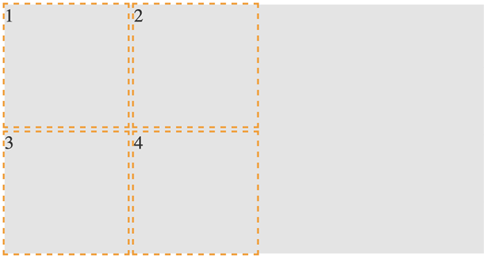

Figure 5.2: Our first grid; as simple as possible

Here is the markup:


``` {.language-markup}
<div class="my-first-grid">
  <div class="grid-item-1">1</div>
  <div class="grid-item-2">2</div>
  <div class="grid-item-3">3</div>
  <div class="grid-item-4">4</div>
</div>
```


The first thing I want you to consider is that with Grid, the markup
pattern is a containing element, which is the grid, and the elements of
the grid are the direct children. Write the markup for grid child
elements in the order that makes the most sense for the content; Grid
can place them visually wherever you need them. Here is the related CSS:


``` {.language-markup}
.my-first-grid {
  display: grid;
  grid-gap: 10px;
  grid-template-rows: 200px 200px;
  grid-template-columns: 200px 200px;
  background-color: #e4e4e4;
}
.grid-item-1 {
  grid-row: 1;
  grid-column: 1;
}
.grid-item-2 {
  grid-row: 1;
  grid-column: 2;
}
.grid-item-3 {
  grid-row: 2;
  grid-column: 1;
}
.grid-item-4 {
  grid-row: 2;
  grid-column: 2;
}
[class^='grid-item'] {
  outline: 3px dashed #f90;
  font-size: 30px;
  color: #333;
}
```


The parts to concentrate on in that CSS are the grid-specific
properties. I've added some outlines and a
background to make it easier to see where the grid
is and the size and shape of the grid items.

We use `display: grid` to set our container as a grid and
then `use grid-template-rows: 200px 200px` to set two rows,
each 200 px high, and `grid-template-columns: 200px 200px`
to set the grid to have two 200 px-wide columns.

In terms of the child elements of the grid, we use
`grid-row` with a number to tell Grid Layout which row to
place the item in and `grid-column` to tell it which column
to place it in.

By default, the child elements of a grid remain as their standard layout
type. Although our grid items belong to our grid, in this example, as
they are all `div` elements, they are still computed as
`display: block`. This is important to understand when we
start trying to align grid items.

Let's use the alignment properties we learned about in the last lab
to try centering our grid items:


``` {.language-markup}
.my-first-grid {
  display: grid;
  grid-gap: 10px;
  grid-template-rows: 200px 200px;
  grid-template-columns: 200px 200px;
  background-color: #e4e4e4;
  align-items: center;
  justify-content: center;
}
```


When I first started with Grid Layout and tried something like this, I
expected to see the numbers perfectly centered in
their respective grid tracks. However, that is not the case:


Figure 5.3: If you don't set a width, a grid will consume the available
space

If we think about what we have done, it does make sense. We made a grid,
with two columns and two rows, each 200 px, and asked for the items to
be both vertically and horizontally centered. Because we have used
`grid` and not `inline-grid`, the grid fills
the entire width of the page, despite the fact that our grid items don't
need all that space.

Let's tweak this so that the grid is only as wide as its content.
Furthermore, let's center the items inside their respective grid items.
To do that, we can make the items themselves either Flexbox or Grid. As
this is a lab about Grid, let's try using that:


``` {.language-markup}
.my-first-grid {
  display: inline-grid;
  grid-gap: 10px;
  grid-template-rows: 200px 200px;
  grid-template-columns: 200px 200px;
  background-color: #e4e4e4;
}
[class^='grid-item'] {
  display: grid;
  align-items: center;
  justify-content: center;
  outline: 3px dashed #f90;
  font-size: 30px;
  color: #333;
}
```


If that selector with the hat symbol doesn't make sense, don't worry. We
cover that in *Lab 6*, *CSS Selectors, Typography, and More*.

We switched our container to be an
`inline-grid`, set all the grid items to
`display: grid`, and used the alignment properties
`justify-content` and `align-items`.

That produces this result:

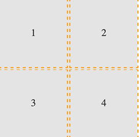

Figure 5.4: By making the child elements flex or grid, we can center
their contents

You can find the code for this at `example_05-02`. As an
exercise, try moving the position of the grid elements to different rows
and columns.

OK, a little progress has been made. Let's move on to the topic of
explicit and implicit item placement.

Explicit and implicit
---------------------

Earlier in the lab, we discussed the difference between an explicit
and implicit grid, an explicit grid being
the structure you define in your CSS when
setting up the grid. When more content is
placed in that grid than you provisioned for, the
implicit grid comes into effect.

Let's look at that again by extending our prior example.

We'll add in another item and see what happens:


``` {.language-markup}
<div class="my-first-grid">
  <div class="grid-item-1">1</div>
  <div class="grid-item-2">2</div>
  <div class="grid-item-3">3</div>
  <div class="grid-item-4">4</div>
  <div class="grid-item-5">5</div>
</div>
```


With that added, this is what we get in the browser:

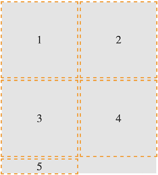

Figure 5.5: The grid has added our item, but not with the kind of
proportions we were hoping for

That's sort of useful; the grid has created implicit grid lines to
create an implicit track for our new item. Now, we didn't tell it what
to do with that extra item, so it made the best guess. However, we can
control how Grid handles items implicitly with the following properties:
`grid-auto-rows` and `grid-auto-columns`.

### grid-auto-rows and grid-auto-columns

Let's use `grid-auto-rows` and
`grid-auto-columns` to make any extra
grid items the same size as the existing ones:


``` {.language-markup}
.my-first-grid {
  display: inline-grid;
  grid-gap: 10px;
  grid-template-rows: 200px 200px;
  grid-template-columns: 200px 200px;
  grid-auto-rows: 200px;
  grid-auto-columns: 200px;
  background-color: #e4e4e4;
}
```


Now, without writing any extra CSS, when additional items are placed in
our grid, they get the 200 px x 200 px sizing we have defined. Here, we
have added another item in the DOM for a total of six:

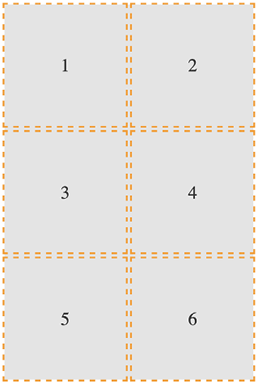

Figure 5.6: With some auto settings, extra elements can be added at a
more preferable size

You can even make patterns so that the first extra
item is one size and the next is another. The
pattern gets repeated:


``` {.language-markup}
.my-first-grid {
  display: inline-grid;
  grid-gap: 10px;
  grid-template-rows: 200px 200px;
  grid-template-columns: 200px 200px;
  grid-auto-rows: 100px 150px;
  grid-auto-columns: 100px 150px;
  background-color: #e4e4e4;
}
```


Here's what it looks like:

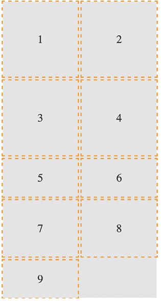

Figure 5.7: You can specify a sizing pattern for any auto-added rows or
columns

Can you see how item 5 onward uses the pattern we defined in the value
of the `grid-auto-rows` property? First, 5 and 6 are 100 px
tall, then 7 and 8 are 150 px, and then back to 100 px for 9.

So far, you can see that the grid items are
flowing vertically down the page. You can easily
switch this to flow across the page instead! You can play about with
this code in `example_05-03`.

### grid-auto-flow

The `grid-auto-flow` property allows you to define the
direction that any implicitly added items flow
inside the grid. Use a value of `column` when you want the
grid to add extra columns to accommodate extra items, and use a value of
`row` when you want the grid to add extra rows.

Let's amend our example by adding `grid-auto-flow: column`
to make the items flow across the page instead of down:

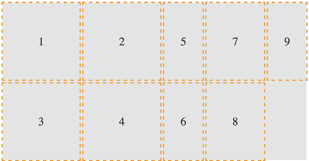

Figure 5.8: Switching the grid to add extra items horizontally

There is an additional `dense` keyword that can be added so
that we have `grid-auto-flow: column dense` or
`grid-auto-flow: row dense` -- we'll look at that shortly.


Placing and sizing Grid Layout items
====================================


So far, each item we have added to a grid has taken up a single grid
area. We are going to start a new example now (you
can find it in the code as `example_05-04`). This grid will
have 20 grid items; these are just random foods and their source
order within their container as a number. However,
there are quite a few new things to go over in the CSS. Before we go
through each new thing step by step, take a look at the code and the
screenshot and see how much of it you can make sense of before reading
on.

It's also worth mentioning that I've purposely mixed up the use of
whitespace in the values. You can write
`grid-row: 6 / span 2` or `grid-row: 6/span 2`
-- either is just as valid. Just pick which you prefer.

Here's the markup:


``` {.language-markup}
<div class="container">
  <div class="grid-item1">1. tofu</div>
  <div class="grid-item2">2. egg plant</div>
  <div class="grid-item3">3. onion</div>
  <div class="grid-item4">4. carrots</div>
  <div class="grid-item5">5. swede</div>
  <div class="grid-item6">6. scones</div>
  <div class="grid-item7">7. cucumber</div>
  <div class="grid-item8">8. carrot</div>
  <div class="grid-item9">9. yam</div>
  <div class="grid-item10">10. sweet potato</div>
  <div class="grid-item11">11. peas</div>
  <div class="grid-item12">12. beans</div>
  <div class="grid-item13">13. lentil</div>
  <div class="grid-item14">14. tomato</div>
  <div class="grid-item15">15. butternut squash</div>
  <div class="grid-item16">16. ham</div>
  <div class="grid-item17">17. pizza</div>
  <div class="grid-item18">18. pasta</div>
  <div class="grid-item19">19. cheese</div>
  <div class="grid-item20">20. milk</div>
</div>
```


Here is the CSS:


``` {.language-markup}
.container {
  font-size: 28px;
  font-family: sans-serif;
  display: grid;
  gap: 30px;
  background-color: #ddd;
  grid-template-columns: repeat(4, 1fr);
  grid-auto-rows: 100px;
  grid-auto-flow: row;
}
[class^='grid-item'] {
  outline: 1px #f90 dashed;
  display: grid;
  background-color: goldenrod;
  align-items: center;
  justify-content: center;
}
.grid-item3 {
  grid-column: 2/-1;
}
.grid-item6 {
  grid-row: 3/6;
  grid-column: 3 / 5;
}
.grid-item17 {
  grid-row: 6 / span 2;
  grid-column: 2/3;
}
.grid-item4 {
  grid-row: 4 / 7;
}
```


And what we get in
the browser:

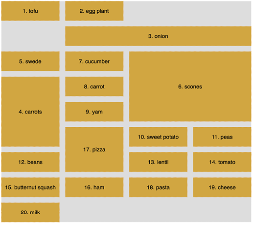

Figure 5.9: Grid items sized arbitrarily

We've introduced a few new things here. Let's
cover each in turn, starting with how we have
achieved a nice uniform gap between grid elements.

gap
---

I've used `gap` in some of the prior
code samples, but I've not explained it. Forgive me! The
`gap` property lets you specify a gap between grid tracks.
It is actually shorthand for both `row-gap` and
`column-gap`. Just like when you specify a margin with two
values, the first value applies to the top and bottom (row), and the
second to the left and right (columns). If you specify a single value,
as we have, it applies to both.

It's especially useful because, unlike dealing
with padding or margin when laying things out, you don't need to worry
about undoing it again on the final item; `gap` only
applies between the items. You should also be aware that all modern
browsers allow you to apply `gap` to Flexbox items too!

repeat
------

If you were making a grid with 30 identical
columns, it would get a little tiring having to write
`auto` 30 times, for instance,
`grid-template-columns: auto auto auto auto auto auto...`;
in fact, I got bored just writing that!

Thankfully, the Grid Layout specification writers have blessed us with
`repeat()`. As you might have guessed, the
`repeat()` function provides a convenient way of stamping
out the need for any number of items. In our example, we have used it to
create four columns, all `1fr` in width:


``` {.language-markup}
repeat(4, 1fr);
```


The format of the syntax is that, inside the parentheses, the first
value is the number of times you want something repeated, and the second
value is the width of each item.

Don't worry, I'll explain `fr` units in a moment; for now,
just know that you can create multiple columns/rows with ease. Do you
want 15 columns, all 100 px wide? It's as easy as
`repeat(15, 100px)`.

fr units
--------

The `fr` unit represents "flexible length" and
stands for "flex fraction." It's
used to communicate how much of any available free
space we want something to gobble up, much like the
`flex-grow` unit we covered for Flexbox in *Lab 4*,
*Fluid Layout and Flexbox*.

The specification doesn't say so, but I conceptualize `fr`
as standing for "free room" when I'm thinking about a layout. In our
example, we have made four columns, each taking up one portion of the
available free room.

Placing items in the grid
-------------------------

Before this example, we have been positioning each
grid item in a single grid area. However, here, we have certain grid
items being assigned spans of columns or rows numerically.

Let's take the `grid-item3` example:


``` {.language-markup}
.grid-item3 {
  grid-column: 2/-1;
}
```


Here, the `grid-column` property is being set to start at
the second grid line and end at the `-1` grid line. The
`-1` looks pretty odd at first, but it is part of a very
smart piece of syntax.

The first number is the start point, which is separated from the
endpoint with a forward slash, `/`. Positive numbers count
from the start side, the left-hand side in our column example, while
negative numbers start from the end side, the right, in this instance.
So, `-1` basically just means the last grid line. So, this
nice terse syntax just reads: "Start at line 2 and go to the end."

There's an example of spanning across rows in there too. Take a look at
this one again:


``` {.language-markup}
.grid-item4 {
  grid-row: 4 / 7;
}
```


This one says, "Start at grid row line 4 and end at grid row line 7." If
your preference is not telling the Grid where something ends and more
how much space something should span, Grid Layout has just the property
for you.

span
----

Take a look at the CSS for
`.grid-item17` now:


``` {.language-markup}
.grid-item17 {
  grid-row: 6 / span 2;
  grid-column: 2/3;
}
```


Can you see how we have done something a little different with the value
for `grid-row`?

Rather than stipulating a definite start and end point when placing grid
items, you can give one or the other and then tell the item to span a
number of rows/columns from that point either forward or backward. In
our example, we told the item to start at grid line 6 and span 2 rows.

I find going backward a little more confusing, but
that might just be me! But to illustrate, we could achieve the same
visual effect for our example by changing that line to
`grid-row: span 2 / 8`. In this instance, the definite
point we have is the endpoint, so we are telling the grid to make the
item start at grid row 8 and span 2 back from there.

dense
-----

Remember when we looked at
`grid-auto-flow`, I mentioned the `dense`
keyword? Well, this is the perfect opportunity to show you what that
does. I'll amend the value of the `grid-auto-flow` property
to this: `grid-auto-flow: row dense;`. And here is what it
does in the browser:

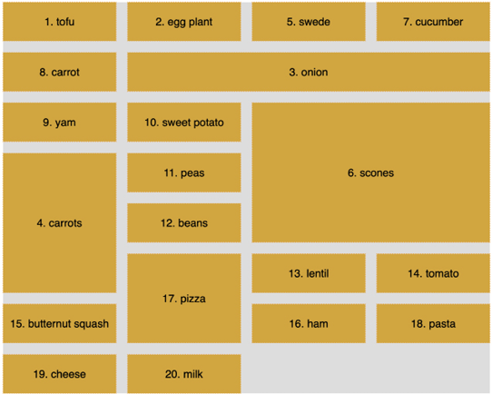

Figure 5.10: The "dense" keyword rearranges grid items so that gaps are
removed

Can you see how the gaps have been filled? That's what
`dense` does for you. However, while this
might seem more aesthetically pleasing, there is a
cost. The reason the items are numbered is that I wanted to highlight to
you that using `dense` tells the Grid Layout algorithm to
move things, visually, from their source order to any available space.
Notice how in this instance the items are not necessarily in source
order? That's the cost of the visual nicety.

So far, we have been laying things out using the numbers of the grid
lines. However, if you would rather name the grid lines, that is
something you can do too.

Named grid lines
----------------

Grid Layout allows authors to work with grids in a number of ways. For
example, if you'd rather work with words than
numbers, it's possible to name grid lines. Consider a 3-column by 3-row
grid.

You can find this example in the course's code as
`example_05-05`:

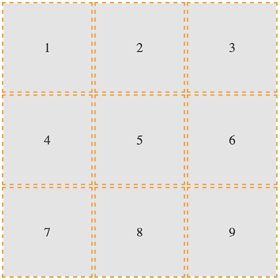

Figure 5.11: We will use named grid lines to rearrange our elements

Here's our markup:


``` {.language-markup}
<div class="my-first-grid">
  <div class="grid-item-1">1</div>
  <div class="grid-item-2">2</div>
  <div class="grid-item-3">3</div>
  <div class="grid-item-4">4</div>
  <div class="grid-item-5">5</div>
  <div class="grid-item-6">6</div>
  <div class="grid-item-7">7</div>
  <div class="grid-item-8">8</div>
  <div class="grid-item-9">9</div>
</div>
```


We set the grid up with this rule. Note the words in square brackets:


``` {.language-markup}
.my-first-grid {
  display: inline-grid;
  grid-gap: 10px;
  grid-template-columns: [left-start] 200px [left-end center-start] 200px
  [center-end right-start] 200px [right-end];
  grid-template-rows: 200px 200px 200px;
  background-color: #e4e4e4;
}
```


What we are doing inside the square brackets is
giving a name to the grid line. In this instance, the first column grid
line we have named `left-start`, and the one after the
first column we have named `left-end`. Notice that, in the
center grid line, we have assigned two names: `left-end`
and `center-start`. We can do this by space-separating the
names. In this situation, it makes sense because that grid line is both
the end of the left column and the beginning of the center one.

Let's amend our `grid-template-row` and add some named grid
lines there too:


``` {.language-markup}
grid-template-rows: [top-start] 200px [top-end middle-start] 200px [middle-end bottom-start] 200px [bottom-end];
```


Here's an example of how we can use these names to position grid items
instead of numerical values. This is just the first three of the items
we will see in the following diagram:


``` {.language-markup}
.grid-item-1 {
  grid-column: center-start / center-end;
  grid-row: middle-start / middle-end;
}
.grid-item-2 {
  grid-column: right-start / right-end;
  grid-row: bottom-start / bottom-end;
}
.grid-item-3 {
  grid-column: left-start / left-end;
  grid-row: top-start / middle-start;
}
```


In the example code, I have set each grid item to a random position
using this technique. You can see how the three above are placed in this
diagram:

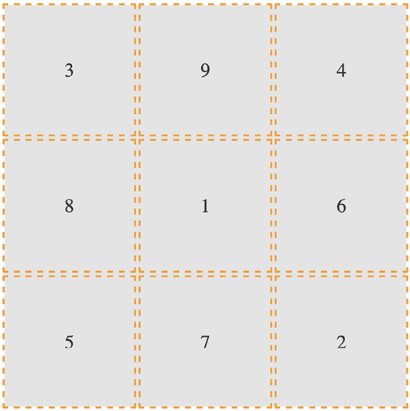

Figure 5.12: You can move things around just as easily with named grid
lines

In specification terms, the name we assign to a
grid line is known as a **custom ident**. Because they are just words,
avoid using terminology that might interfere with grid keywords. For
example, don't start naming grid lines "dense," "auto-fit," or "span"!

Grid Layout has an extra nicety you can make use
of when you use named grid lines. If you append your names with
`-start` and `-end`, as we have in our
example, then `grid` automagically (yes, I know, that's not
a real word) makes you a named grid area. Wait, what? Yep, that means
that once you have named your grid lines, you can place items in your
grid with a one-line `grid-area`. To prove that point, here
are just the first three `grid-item` rules from earlier
rewritten this way:


``` {.language-markup}
.grid-item-1 {
  grid-area: middle / center;
}
.grid-item-2 {
  grid-area: bottom / right;
}
.grid-item-3 {
  grid-area: top / left;
}
```


I've gotten a little bit ahead of myself now, as I
have introduced `grid-area` without any explanation. Let's
cover that now.

grid-template-areas
-------------------

Yet another way you can work with Grid Layout is to create grid template
areas to establish the areas of your grid. Let's
rework our prior example and we will remove the named grid lines
entirely, starting again with this basic CSS for the grid.

This is `example_05-06` in the code:


``` {.language-markup}
.my-first-grid {
  display: inline-grid;
  grid-gap: 10px;
  grid-template-columns: 200px 200px 200px;
  grid-template-rows: 200px 200px 200px;
  background-color: #e4e4e4;
}
[class^='grid-item'] {
  display: grid;
  align-items: center;
  justify-content: center;
  outline: 3px dashed #f90;
  font-size: 30px;
  color: #333;
}
```


Now, we will define our grid template areas like this, which we will add
to the `.my-first-grid` rule:


``` {.language-markup}
grid-template-areas:
  'one two three'
  'four five six'
  'seven eight nine';
```


With `grid-template-areas`, we can define rows and columns
very simply. A row is defined with quotes (double or single), with the
names of each column space-separated inside. Each row in the grid is
just another pair of quotes with custom idents inside.

You can use numbers for the start of each grid area, but you then need
to **escape** them when you reference them.


**Escaping** a character, in computer terms, is a means of invoking an
alternative interpretation of the character. It is a way of being more
explicit about the meaning you would like a certain character to have
that could potentially be interpreted in multiple ways.


For example, if one of our areas was named "9," it
would have to be referenced like this: `grid-area: "\39;"`.
I find that too burdensome, so I suggest using a string for each area
or, at least, starting each custom ident with an alpha character.

And that means we can position our items with `grid-area`
like this:


``` {.language-markup}
.grid-item-1 {
  grid-area: five;
}
.grid-item-2 {
  grid-area: nine;
}
.grid-item-3 {
  grid-area: one;
}
```


Admittedly, this is a simplistic example, but hopefully, you can imagine
a more useful scenario: perhaps a blog layout with a header, left-hand
sidebar area, main content area, and footer. You might define the
necessary `grid-template-areas` like this:


``` {.language-markup}
grid-template-areas:
  'header header header header header header'
  'side side main main main main'
  'side side footer footer footer footer';
```


As the specification (the link for the relevant section follows) states
that any whitespace character fails to produce a token, which for our
purposes simply means delineating one area from another, you could opt
to separate columns with tab characters if you
would rather, to aid in visually lining up the columns:
[[https://www.w3.org/TR/css-grid-1/\#valdef-grid-template-areas-string]](https://www.w3.org/TR/css-grid-1/#valdef-grid-template-areas-string).


When you write the grid template areas, the indentation is not
important, nor are the carriage returns; you could lay each row out in a
long space-separated list if you liked. As long as
the names for each area are inside quotes, with a
whitespace character between each, and there is a space between each set
of quotes, all is well.

Let's move on to some even more advanced Grid Layout techniques now.

auto-fit and auto-fill
----------------------

`auto-fit` and `auto-fill` are
"repeat-to-fill" keywords used to describe repetition to Grid.

Thanks to the similarity of their names, I can't
help but feel that the `auto-fit` and
`auto-fill` keywords are almost guaranteed to confuse --
just like `cover` and `contain` do for
background image-sizing (we cover them in *Lab 8*, *Stunning
Aesthetics with CSS*).

The upshot of this is that I frequently have to check which one is
which. Thankfully, for both our benefits, we're going to clarify what
each of these does now, and why you might want to use them.

Let me start with the why, as that covers both keywords. What if I told
you that with the help of `auto-fill` or
`auto-fit`, we can create a fully responsive grid that
adds/removes columns based upon the available size of the viewport, with
no media queries needed?

Compelling, right?

Consider a 9-column grid, where each column is at least 300 px wide. In
a slightly back-to-front way, I want to start this by showing you the
solution:


``` {.language-markup}
grid-template-columns: repeat(auto-fit, minmax(300px, 1fr));
```


And here is what that gives you in the browser in a smaller viewport:

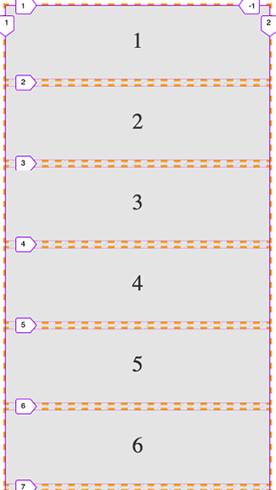

Figure 5.13: One line with Grid gives you a mobile layout...

And same thing on a
wider screen:

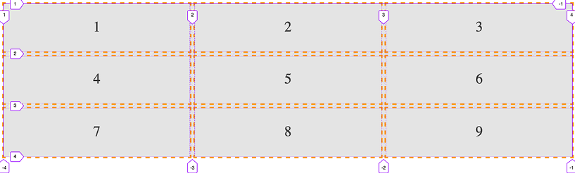

Figure 5.14: ...and also a layout for wider viewports!

Pretty handy, right?

Let's break down all the magic in that one-liner.

We are using `grid-template-columns`,
as we have done before, to set up the columns of
our grid. We are using the `repeat()` function to set up a
repeating pattern of columns; however, instead of passing in a number of
columns, we tell the grid to `auto-fit`. We may have used
`auto-fill` there too, but we'll get to the differences
between them in a moment. For now, we have told the browser to
repeatedly create `auto-fit` columns, and we define the
width of those columns using the `minmax` function.

The minmax() function
---------------------

Now, if you are new to Grid, it's likely you haven't used
`minmax()` before. It's a CSS function
that allows you to set up a range for the browser.
You specify a minimum size and a maximum size, and it computes something
in between based on the available space. In our example, we are passing
`minmax()` a minimum size of 300 px and a maximum size of 1
`fr` (remember, it might help to think of `fr`
as "free room").


When dealing with `minmax()`, if you specify a maximum size
that is smaller than the minimum, the maximum will be ignored and the
minimum will be the computed value.


With that set, the grid "auto-fits" columns that are at least 300 px
wide and no more than the size of its content plus a `1fr`
share of any remaining space.

In practical terms, this provides a responsive layout that lets our grid
resize itself based on the available viewport width.

To more easily show you the difference between `auto-fit`
and `auto-fill`, let's revise our one-liner to a minimum of
100 px:


``` {.language-markup}
grid-template-columns: repeat(auto-fit, minmax(100px, 1fr));
```


That gives us this layout on a wide viewport:

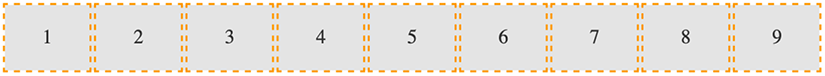

Figure 5.15: Using auto-fit will fit our content into the available
space

Note how the columns span the entire width of the page. Now we will
change to `auto-fill`:


``` {.language-markup}
grid-template-columns: repeat(auto-fill, minmax(100px, 1fr));
```


Here is what that produces:

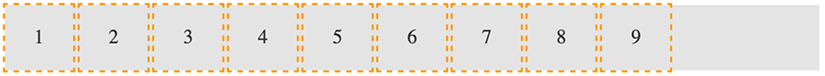

Figure 5.16: Using auto-fill, any spare space is filled up with
invisible columns

Notice the space at the end? What happened there?

The key to understanding the difference comes down
to whether spare columns are collapsed or not.

When the browser creates the grid in both `auto-fit` and
`auto-fill`, it initially lays them out the same. However,
when using `auto-fit`, any extra columns left, having laid
out the content, are collapsed, leaving that space free to be
distributed evenly between the items in the row. In our example (play
about with it in the code as `example_05-07`), because each
item also has a maximum size of `1fr` unit, each takes up
an equal portion of that free space. This results in columns that span
the entire width of the space.

However, with `auto-fill`, once the items (in our example,
100 px wide) are laid out, if there is any extra space, the extra empty
columns are not collapsed. They remain in situ, filled up, and
subsequently the space is not free for the grid items to gobble up. The
result is that we get space at the end.

There will be instances where one is more appropriate than the other;
just be aware that you can achieve either.


Shorthand syntax
================


There are a couple of shorthand syntaxes you can use with Grid: one
relatively straightforward, one less so. The first one that you'll
probably find most utility for is `grid-template`.

While shorthand syntaxes can be great, my advice
would be to write your grids one property at a time, at least to begin
with. When you get confident enough that writing each property and value
out individually becomes a chore, take the time to learn the shorthand
variant.

With that advice dispensed, let's look at these two shorthand methods.

grid-template shorthand
-----------------------

This allows you to set
`grid-template-rows`, `grid-template-columns`,
and `grid-template-areas` in one line.

So, for example, for a grid with two 200 px rows
and three 300 px columns, we could write:


``` {.language-markup}
grid-template: 200px 200px / 300px 300px 300px;
```


Or, if you'd rather do it with the `repeat` function, you
could write:


``` {.language-markup}
grid-template: repeat(2, 200px) / repeat(3, 300px);
```


The part before the forward slash (`/`) deals with the rows
and the bit after the columns. You can add
`grid-template-areas` in there too if you like:


``` {.language-markup}
grid-template:
  [rows-top] 'a a a' 200px
  'b b b' 200px [rows-bottom]
  / 300px 300px 300px;
```


That computes to this in the browser:


``` {.language-markup}
grid-template-rows: [rows-top] 200px 200px [rows-bottom];
grid-template-columns: 300px 300px 300px;
grid-template-areas: 'a a a' 'b b b';
```


Personally, I find that once you start mixing in named template areas
alongside numerical values, it starts to get too confusing to understand
easily. Regardless, some people love the shorthand syntax (maybe you
will be one of them), and you should be aware it's possible.

However, we're going to take it up another
notch now and deal with the `grid` shorthand.


### grid shorthand value -- option one

This is the same value that you would use if you
were using `grid-template`. For example, here is a grid
with two 100 px rows and three 200 px columns:


``` {.language-markup}
grid: 100px 100px / 200px 200px 200px;
```


Just like with our `grid-template` examples from earlier,
you can also use `grid-template-areas` if you like.

### grid shorthand value -- option two

This involves specifying a set of lengths for explicit grid rows, then,
separated by a forward slash, a definition for how
you want to handle implicit columns. This can be
`auto-flow` to set `grid-auto-rows`, with the
option of setting `grid-auto-flow` by adding
`dense` too. Or, alternatively, you could add a length
value for the width of the columns if you want to set
`grid-template-columns` instead.

Phew, that's a lot to compute. Take a look at some examples.

So, for a grid with two explicit 100 px rows and any number of explicit
columns that are 75 px wide:


``` {.language-markup}
grid: 100px 100px / repeat(auto-fill, 75px);
```


With this grid, should you have too many items, they will spill over
into the implicit rows with a default size of `auto`.

In the browser, that shorthand will compute to the following:


``` {.language-markup}
grid-template-rows: 100px 100px;
grid-template-columns: repeat(auto-fill, 75px);
grid-template-areas: none;
grid-auto-flow: row;
grid-auto-rows: auto;
grid-auto-columns: auto;
```


Let's try another. Say we want to lay out a grid that has only one row,
100 px high, but any number of columns, potentially running off the side
of the container:


``` {.language-markup}
grid: 100px / auto-flow;
```


That rule computes to the following:


``` {.language-markup}
grid-template-rows: 100px;
grid-template-columns: none;
grid-template-areas: none;
grid-auto-flow: column;
grid-auto-rows: auto;
grid-auto-columns: auto;
```


It's also worth knowing that, when you use the
`grid` shorthand, you are resetting all of the values it
deals with back to their initial state. You can see that if you look at
the computed values of styles in the developer tools of your browser.

### grid shorthand value -- option three

The final syntax you can pass to
`grid` is effectively the opposite of option two. This
time, you set `grid-auto-flow` to handle implicit rows
(with an optional `dense`) with an optional
`grid-auto-rows` value for the size of the rows. Then,
after the forward slash, we handle `grid-template-columns`.

With this kind of value, we are getting our grid to lay out in rows when
needed, rather than in columns, as in the previous option. Here are some
examples.

How about a grid that creates as many 100 px rows as needed and 5
columns that occupy `1fr` each?


``` {.language-markup}
grid: auto-flow 100px / repeat(5, 1fr);
```


That computes to this:


``` {.language-markup}
grid-auto-columns: auto;
grid-auto-flow: row;
grid-auto-rows: 100px;
grid-template-areas: none;
grid-template-columns: 1fr 1fr 1fr 1fr 1fr;
grid-template-rows: none;
```


Or, what about a grid that creates a single column with as many 100 px
rows as needed for the content?


``` {.language-markup}
grid: auto-flow 100px / auto;
```


That computes to this:


``` {.language-markup}
grid-auto-columns: auto;
grid-auto-flow: row;
grid-auto-rows: 100px;
grid-template-areas: none;
grid-template-columns: auto;
grid-template-rows: none;
```


You can see that the `grid` shorthand
is very powerful but, arguably, not particularly intuitive. For some
people, the shorthand is preferable. For some, it is maddening. There is
no right or wrong -- just what is right or wrong for you.

It won't be long into working with Grid before you hit a seemingly
ridiculous shortcoming. If you are dealing with nested elements and
wondering why on earth you are not able to make them align with your
grid, welcome to the long list of other developers who have thought that
very thing. So, what can we do about it?


Allowing nested elements to take part in the Grid
=================================================


It is important to be aware that when you define a grid, it is only the
direct descendant elements of that grid element
that can participate in the layout. The children of those direct
descendants cannot.

There are more flexible solutions to this
shortcoming on the horizon in the form of `subgrid`.
However, right now, `subgrid` only has an implementation in
Firefox and Safari, so we will only take a cursory look at that in a
moment.

One way we can work around this particular problem right now is with
`display: contents`.

What the `display: contents` declaration does is
effectively make the layout aspect of the element it is set on -- and
crucially, not the accessibility side -- disappear, allowing the
children of that element to behave visually, as if the parent element
didn't exist.

Let's consider this markup, and try this out for yourself as we go, by
playing with `example_05-08`:


``` {.language-markup}
<div class="container">
    <div class="child">Child-1</div>
    <div class="child">Child-2</div>
    <div class="parent">
        <div class="grandchild">Grandchild 3</div>
        <div class="grandchild">Grandchild 4</div>
    </div>
</div>
```


And this CSS:


``` {.language-markup}
.container {
    display: grid;
    grid: repeat(2, 200px) / repeat(2, 200px);
}
[class*='child'] {
    border: 2px dashed orange;
}
```


And by default, that gives us something like this in the browser:

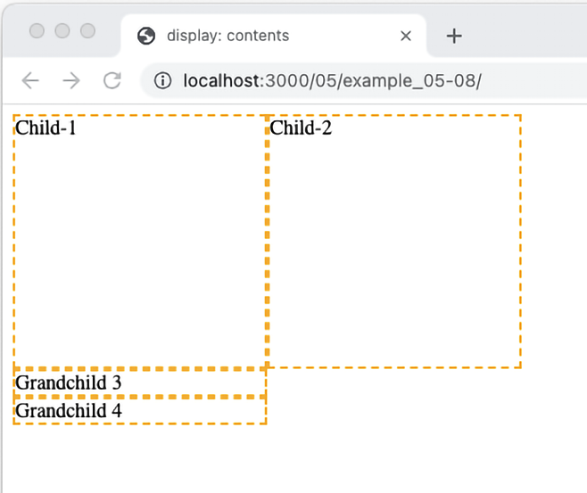

Figure 5.17: By default, descendants of grid items cannot take part in
the grid

You can see that the two grandchildren elements
are not taking part in the grid. We can solve that
like this:


``` {.language-markup}
.parent {
    display: contents;
}
```


By setting the parent element to have `display: contents`,
we are allowing the element to display its contents and therefore
allowing those elements to participate in the grid layout.

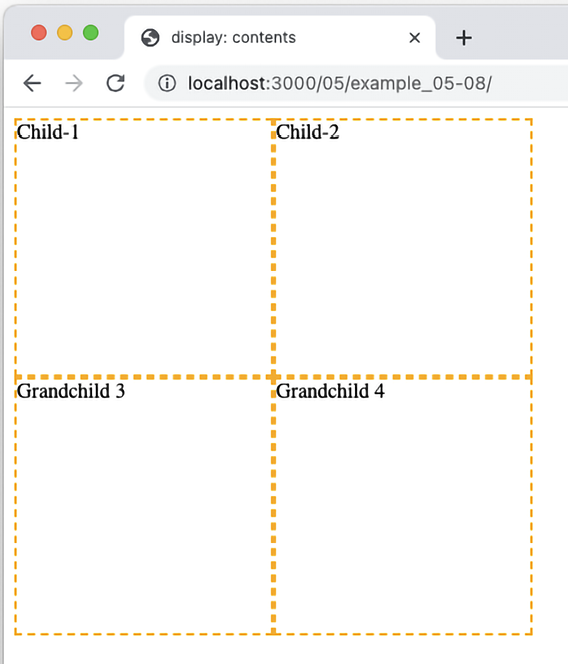

Figure 5.18: Setting display: contents on an element stops it from
producing its own box, allowing child elements to take part in the
layout

You are then able to position those elements in
the grid as if the parent element didn't exist.

The subgrid value
-----------------

Part of the Level 2 CSS Grid Layout specification deals with the
`subgrid` value. There is every chance
that, as you read these words,
`subgrid` will already be available to use. However,
support for it will not be ubiquitous for some time.


As ever, you can check support levels at
[[https://caniuse.com/css-subgrid]](https://caniuse.com/css-subgrid),
and read the specification here:
[[https://www.w3.org/TR/css-grid-2/\#subgrids]](https://www.w3.org/TR/css-grid-2/#subgrids).


In essence, `subgrid` provides a mechanism for non-direct
child elements of a grid ancestor to inherit their grid tracks. Using
`subgrid` is as simple as setting `subgrid` as
the value of either `grid-template-columns` or
`grid-template-rows`, or both.

Let us start with the `subgrid` value by solving the same
problem we solved with `display: contents` in the last
section.

When using the `subgrid` value, instead we would set the
CSS for the `.parent` like this (you can view the full code
in `example_05-09`):


``` {.language-markup}
.parent {
    display: grid;
    grid-template-columns: subgrid;
    grid-column: span 2;
}
```


And just like that, this particular problem is solved.

However, for solving that particular problem, we have actually used more
code than the prior solution with `display: contents`, but
bear with me. We can understand how it works with this simple example
before we look at something more involved.

First, we are making the `.parent` element a grid, and then
crucially telling it that we want the template for the columns to be a
`subgrid`, so that it will inherit the columns from the
ancestor grid it is part of.

Next, we need to tell the browser how big this element is going to be in
the ancestor grid it is part of. Here we have set it to
`span 2` columns, making it the full width of the ancestor
grid, as, remember, the ancestor grid is made up of two columns.

With that in place, the `.grandchild` elements happily
position themselves in the next available column. We don't need to do
anything extra with them.

Let's look at one further, slightly more involved example. Consider this
screenshot:


Figure 5.19: Without subgrid, the labels at the bottom are out of
alignment

Here, we have a horizontally scrolling component
containing images of different planets of our Solar System. Crucially,
notice how, due to the information text that accompanies each planet,
the caption for the image doesn't sit at the same level? While that is a
problem we could fix with other means and approaches, subgrid is a
perfect fit.

Here it is with our subgrid code in place. Notice how the captions below
each planet line up perfectly? Let's look at how this is done.

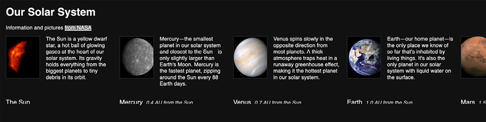

Figure 5.20: subgrid allows us to inherit the row and column tracks of a
parent grid

Firstly, consider the markup. We have a containing element with the
class of `.Scroll_Wrapper` to create the scrolling section,
and then a number of `figure` elements, each with a class
of `.Item`, and containing a planet image and associated
information.

For brevity, I'll just show you the HTML for the opening of the
containing element, and one of the planets (the full code is at
`example_05-10`):


``` {.language-markup}
<div class="Scroll_Wrapper">
    <figure class="Item">
        
        <figcaption class="Caption">The Sun</figcaption>
        <p>
            The Sun is a yellow dwarf star, a hot ball of glowing gases
            at the heart of our solar system. Its gravity holds everything
            from the biggest planets to tiny debris in its orbit.
        </p>
    </figure>
```


To set up the outer grid on the container, we have
this:


``` {.language-markup}
.Scroll_Wrapper {
    display: grid;
    width: 100%;
    overflow-y: hidden;
    overflow-x: auto;
    gap: 0 20px;
    grid-template-rows: auto auto;
    grid-auto-columns: auto;
    grid-auto-flow: column;
}
```


Those are all grid-related properties you have seen already in this
lab. Now, as we are interested in positioning the contents of each
planet, our `.Item` element, against that grid, we need to
introduce `subgrid`.

We need our element to be a grid itself and, crucially, we need the rows
to inherit from the nearest ancestor grid:


``` {.language-markup}
.Item {
    grid-row: 1/-1;
    display: grid;
    grid-template-rows: subgrid;
    grid-template-columns: 100px 200px;
    gap: 0 20px;
    margin: 0;
}
```


As the `.Item` is itself part of an outer grid, we need to
tell it how it should be positioned in that grid, so setting
`grid-row: 1/-1` tells it to start at the first row and end
at the last.

We then set the rows for this item's own grid with
`grid-template-rows`, but use `subgrid` to get
the row layout from the parent (the `.Scroll_Wrapper`).

With that in place, we can set the row and column
positions of child elements inside the grid as we would normally. But
the "magic" part is: because our rows are connected to the outer grid
via the `subgrid` value, it means they are sized with the
largest child in mind, which in turn means that all the internal
elements of each `.Item` can line up.

When you hit these kind of child element problems with Grid, if you
simply need to remove a containing element, as if it wasn't there, opt
for `display:contents`. If, however, you need to keep the
containing element -- perhaps it has a background color or image -- then
`subgrid` is the best choice.

This is but one simple use case of a layout conundrum that can be easily
solved with `subgrid`. 


Summary
=======


If you are fairly new to building on the web, you almost have an
advantage when it comes to learning CSS Grid: a "beginner's mind," if
you like. For people that have been laying things out with other
techniques over the years, the difficulty, in some ways, is undoing what
you already know about layout with CSS.

Having completed this lab, you should have some understanding of what is
possible with Grid Layout and how you might employ it.

Plus, with `subgrid` more recently joining the existing
capabilities of CSS Grid, we now have an incredibly powerful, complete,
and expressive method of laying out elements on our page with CSS.
