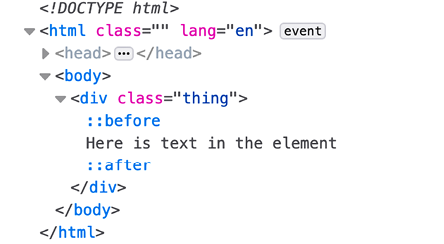
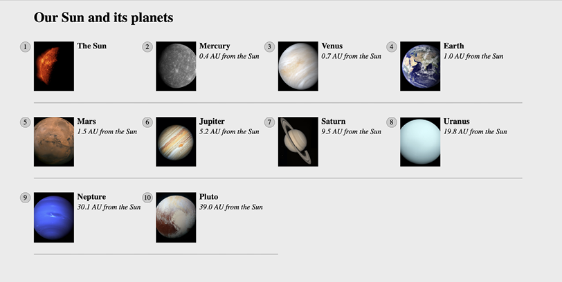
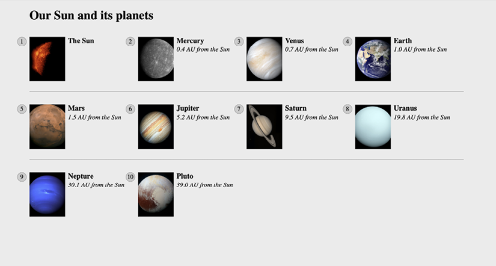
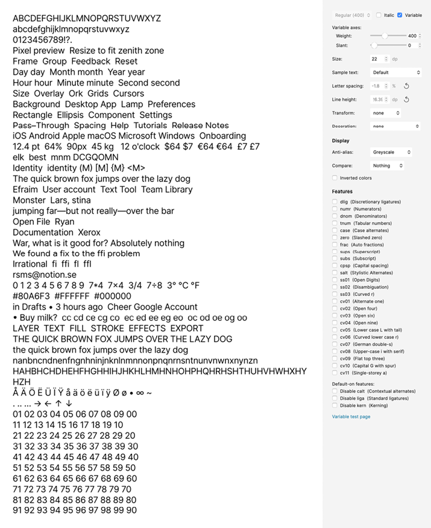

CSS Selectors, Typography, and More
===================================

As there are quite a few topics to cover, they have been grouped as
follows:

Selectors, units, and capabilities:

-   `::before` and `::after` pseudo-elements
-   Attribute selectors and substring matching
-   Structural pseudo-classes, including `:last-child`,
    `:nth-child`, `:empty`,
    and` :not`
-   Combinator selectors, including child, next sibling, and subsequent
    sibling
-   Functional pseudo-class selectors (`:is` and
    `:where`)

Viewport-related units and feature queries:

-   Viewport-related length units, `vh`, `vw`,
    `vmax`, and `vmin`, and their dynamic
    variants
-   Writing feature queries using `@supports` to fork CSS

Web typography:

-   `@font-face` rule
-   Font formats, including `.woff` and
    `.woff2`
-   Font loading control with the `font-display` property
-   Variable fonts and font features

As you can see, we have a lot to get through. Let's begin.


Selectors, units, and capabilities
==================================


Although they may not seem like the most exciting of subjects,
selectors, units, and capabilities are the "meat
and potatoes" of CSS. Master these and your power
to solve problems with CSS will increase
substantially. So, skip this section at your peril!

Anatomy of a CSS rule
---------------------

Before exploring some of the recent additions to
CSS, to prevent confusion, let's establish the terminology we use to
describe a CSS rule. Consider the following example:


``` {.language-markup}
.selector {
    /* comment */
    property: value; /* declaration */
}
```


This rule is made up of the selector (`.selector`) and
then, inside the curly braces, the declaration. The
declaration is further defined by the property and
the value. Happy we're on the same page? Great, let's press on.

Pseudo-elements and pseudo-classes
----------------------------------

There is potential for some confusion when we go on shortly to talk
about "pseudo" classes. The reason being is that,
in CSS, there are both pseudo-classes and
pseudo-elements. Let's therefore take a moment to
establish the difference.

The word "pseudo" in this context means something that is *like*
something, but not really it. So, a pseudo-element is something that is
like an element but not really one, and a pseudo-class is something that
selects something that isn't really something, but rather the *state* of
something. So,`:hover` is a pseudo-state, as it selects
something when in a certain state. It's possible I'm starting to sound
like the Riddler now from Batman! Let's clarify with some code. Here is
how you create a pseudo-element in CSS:


``` {.language-markup}
.thing::before {
    content: "Spooky";
}
```


That inserts a `::before` pseudo-element into the
`.thing` element with the content `"Spooky"`.
A `::before` behaves like a first child of the element it
is defined on, and an `::after` behaves like a last child.

The following image might help. It shows a single element represented in
the Firefox developer tools, containing text with both a
`::before` and an `::after` pseudo-element
added in CSS:



Figure 6.1: The Firefox developer tools will show you where
pseudo-elements are in the DOM

The key thing to remember with pseudo-elements is that if you don't
provide a value for `content`, nothing will show on the
page. Notice the double colon before `before`? Officially,
that is how you should code pseudo-elements as it
helps differentiate them from pseudo-classes, which only use one.
However, a single colon worked with the first
implementations of `::before` and `::after`
and so you can still write them that way too.

You can't do the same with pseudo-classes; they always have a single
colon. For example, `:hover`, `:active`, and
`:focus` are all pseudo-classes and are written with a
single colon.

Hopefully, the difference between pseudo-classes and elements is now
clear.

With that distinction made, let's move on and look at some of the
powerful selectors available to us today in CSS.


CSS selectors -- beyond the normal!
===================================


CSS now provides incredible power for selecting
elements within a page. If you are only used to selecting elements based
on their class, ID, or element type, these techniques may open your eyes
to new possibilities. I'd better qualify that bold claim.

CSS attribute selectors
-----------------------

You've probably used CSS attribute selectors to
create rules. For example, consider the following markup:


``` {.language-markup}

```


And this CSS:


``` {.language-markup}
img[alt] {
    border: 3px dashed #e15f5f;
}
```


This would select the `img` element in the preceding code,
and any others on the page provided that they have an `alt`
attribute.

In fact, to make something a little more useful, we could combine this
with the `:not` negation selector (we will look at that in
detail later in this lab) to add a red border around any images that
have no `alt` attribute or an `alt` attribute
with no value:


``` {.language-markup}
img:not([alt]),
img[alt=""] {
    border: 3px solid red;
}
```


That would be useful from an accessibility point of view, as it would
visually highlight any images that didn't have alternate text included
for assistive technology.

As another example, let's say we wanted to select all elements with a
`data-sausage` attribute:


``` {.language-markup}
[data-sausage] {
    /* styles */
}
```


The key thing here is to use square brackets to specify the attribute
you want to select.


The `data` attribute was introduced
in HTML5 to provide a place for custom data that can't be stored
sensibly by any other existing mechanism.


You can also narrow things down by specifying what the attribute value
is. For example, consider the following rule:


``` {.language-markup}
img[alt="Sausages cooking"] {
    /* Styles */
}
```


This would only target images that have an
`alt` attribute value of `"Sausages cooking"`;
for example:


``` {.language-markup}

```


So far, so "big deal, we could do that in CSS2." I hear you. Let's turn
things up a notch, shall we?

CSS substring matching attribute selectors
------------------------------------------

We also have the ability to select elements based
on the substring of their attribute selector. That sounds complicated.
It isn't! The three options are whether the attribute:

-   Begins with a certain substring
-   Contains an instance of a certain substring
-   Ends with a certain substring

Let's see what they look like.

### The "beginning with" substring matching attribute selector

Consider the following markup:


``` {.language-markup}
<li data-type="todo-chore">Empty the bins</li>
<li data-type="todo-exercise">Play football</li>
```


Suppose that markup represents two items in a "to-do" list application
we are building. Even though they both have different
`data-type` attribute values, we can select them both with
the "beginning with" substring matching attribute selector, like this:


``` {.language-markup}
[data-type^="todo"] {
    /* Styles */
}
```


The key character in all this is the
`^` symbol. That symbol is called the
**caret**, although it is often referred to as the **hat** symbol too.
In this instance, it signifies "begins with." Because both
`data-type` attributes have values that begin with
`"todo"`, our selector selects them.

### The "contains an instance of" substring matching attribute selector

The "contains an instance of" substring matching
attribute selector has the following syntax:


``` {.language-markup}
[attribute*="value"] {
    /* Styles */
}
```


Like all attribute selectors, you can combine them with a
`type` selector (one that references the actual HTML
element used) if needed, although I would only do that if I had to---in
case you want to change the type of element used. Let's try an example.
Consider this markup:


``` {.language-markup}
<p data-ingredients="scones cream jam">Will I get selected?</p>
```


We can select that element like this:


``` {.language-markup}
[data-ingredients*="cream"] {
    color: red;
}
```


The key character in all this is the `*` symbol, which in
this context means "contains." The "begins with" selector would not have
worked in this markup as the string inside the attribute didn't begin
with `"cream"`. It did, however, contain
`"cream"`, so the "contains an instance of" substring
attribute selector finds it.

### The "ends with" substring matching attribute selector

The "ends with" substring matching attribute
selector has the following syntax:


``` {.language-markup}
[attribute$="value"] {
    /* Styles */
}
```


An example should help. Consider this markup:


``` {.language-markup}
<p data-ingredients="scones cream jam">Will I get selected?</p>
<p data-ingredients="toast jam butter">Will I get selected?</p>
<p data-ingredients="jam toast butter">Will I get selected?</p>
```


Suppose we only want to select the element with `"jam"` at
the end of the `data-ingredients` attribute (which would be
the first element of those three). We can't use the "contains an
instance of" (it will select all three) or "begins with" (it will only
select the last one) substring attribute selector. However, we can use
the "ends with" substring attribute selector:


``` {.language-markup}
[data-ingredients$="jam"] {
    color: red;
}
```


The key character in all this is the `$` (dollar) symbol,
which means "ends with."

Right, we have some pretty handy attribute-related selectors now. But
it's also worth knowing that you can chain attribute selectors, just
like you can class selectors.

### Chaining attribute selectors

You can have even more possibilities for selecting
items by grouping attribute selectors. Suppose we had this markup:


``` {.language-markup}
<li
    data-todo-type="exercise"
    data-activity-name="running"
    data-location="indoor"
>
    Running
</li>
<li
    data-todo-type="exercise"
    data-activity-name="swimming"
    data-location="indoor"
>
    Swimming
</li>
<li
    data-todo-type="exercise"
    data-activity-name="cycling"
    data-location="outdoor"
>
    Cycling
</li>
<li
    data-todo-type="exercise"
    data-activity-name="swimming"
    data-location="outdoor"
>
    Swimming
</li>
```


Let's suppose I only wanted to select "indoor
swimming." I can't use just `data-location="indoor"` as
that would get the first element too. I can't use
`data-activity-name="swimming"` as that would get me the
second and the fourth, but I can do this:


``` {.language-markup}
[data-activity-name="swimming"][data-location="indoor"] {
    /* styles */
}
```


This selects elements that have `"swimming"` as the
activity name, as long as they also have `"indoor"` as the
location.


Attribute selectors allow you to select IDs and classes that start with
numbers. Before HTML5, it wasn't valid markup to start IDs or class
names with a number. HTML5 removes that
restriction. When it comes to IDs, there are still some things to
remember. There should be no spaces in the ID name, and it must be
unique on the page. 


CSS structural pseudo-classes
=============================

CSS gives us more power to select elements based on where they sit in
the structure of the DOM. Let's consider a common
design treatment; we're working on the navigation bar for a larger
viewport and we want to have all but the last link over on the left.
Historically, we would have needed to solve this problem by adding a
class name to the last link so we could select it, like this:


``` {.language-markup}
<nav class="nav-Wrapper">
    <a href="/home" class="nav-Link">Home</a>
    <a href="/About" class="nav-Link">About</a>
    <a href="/Films" class="nav-Link">Films</a>
    <a href="/Forum" class="nav-Link">Forum</a>
    <a href="/Contact-Us" class="nav-Link nav-LinkLast">Contact Us</a>
</nav>
```


This in itself can be problematic. For example, sometimes, just getting
a content management system to add a class to a final list item can be
frustratingly difficult. Thankfully, in those eventualities, we can
solve this problem and many more with CSS structural pseudo-classes.

The :last-child selector
------------------------

Way back in CSS 2.1, we already had a selector
applicable for the first item in a list, the
`:first-child` selector:


``` {.language-markup}
div:first-child {
    /* Styles */
}
```


However, CSS Level 3 added a selector that can also match the last:


``` {.language-markup}
div:last-child {
    /* Styles */
}
```


Let's look at how that selector could fix our
prior problem if we didn't want to, or couldn't,
add another class at the desired point in the markup:


``` {.language-markup}
.nav-Wrapper {
    display: flex;
}
.nav-Link:last-child {
    margin-left: auto;
}
```


There are also useful selectors for when something is the only item
(`:only-child`) and the only item of a type
(`:only-of-type`).

The nth-child selectors
-----------------------

The `nth-child` selectors let us solve even more difficult
problems. With the same markup as before, let's
consider how `nth-child` selectors allow us to select any
arbitrary link(s) we want within the list.

Firstly, what about selecting every other list
item? We could select the odd ones like this:


``` {.language-markup}
.nav-Link:nth-child(odd) {
    /* Styles */
}
```


Or, if you wanted to select the even ones, you could do this:


``` {.language-markup}
.nav-Link:nth-child(even) {
    /* Styles */
}
```


### Understanding what nth rules do

For the uninitiated, nth-based selectors can look
pretty intimidating. However, once you've mastered the logic and syntax,
you'll be amazed at what you can do with them. Let's take a look.

Here are the nth-based selectors at our disposal:

-   `nth-child(n)`
-   `nth-last-child(n)`
-   `nth-of-type(n)`
-   `nth-last-of-type(n)`

We've seen that we can use `(odd)` or
`(even)` values already in an nth-based expression, but the
`(n)` parameter can be used in another couple of ways:

-   As an integer; for example, `:nth-child(2)` would
    select the second item. Passing a number/integer into the nth
    selector is easy enough to understand; just enter the element number
    you want to select.
-   You can also pass a numeric expression. For example,
    `:nth-child(3n+1)` would start at the first element,
    and then select every third element.

The numeric expression version of the selector is the part that can be a
little baffling at first. Let's break it down.

#### Breaking down the math

Let's consider 10 spans on a page (you can play
about with these by looking at `example_06-01`):


``` {.language-markup}
<span></span>
<span></span>
<span></span>
<span></span>
<span></span>
<span></span>
<span></span>
<span></span>
<span></span>
<span></span>
```


We will style them like this:


``` {.language-markup}
span {
    height: 2rem;
    width: 2rem;
    background-color: blue;
    display: inline-block;
}
```


As you might imagine, this gives us 10 squares in a line:


Figure 6.2: We will test our nth-child selection skills on these 10
identical elements

OK, let's look at how we can select different ones with nth-based
selections.

For practicality, when considering the expression within the
parentheses, I start from the right. So, for example, if I want to
figure out what `(2n+3)` will select, I start with the
right-most number (the "3" here indicates the third item from the left)
and know it will select every second element from
that point on. So, adding this rule:


``` {.language-markup}
span:nth-child(2n + 3) {
    background-color: #f90;
    border-radius: 50%;
}
```


Results in this in the browser:


Figure 6.3: Anything that matches our nth-child selector is turned round
and orange

As you can see, our nth selector targets the third list item and then
every subsequent second one after that too. If there were 100 list
items, it would continue selecting every second one.

How about selecting everything from the second item onward? Well,
although you could write `:nth-child(1n+2)`, you don't
actually need the first number 1 as, unless otherwise stated,
`n` is equal to 1. We can, therefore, just write
`:nth-child(n+2)`. Likewise, if we wanted to select every
third element, rather than write `:nth-child(3n+3)`, we
could just write `:nth-child(3n)` as every third item would
begin at the third item anyway, without needing to state it explicitly.

The expression can also use negative numbers; for example,
`:nth-child(3n-2)` starts at minus 2 and then selects every
third item.

You can also change the direction. By default, once the first part of
the selection is found, the subsequent ones go down the elements in the
DOM (and therefore from left to right in our example). However, you can
reverse that with a minus; for example:


``` {.language-markup}
span:nth-child(-2n + 3) {
    background-color: #f90;
    border-radius: 50%;
}
```


This example finds the third item again, but then
goes in the opposite direction to select every two elements; up the DOM
tree and therefore from right to left in our example:


Figure 6.4: With a minus symbol, we can select in the opposite direction

Hopefully, the nth-based expressions are making more sense now.
`nth-child` and `nth-last-child` differ in
that the `nth-last-child` variant works from the opposite
end of the document tree. For example,
`:nth-last-child(-n+3)` starts at 3 from the end and then
selects all the items after it. Here's what that rule gives us in the
browser:


Figure 6.5: nth-last-child lets you start from the opposite end of the
elements

Finally, let's consider `:nth-of-type` and
`:nth-last-of-type`. While the previous examples count any
children, regardless of type (always remember the
`nth-child` selector targets all children at the same DOM
level, regardless of classes), `:nth-of-type` and
`:nth-last-of-type` let you be specific about the type of
item you want to select. Consider the following markup
(`example_06-02`), which is a mixture of `div`
and `span` elements, albeit with the same class:


``` {.language-markup}
<span class="span-class"></span>
<span class="span-class"></span>
<span class="span-class"></span>
<span class="span-class"></span>
<span class="span-class"></span>
<div class="span-class"></div>
<div class="span-class"></div>
<div class="span-class"></div>
<div class="span-class"></div>
<div class="span-class"></div>
```


If we used the selector:


``` {.language-markup}
.span-class:nth-of-type(-2n + 3) {
    background-color: #f90;
    border-radius: 50%;
}
```


Even though all the elements have the same `span-class`
class, they don't get seen as one group. The selector applies once to
the `span` elements, and then to the `div`
elements. Here is what gets selected:


Figure 6.6: nth-of-type selectors work on each type of element they find


CSS doesn't count like JavaScript! If you're used to using JavaScript,
you'll know that it counts from 0 upward (zero index-based). For
example, when selecting an element in JavaScript, an integer value of 1
is actually the second element. CSS, however, starts at 1 so that a
value of 1 is the first item it matches.


### nth-based selection in responsive web designs

Just to close out this little section, I want to illustrate a real-life
responsive web design problem and how we can use
nth-based selection to solve it. Imagine we are building a page showing
our sun and the various planets of our solar
system. Our content management system simply spits all the items out in
a list, but we want to show them in a grid of sorts.

For some viewports, we will only be able to make it two items wide.
However, as the viewport increases in width, we can show three items,
and at larger sizes still, we can show four.

Here is the problem, though. Regardless of the viewport size, we want to
prevent any items on the bottom row from having a border on the bottom.
You can view this code at `example_06-03`. Here is how it
looks when it's four items wide:



Figure 6.7: Our task here is to remove the border on the bottom row,
regardless of how many items are showing

See that pesky border below the bottom two items? That's what we need to
remove. However, I want a robust solution so that if there was another
item on the bottom row (if another planet is suddenly discovered hiding
behind Uranus!), the border would also be removed from that too.

Now, because there is a different number of items on each row at
different viewports, we will also need to change the nth-based selection
at different viewport widths. But we can use media queries for that. For
the sake of brevity, I'm not going to show you the selection for each
media query. I'll just show you the selection that matches four items
per row, as you can see in the preceding screenshot. However, you can
open the code sample to see the selections for each different viewport:


``` {.language-markup}
@media (min-width: 55rem) {
    .Item {
        width: 25%;
    }
    /* Get me every fourth item and, of those, only ones that are in the
    last four items */
    .Item:nth-child(4n + 1):nth-last-child(-n + 4),
    /* Now get me every one after that same collection too. */
    .Item:nth-child(4n + 1):nth-last-child(-n + 4) ~ .Item {
        border-bottom: 0;
    }
}
```


You'll notice here that we are chaining the
nth-based pseudo-class selectors, much like we chained attribute
selectors earlier in this lab. It's important
to understand when you chain nth selectors like this that the first
selector doesn't "filter" the selection for the next selector; rather,
the element has to match each of the selections.

So, for the line like this:


``` {.language-markup}
.Item:nth-child(4n + 1):nth-last-child(-n + 4),
```


`.Item` has to be the first item of four and also be one of
the last four:



Figure 6.8: Achievement unlocked---using nth-child selectors like some
kind of nth-child wizard!

Nice! Thanks to nth-based selections, we
have a defensive set of rules to remove the bottom
border, regardless of the viewport size or the number of items we are
showing. You can view the completed code in
`example_06-04`.

Now, one nifty bit of selection we are doing in that prior example is
using the "subsequent sibling" selector. We haven't looked at that, so
we will cover it next.


Combinator selectors -- child, next sibling, and subsequent sibling
===================================================================


Sometimes you want to do something particular to
an element but only if it follows another, or perhaps only if it is the
child of another element. We are going to look now at how we can do
that.

I'm making the assumption at this point that you understand the basic
selector pattern where one class followed by another selects any
descendant that matches. For
example,`.parent .descendant {}` would select any element
that was a descendant of the `.parent` element with a class
of `.descendant`, no matter how many levels deep.

The child combinator
--------------------

The child combinator only selects direct
descendants. Consider this markup:


``` {.language-markup}
<div class="parent">
    <div class="descendant child">
        <div class="descendant grandchild"></div>
    </div>
</div>
```


We can select only the direct "child" of the parent element, like this:


``` {.language-markup}
.parent > .descendant {
    /* Styles */
}
```


Notice the right-angle bracket between the two class names in the
selector; that's the child combinator symbol.

The next sibling
----------------

Consider another example:


``` {.language-markup}
<div class="item one">one</div>
<div class="item">two</div>
<div class="item">three</div>
<div class="item">four</div>
<div class="item">five</div>
<div class="item">six</div>
```


Let's suppose we wanted to select an item, but
only if it is the next sibling of `.one`. With that markup,
we could select the second element in that list like this:


``` {.language-markup}
.one + .item {
    border: 3px dashed #f90;
}
```


The `+` `symbol` there means "next sibling,"
so select the next sibling element of `.one`, our second
element.

The subsequent sibling
----------------------

With the same markup from the
previous example, if we wanted to select all items
after the third, we could do this:


``` {.language-markup}
.item:nth-child(3) ~ .item {
    border: 3px dashed #f90;
}
```


The \~ symbol, called a **tilde**, says "every subsequent sibling."

The negation (:not) selector
----------------------------

Another handy selector is the negation
pseudo-class selector. This is used to select
everything that isn't something else. Consider this:


``` {.language-markup}
<div class="a-div"></div>
<div class="a-div"></div>
<div class="a-div"></div>
<div class="a-div not-me"></div>
<div class="a-div"></div>
```


And then these styles:


``` {.language-markup}
.a-div {
    display: inline-block;
    height: 2rem;
    width: 2rem;
    background-color: blue;
}
.a-div:not(.not-me) {
    background-color: orange;
    border-radius: 50%;
}
```


Our final rule will make every element with a class of
`.a-div` orange and round, with the exception of the
`div` that also has the `.not-me` class. You
can find that code in the `example_06-05` folder of the
code samples:


Figure 6.9: The negation selector allows you to exclude elements from
selection

So far, we have looked primarily at what's
known as structural pseudo-classes (full
information on this is available at
[[https://www.w3.org/TR/selectors/\#structural-pseudos]](https://www.w3.org/TR/selectors/#structural-pseudos)).
However, CSS has many more selectors. If you're working on a web
application, it's worth looking at the full list of UI element
state pseudo-classes
([[https://www.w3.org/TR/selectors/\#resource-pseudos]](https://www.w3.org/TR/selectors/#resource-pseudos))
as they can, for example, help you target rules based on whether
something is selected or not.

The empty (:empty) selector
---------------------------

I've encountered situations where I have an element that includes some
padding on the inside and gets content dynamically
inserted. Sometimes, it gets content inserted,
while sometimes it doesn't. The trouble is, when it doesn't include
content, I still see the padding. Consider the HTML in
`example_06-06`:


``` {.language-markup}
<div class="thing"></div>
```


And here's the CSS:


``` {.language-markup}
.thing {
    padding: 1rem;
    background-color: violet;
}
```


Without any content in that element, I still see the background color.
Thankfully, we can easily hide it, like this:


``` {.language-markup}
.thing:empty {
    display: none;
}
```


However, just be careful with the `:empty` selector. For
example, you might think this is empty:


``` {.language-markup}
<div class="thing"> </div>
```


It isn't! Look at the whitespace in there.
Whitespace is not "no" space! And neither is something like a line
break.

However, just to confuse matters, be aware that a
comment doesn't affect whether an element is considered empty or not.
For example, this is still considered empty:


``` {.language-markup}
<div class="thing"><!--I'm empty, honest I am--></div>
```


Grouping selectors
==================


Ordinarily, when we want to share a bunch of
properties across a number of things, we just comma-separate the
selectors into a list:


``` {.language-markup}
.thing1,
[data-thing],
#thing {
    /* styles */
}
```


That works fine for a few things. All those comma-separated selectors
get the same styles applied, but it can start to become unwieldy and
repetitive in more complicated scenarios:


``` {.language-markup}
.blog-post > h1,
.blog-post > h2,
.blog-post > h3,
.blog-post > h4,
.blog-post > ul,
.blog-post > ul li,
.blog-post > p,
.blog-post > a {
    /* shared styles */
}
```


The other downside is that a single mistake in that group renders the
whole list invalid:


``` {.language-markup}
.blog-post > h1,
.blog-post > h2,
.blog-post > h3,
.blog-post > h4,
.blog-post > ul,
.blog-post > ul < li,
.blog-post > p,
.blog-post > a {
    /* shared styles */
}
```


That accidental "less than" symbol will mean this rule won't apply any
styles to any of the selectors. Now, I don't think
that is something to concern yourself with too much, but there are newer
selectors that can solve these issues.

The :is() functional pseudo-class
---------------------------------

This is also known as the "matches any" selector.
Let's use it to refactor that prior example, and
then talk about the differences:


``` {.language-markup}
.blog-post > :is(h1, h2, h3, h4, ul, ul < li, p, a) {
    /* shared styles */
}
```


Not only is this more compact, but it has the
added benefit that even though that invalid selector is still present,
the entire rule is not invalidated; just that one. Nice, eh?

Now, it is important to be aware that the `:is` functional
gives all selectors within the specificity of the most specific
selector. And that can be problematic. Here is the relevant portion of
the specification:

*The specificity of an* `:is()`*,* `:not()`*,
or* `:has()` *pseudo-class is replaced by the specificity
of the most specific complex selector in its selector list argument.*

So, suppose you have a grouping like this:


``` {.language-markup}
:is(.thing, .another-thing, and-another) {
    /* styles */
}
```


Each of those selectors will only have a specificity of 0,1,0, as the
most specific selector in the selector list is a class.

However, if I add an ID selector in there:


``` {.language-markup}
:is(#ouch .thing, .another-thing, and-another) {
    /* styles */
}
```


Each one of those now gets the specificity of the
ID: 1,0,0. That can introduce problems in the long term, as it means you
have a very high specificity selector in your
codebase, and should you ever need to override it at some point, you
will need to create a rule with even greater specificity. As such, it is
generally advisable to avoid using IDs unless absolutely necessary.


The :where() functional pseudo-class
------------------------------------

The `:where()` selector takes a
selector list, just as `:is()` does. However, this selector
is snappily known as the "specificity-adjustment pseudo-class." Cripes!

Any selector inside the `:where()`
selector list is given a specificity of zero. Even big bad ID selectors!
So, if you do find yourself in a scenario where you need to use an ID
selector, you can wrap it in `:where()` and it will not add
to specificity. Let's take a look.

Suppose we had markup like this:


``` {.language-markup}
<div id="thing" class="hi">hi</div>
```


And we added CSS like this:


``` {.language-markup}
.hi {
    width: 200px;
    height: 200px;
    background-color: gold;
}
#thing {
    background-color: red;
}
```


You can hopefully guess that the square we have will be red. The ID is
an order of magnitude more specific than the
class, and it is also written after it in the
stylesheet too, so no way that square is going to have a gold
background! However, wrap it in a `:where()`:


``` {.language-markup}
.hi {
    width: 200px;
    height: 200px;
    background-color: gold;
}
:where(#thing) {
    background-color: red;
}
```


And that ID has zero specificity, meaning our square displays gold. This
selector is useful in lots of scenarios but I find it most useful for
"reset" styles, or any style you know you'll be overriding later on.


Remember to check support for your users. As we delve into CSS more and
more, don't forget to visit
[[https://caniuse.com]](https://caniuse.com/), if you ever want to
know what the current level of browser support is for a particular CSS
or HTML5 feature. Alongside showing browser version support (searchable
by feature), it also provides the most recent set of global usage
statistics from
[[https://gs.statcounter.com]](https://gs.statcounter.com/).


The :has() relational pseudo-class
----------------------------------

A very recent addition to the CSS selectors
at our disposal is the `:has()`
functional pseudo-class.

In simple terms, it's a way of selecting an element, as long as it has
certain child elements or conditions.

Let's suppose you want to do something with a container, but only if it
has a `video` element inside. That would look like this:


``` {.language-markup}
.thing:has(video) {
    /* Styles */
}
```


Or you want to add some padding
in the block flow direction if an element doesn't
have a `p` element inside of it. That would look like this:


``` {.language-markup}
.other-thing:not(:has(p)) {
    padding-block: 10px;
}
```


How about an even more convoluted use case; suppose you want to select a
`h1` if there is an `img` directly after it.
We can do that like this:


``` {.language-markup}
h1:has(+ img) {
    /* Styles */
}
```


There are so many possibilities with `:has()`!

If you need to fork your code based on support for
`:has()`, you can do this with feature queries. That would
look like this:


``` {.language-markup}
@supports selector(:has(*)) {
/* Styles */
} 
```


Now, don't worry if you've not come across feature queries before; we
are going to look at them later on in this very lab.


We've looked at how we can select items in our
responsive world. But how about how we size them? We'll look at viewport
percentage lengths next.


Responsive viewport relative lengths
====================================


CSS Values Module
Level 3
([[https://www.w3.org/TR/css3-values/\#viewport-relative-lengths]](https://www.w3.org/TR/css3-values/#viewport-relative-lengths))
ushered in **viewport relative units**. These are great for
responsive web design, as each unit is a
percentage length of the viewport:

-   The `vw` unit, where each `vw` unit is 1%
    of the viewport width
-   The `vh` unit, where each `vh` unit is 1%
    of the viewport height
-   The `vmin` unit (for viewport minimum; equal to the
    smaller of either `vw` or `vh`)
-   The `vmax` (viewport maximum; equal to the larger of
    either `vw` or `vh`)

Want a modal window that's 90% of the browser height? This is, at least
in theory, as easy as:


``` {.language-markup}
.modal {
    height: 90vh;
}
```


Now, as useful as viewport relative units are, some browsers have had
curious implementations. Safari in iOS, for example, changes the
viewable screen area as you scroll from the top of a page (it shrinks
the address bar), but crucially doesn't make any changes to
the reported viewport height. So that thing you
sized to be 90% of the viewport may no longer be 90% of the viewport
once you scroll.

As such, there is now a bunch of related viewport
units coming our way:
[[https://www.w3.org/TR/css-values-4/\#viewport-variants]](https://www.w3.org/TR/css-values-4/#viewport-variants):

-   `lvh`/`lvw`, where the `lv`
    is for **largest viewport** percentage units. So in our iOS example,
    imagine the browser in a state where any
    shrinking UI is out of the way and the
    viewport is as large as it can be; this is the size that
    `lvh` would be a percentage of.
-   `svh`/`svw` is for **smallest viewport**
    units. This represents a
    percentage of the screen on the basis of any UI being at its largest
    state.
-   `dvh`/`dvw` is for **dynamic viewport**
    units. These represent a percentage of what the
    browser is currently
    using, possibly between the largest and
    smallest. For example, if a browser has two states, a largest and
    smallest, as is the case with iOS Safari currently, this value would
    choose one or the other. The problem here is two-fold. Firstly, the
    browser doesn't necessarily animate between the two values as they
    change, so it may be choppy. And secondly, if the browser does
    decide to animate that value as its UI sizes change, it may not
    always be preferable. Imagine setting your font size using that unit
    and then seeing all the text resize as you scroll. Probably not the
    best user experience!

However, you can perhaps find more utility for these units when coupled
with fonts. For example, it's now trivially easy to create text that
scales in size, depending on the viewport.

For example:


``` {.language-markup}
.hero-text {
    font-size: 10vw;
}
```


Now, the text will always be sized as a percentage of the viewport
width. However, the limit with something like `vw` units
for text, used in isolation, quickly becomes apparent as you use them.
Our example size of `10vw` would be a large headline size
of `32px` at a small viewport size of `320px`,
but a rather over-the-top size of `130px` at a larger
viewport of `1300px`.

We can solve this kind of issue easily with the
CSS `clamp` function. But that's a whole other topic, and
you will need to head over to *Lab 12*, *Custom Properties and CSS
Functions*, to get the low-down on that.

However, for the newer viewport-related units we just looked at and a
whole raft of stuff we haven't yet, it can be really handy to be able to
**fork** your code for when those things are supported and when they are
not. For that we can reach for feature queries. Let's look at how to use
those next.


Using \@supports to fork CSS
============================


When you're building out a responsive web design, attempting to provide
a single design that works everywhere, on every device, it's a simple
fact that you'll frequently encounter situations
when features or techniques are not supported on certain devices. It's
also a likely scenario with newer selectors, like `:has()`,
which we looked at earlier in the lab. In these instances, you'll
likely want to create a fork in your CSS. If the browser supports a
feature, provide one chunk of code; if it doesn't, it gets different
code.

This is the kind of situation that gets handled by
`if/else` or `switch` statements in
JavaScript. In CSS, we use the `@supports` at-rule.

Now, before we dig into feature queries, it is worth pointing out a
straightforward way of providing fallbacks for older browsers. Suppose
we want to use some of our new viewport-related length units but ensure
we have some kind of fallback for older browsers.

Due to the way in which CSS is parsed we can write the older value
first, then the newer style one immediately afterward. For example:


``` {.language-markup}
.thing {
    padding: 0 10vw;
    padding: 0 10dvw;
}
```


An older browser that understands `vw` but not
`dvw` will use the first padding-based declaration and
discard the second because it can't understand it. A newer browser that
does support `dvw` units will use the first declaration and
then immediately replace it with the second as it
comes after it.

Nice and simple. However, that is only really useful for minor
fallbacks. There will be times when you need a more sophisticated and
robust approach.

Feature queries
---------------

The native solution to forking code in CSS is
to use **feature queries**, part of the CSS
Conditional Rules Module Level 3
([[https://www.w3.org/TR/css-conditional-3/]](https://www.w3.org/TR/css-conditional-3/)).
Support was introduced in iOS and Safari 9, Firefox 22, Edge 12, and
Chrome 28.

The great news is, feature queries follow a similar syntax to media
queries. So, as you understand media queries, the way we use feature
queries should seem instantly familiar. Consider this:


``` {.language-markup}
@supports (flashing-sausages: lincolnshire) {
    body {
        sausage-sound: sizzling;
        sausage-color: slightly-burnt;
        background-color: brown;
    }
}
```


Here, the styles will only get applied if the browser supports the
`flashing-sausages` property in combination with the
`lincolnshire` value. I'm quite confident that no browser
is ever going to support a
`flashing-sausages: lincolnshire` property/value
combination (and if they do, I want full credit), so none of the styles
inside the `@supports` block will be applied.

Let's consider a more practical example. How about we use Grid when
browsers support it and fall back to another layout technique when they
don't? Consider this example:


``` {.language-markup}
@supports (display: grid) {
    .Item {
        display: inline-grid;
    }
}
@supports not (display: grid) {
    .Item {
        display: inline-flex;
    }
}
```


Here, we are defining one block of code for when the browser supports a
feature and another lot for when it doesn't. This pattern is fine if the
browser supports `@supports` (yes, I realize that is
confusing), but if it doesn't, it won't apply any of those styles.

If you want to make provision for devices that
don't support `@supports`, you're better off writing your
default declarations first and then your
`@supports`-specific one after. That way, the prior rule
will be overruled if support for `@supports` exists, and
the `@supports` block will be ignored if the browser
doesn't support it. Our prior example could, therefore, be reworked to:


``` {.language-markup}
.Item {
    display: inline-flex;
}
@supports (display: grid) {
    .Item {
        display: inline-grid;
    }
}
```


Sorry, that explanation was tough---hopefully you got through it!

Combining conditionals
----------------------

You can also combine conditionals. Let's suppose
we only wanted to apply some rules if both Flexbox and
`pointer: coarse` were supported (in case you missed it, we
covered the pointer interaction media feature back in *Lab 3*,
*Media Queries and Container Queries*). Here is what that might look
like:


``` {.language-markup}
@supports ((display: flex) and (pointer: coarse)) {
    .Item {
        display: inline-flex;
    }
}
```


Here, we have used the `and` keyword but we can also use
`or` alongside it in a query, or just instead of it; for
example, if we were happy to apply styles if those two prior
property/value combinations were supported, or if 3D transforms were
supported:


``` {.language-markup}
@supports ((display: flex) and (pointer: coarse)) or
    (transform: translate3d(0, 0, 0)) {
    .Item {
        display: inline-flex;
    }
}
```


Note the extra set of parentheses that separates
the `display` and `pointer` conditional from
the `transform` conditional.

Finally, with all the newer selectors we have looked at and future ones
coming in time, it is worth knowing you can test for those too. This is
what a feature query for `:where()` would look like:


``` {.language-markup}
@supports selector(:where(div)) {
    /* styles */
}
```


You place the selector you are interested in testing support for into
the `selector()` function.

All the related `not`-, `or`-, and
`and`-related keywords work just the same with
`selector()`. This is incredibly handy, as not only can we
then fork our code on a specific feature, but we can do it for the more
recent selectors introduced to CSS too.

The only other thing to mention is that you can nest other at-rules
inside, such as media queries and keyframes.

And that's everything you are likely to need to understand when it comes
to feature queries. As with media queries, put your "default" styles
first, and then your enhancement inside a feature query
`@supports` at-rule.

It's time to switch gears one final time in this lab to cover our
last major topic: web typography.


System fonts
------------

Each operating system has its own set of fonts that come pre-installed.
However, aside from a few exceptions, there aren't
many fonts you can rely upon to be installed on
every device a user might view your site with. Subsequently, we've grown
accustomed to writing font **stacks**, which
enable us to write a font "wish list" for the browser. For example:


``` {.language-markup}
font-family: -apple-system, BlinkMacSystemFont, Roboto, Ubuntu, "Segoe UI", "Helvetica Neue", Arial, sans-serif;
```


Optimizing font loading with font-display
-----------------------------------------

If your `main` font is a web font, it's a good idea to
request the file upfront by loading it with a link
in the `head` section of your HTML
with the `rel` attribute value as
`preload`. For example:


``` {.language-markup}
<link
    rel="preload"
    href="fonts/inter.var.woff2"
    as="font"
    type="font/woff2"
    crossorigin
/>
```


Adding a link with `rel="preload"` included in this way
triggers a request for the web font early in the critical rendering
path, without having to wait for the **CSS Object Model** (**CSSOM**) to
be created. While this technique is recommended by
Google, even if other browsers don't do the same, it is unlikely to do
any harm. If you are serving up a `.woff` and
`.woff2` file, it's only worth doing this optimization for
the `.woff2` file; browsers that support
`.woff2` also support the `preload` value in
the `rel` attribute.

We can make further optimizations with web fonts by making use of the
`font-display` property.

font-display
------------

We can also make use of the
`font-display` property of CSS (older browsers
that don't understand it will simply ignore it):


``` {.language-markup}
font-display: fallback;
```


You can also see this property being used in the previous examples. It
provides some control over how fonts should get displayed.

The `fallback` value we have provided sets an
extremely short **block** period and
a short **swap** period.

To understand what terms like "block" and "swap" mean in this context,
we need to consider what the browser does in terms of displaying fonts.
I'm talking generically here, but the concepts work for our needs.

Imagine a browser loading our web page in which we
have specified a web font for our text. The browser already has the HTML
and is parsing the CSS, and learns it needs to
download a font in order to display the text it has as intended. Before
it draws any text to the screen, it hangs on, waiting for the web font
so it can paint the text onto the page as needed.
This delay is referred to as a **FOIT**, standing for **Flash of
Invisible Text**.

As soon as the font arrives, the browser parses it and paints the text
to the screen accordingly.

The hope is that this delay is imperceptible. Where it is not, there are
two schools of thought on how best to handle things.

One option is to wait for the font to be downloaded, usually for up to a
few seconds but sometimes indefinitely; Safari is the most famous
proponent of this option.

The second option is to render the text with a system font initially and
then replace the font with the correct font when the browser has it.
This redraw of text from system font to the actual
intended font is known as a **Flash of Unstyled Text**, or **FOUT** for
short.

All the `font-display` setting does is allow us some
control over what we would like to see happen.

The possible values are:

-   `auto`: Whatever the browser
    determines is most appropriate.
-   `block`: Get a white screen for
    up to 3 seconds (but the delay is ultimately at the browser's
    discretion) and then the actual font can replace any system
    displayed font at any future point.
-   `swap`: There is a very short
    blocking period (100 ms is the recommended amount) to let the web
    font load; otherwise, a system font shows and the web font can be
    swapped in whenever it is available.
-   `fallback`: This option prevents
    a web font from replacing a system font if a set amount of time has
    passed (3 seconds is the recommendation). This option blocks for
    around 100 ms initially and allows a swap for up to 3 seconds, but
    after that, if the web font subsequently arrives, it doesn't get
    applied.
-   `optional`: Here, the browser
    allows a very short duration for the web font to load (100 ms) but
    no swap period. The result of this is that the browser has the
    option of canceling the font download if it hasn't arrived, or if it
    has, using it for subsequent page loads.


There are plenty of other font-related properties
and values specified in the CSS Font Module Level 4 specification, but
`font-display` is currently the widest implemented and has
the most direct relevance to responsive web designs and performance.

So far, we have looked at how to get font files into our project and
even considered how best to deal with them from a performance point of
view.

However, the most recent development in web fonts, and probably the one
that has most developers excited, is **variable** fonts. "What new
witchery is this?" I hear you cry. Let's find out.


Variable fonts
==============

A "normal" font contains the information and glyphs for one variation of
a typeface; the regular version of Roboto, for example. By comparison, a
variable font, in a single file, would contain everything needed for
every variation of Roboto. Bold, Italic, Thin, Black, Medium, and more
besides!

This new devilry is not without consequence. A
variable version of a font is usually considerably larger in file size
terms than a "normal" version. However, it can still make sense when you
are making heavy use of a single typeface. It also makes an almost
limitless variation of a font possible, effectively making a custom
version of a font possible.

Caveats aside, let's look at what we can do with a variable font.

font-face changes
-----------------

I'm working with the Inter font we used before, but instead using the
variable version. First, let's consider how we
tell the browser we are working with a variable font in the first place.
It's the `@font-face` syntax again, but with a few changes:


``` {.language-markup}
@font-face {
    font-family: "Inter-V";
    src: url("fonts/inter.var.woff2") format("woff2-variations");
    font-weight: 100 900;
    font-style: oblique 0deg 10deg;
    font-display: fallback;
}
```


The first thing to note is the `format`. We are setting
this to `woff2-variations` to tell the browser this is a
font file that makes use of variations.

The next thing to keep in mind is that we are using a range for
`font-weight`. The two-word value syntax we are using here
is only understood by browsers that understand variable fonts. It is a
way of telling the browser the range of weights this font can use. While
`font-weight` has a range limit of 0-999, other properties
may have a different range. Others still simply accept a binary value of
1 or 0.

Another thing to remember is that we have `font-style`,
which is also being provided with a multiple-value syntax. The
`oblique` keyword tells the browser the next values relate
to how oblique the font can be, and the two values after that define the
range. Be aware that although the range here is positive, you can pass
in negative values. We will see that in use momentarily.

Finally, note that we have used the `font-display` property
here to tell the browser how we want to handle the loading and display
of this font, but that is no different than non-variable fonts.

You can look at this completed example at
`example_06-07`.


How to make use of a variable font
----------------------------------

Variable fonts use what's termed a **variation axis**.

A variation axis is just a way of defining two points at either end of a
scale. You can then choose any point along the scale to display your
font. The scale doesn't need to be vast; in fact, it can be as simple as
"on" or "off" (not much of a scale, I know). Variation axes are
subdivided into two groups: registered and custom.

### Registered axis

Registered axes are the most popular ones, which
the specification writers have made specific
provision for:

-   **Weight**: How heavy the text appears; for example,
    `font-weight: 200`.
-   **Width**: How narrow (condensed) or wide the text appears; for
    example, `font-stretch: 110%`.
-   **Italic**: Whether the font is being displayed as italic or not;
    for example, `font-style: italic`.
-   **Slant**: Don't confuse this with italic. This simply alters the
    angle of the text; it doesn't substitute any glyphs. For example,
    `font-style: oblique 4deg`.
-   **Optical size**: This is the only one of the registered axes that
    has required a new font property. Using
    `font-optical-sizing` lets you alter, yes, you guessed
    it, the optical sizing. But what is that? It's the practice of
    altering a glyph based upon the size it is displayed at to aid
    clarity. This means the same glyph displayed at a large size might
    enjoy thinner stems, for example.

The values you choose to use with these properties should fall within
the capabilities of the variable font you are using. For example, there
isn't much point in specifying a font weight of `999` if
the font you are using can only go up to `600`.

There is also a low-level property that lets you bundle up your variable
font settings into a single property/value combination:


``` {.language-markup}
font-variation-settings: "wght" 300, "slnt" -4;
```


Here, we have set the font weight to `300` and the angle of
the slant to `-4`. However, the specification offers the
following cautionary advice:

*When possible, authors should generally use the other properties
related to font variations (such as font-optical-sizing), and only use
this property for special cases where its use is the only way of
accessing a particular infrequently used font variation. For example, it
is preferable to use font-weight: 700 rather than
font-variation-settings: "wght" 700.*

Font variation properties can be animated and transitioned, which can
make for some fantastic effects!

Having covered the registered axis group, let's briefly take a look at
the custom axis group.

### Custom axis

Variable fonts can include their *own* axis. For
example, the FS Pimlico Glow VF font has a "glow" axis. You can amend
that like this:


``` {.language-markup}
font-variation-settings: "GLOW" 500;
```


Notice how this custom axis is written in
uppercase; that is, `"GLOW"`? That's how to determine the
difference between a registered and custom axis in variable font
settings.

If your head isn't already hurting from the seemingly endless
possibilities, I also need to tell you about font features, which are
sort of similar to the two different axes we just looked at. Don't
worry; it will make sense shortly.

Font features
-------------

Variable fonts can also include their own
**features**. These features can be literally anything the font designer
decides to dream up! Take a look at the choices for Inter:



Figure 6.10: On the right of the Inter settings page are the enormous
possibilities for the font

All of those "features" are settings that can be turned on with CSS. You
can play about with these settings yourself here:
[[https://rsms.me/inter/lab/?antialias=default]](https://rsms.me/inter/lab/?antialias=default).

When we want to apply these custom features, we
make use of the `font-feature-settings` property. This
works very similarly to the `font-variation-settings`
syntax. For example, to switch on "slashed zeroes," we can do this:


``` {.language-markup}
font-feature-settings: "zero";
```


This "slashed zeroes" option is a binary choice, so it is not necessary
to write `"zero" 1`. However, if we wanted to toggle this
setting off further into our styles, we could write:


``` {.language-markup}
font-feature-settings: "zero" 0;
```


When you want to apply multiple `font-feature-settings`,
you can comma-separate them. So, if we wanted to have "lowercase L with
tail" and "uppercase i with serif," we could write this:


``` {.language-markup}
font-feature-settings: "cv08", "cv05";
```


These are the options switched on in the completed
`example_06-07`.


When looking at the lab code, don't concern yourself with any
additional syntax that doesn't make sense. There are CSS custom
properties used, for example, and we will cover those fully in *Lab
12*, *Custom Properties and CSS Functions*.


There is plenty more in the way of settings and features specified in
CSS Fonts Module Level 4. We have just scratched the surface! To dig in
further, take a look at the specification:
[[https://www.w3.org/TR/css-fonts-4/]](https://www.w3.org/TR/css-fonts-4/).


Exercise
========


Have a look at the CSS from our example page:


``` {.language-markup}
:root {
    --MainFont: "Helvetica Neue", Helvetica, Arial, sans-serif;
}
@font-face {
    font-family: "Inter-V";
    src: url("fonts/inter.var.woff2") format("woff2-variations");
    font-weight: 100 900;
    font-display: fallback;
    font-style: oblique 0deg 10deg;
}
body {
    background-color: var(--background);
    color: var(--foreground);
    transition: all 0.35s;
    font-size: 1.2em;
    font-family: "sans-serif";
    font-family: var(--MainFont);
    font-weight: 400;
}
@supports (font-variation-settings: "wdth" 200) {
    body {
        font-family: "Inter-V";
        font-variation-settings: "wght" 300, "slnt" -4;
        font-feature-settings: "cv08", "cv05";
    }
}
```


How much of that can you now understand? We have a system font stack, an
`@font-face` rule loading a variable font (complete with
ranges defined for weight and slant), and a `sans-serif` as
the default `font-family`---which we then immediately
overwrite with a `font-family` defined with a CSS custom
property for browsers that understand it. Finally, we use a feature
query for variable fonts and define settings for it, also adding in some
additional font features we'd like to see.

These are all approaches and techniques that we have covered in this
lab. If you can look at that and have a decent understanding of what
is going on, you have done well. There's a lot in there to parse!


Summary
=======


In this lab, we've learned how to select almost anything we need on
the page with CSS's powerful selection capabilities.

We've also learned how to add custom web typography to a design with the
`@font-face` rule, freeing us from the shackles of the
humdrum selection of web-safe fonts of yesteryear. We also took a dive
into variable fonts and considered many of the possibilities they have
to offer.

In the next lab, we are going to take an extended look at colors in
CSS. Recent additions to the specifications mean it's now a bigger topic
than ever before. So, let's find out all about that in *Lab 7*, *CSS
Color*.
