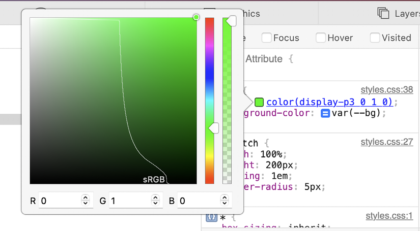
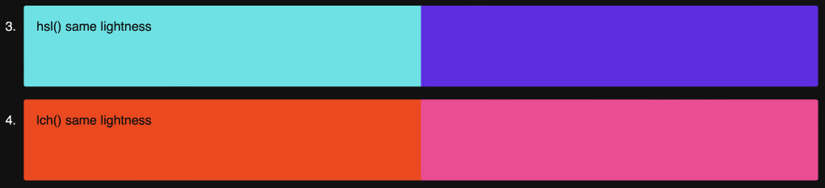
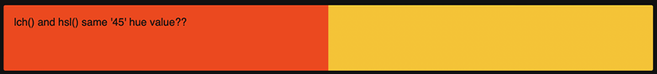

CSS Color
=========


Let's look at what we will be covering in this lab:


-   P3 color gamut
-   The `@media (color-gamut: )` rule
-   The `color()` function
-   Lab and LCH
-   How to write fallbacks for older browsers
-   Relative color syntax
-   The `color-mix()` function
-   The `color-contrast()` function


The current state of CSS color
==============================


-   All monitors and browsers can display sRGB colors, and there are
    various syntaxes to describe them in CSS; hex (for example,
    `#000`), `rgb(0,0,0)`,
    `hsl(0 0% 0%)`.
-   There are also colors that many modern monitors can display but not
    all browsers currently support. This category of colors is typically
    dealt with in CSS with the `color()` function to pass a
    custom color space (typically `display-P3`) to CSS, or
    using LCH/Lab.
-   Finally, there is a category of colors that humans can see, yet few
    (if any?) monitors can display. CSS can now also describe such
    colors with LCH/Lab.
-   Right now, only the Safari browser supports `lch()`, `lab()`,` `and `color()`.


Introductory note
-----------------

As we work through all these formats, be aware that there is no real
"best" color format. They are all useful for
certain applications. For example, I tend to use tried and tested hex
values the majority of the time; they are the values that designers
almost always supply me with and there is no value in converting them to
another format. I tend to make use of one of the newer formats when I
need to realize a certain style of gradient, for example, or use a color
that simply can't be expressed with a hex or `rgb()`.
Hopefully, the notion that there is no "best" format, only a "best
format for this job," will become obvious as we work through the
lab.


Right, let's get on and show you those colors you have never seen on
your screen before.

Display-P3
----------

P3 is a superset of sRGB and makes up to 50% more
colors possible. It's the vivid end of the red, green, and blue colors
that benefit the most, particularly the green.

Before I get you too excited, a couple of caveats. Firstly, you will
need a browser that supports P3; I'm using Safari 15.4. You'll also need
to be using a modern enough screen to see these colors, or this is going
to be a letdown on a par with the end of the *Game of Thrones* TV
series.


It is also almost redundant to point out that the images in this course
will also be unable to convey the colors accurately. You will either
have to trust me, or get that browser open and see for yourself.


OK, open `example_07-01` and inspect
the page with your development tools (in Safari, I'm doing **Develop**
\> **Show Web Inspector**). Select the first color "swatch" and open the
color picker up for the `background-color`. What do you
notice?



Figure 7.3: The Safari color picker shows where sRGB ends and P3 takes
over

In Safari, in the color picker tool, I see a representation of the
standard sRGB range of colors, but the color we have defined is beyond
the sRGB confines we are used to seeing and into the area that only the
`display-p3` color space can display. I hope your retinas
are just a little shocked at the vividness on show!

Because it is a color space we are using, as opposed to a different
color model, we use the `color()` function to pass this
predefined color space in, and then set the red, green, and blue values.
So, if we want the greenest green that P3 has to offer, we can set it in
CSS like this:


``` {.language-markup}
background-color: color(display-p3 0 1 0);
```


It differs only in that rather than using 0-255 to
set each color channel, it uses a decimal between 0 and 1, where
`0` is none of that channel and `1` is all of
it.


If you don't have access to a browser or hardware that can display this
color space, then the following post, also on the WebKit blog, offers
some good examples, with comparison pictures of sRGB and P3:
[[https://webkit.org/blog/10042/wide-gamut-color-in-css-with-display-p3/]](https://webkit.org/blog/10042/wide-gamut-color-in-css-with-display-p3/).


Our prior example looks like this in code:


``` {.language-markup}
color(display-p3 0.135 1 0);
```


Browsers that support P3 should have a color picker capable of playing
with it, so you can see as you play with the colors how the values
express the different amounts of red, green, and blue. Try another color
that plays to the strengths of P3:


``` {.language-markup}
color(display-p3 0 1 1);
```


That will get you a very vivid cyan color. P3 is great for these kinds
of bright colors, and simple to work with, with just a basic
understanding of red, green, and blue.


Browsers that do support wider gamuts like `display-p3` can
also display images that have a relevant color profile attached. An
oft-overlooked fact.


### \@media (color-gamut) media query

Although we dealt with media queries in great
detail in *Lab 3*, *Media Queries and Container Queries*, there is
one media query better dealt with here. That is the
`color-gamut` media query, which lets us test for the
support of certain colors on the host device.

Here is the syntax. In this instance, we are checking for whether a
device is capable of supporting the `rec2020` gamut, a
gamut that includes P3 and more. There is no relevance here other than
for illustration:


``` {.language-markup}
@media (color-gamut: rec2020) {
    .thing {
        color: color(display-p3 0 1 1);
    }
}
```


I don't imagine this is a feature most developers
will find themselves needing regularly, if at all, but it is mentioned
here just in case.

LCH with the lch() function
---------------------------

Even the larger gamut of P3 is nowhere near the
limits of human visual perception. However, we now have a format in CSS
capable of doing that. Lab/LCH are designed to be
able to express all of human vision, even if currently our monitors are
not capable of it.

**LCH** is an abbreviation of **Lightness**, **Chroma**, **Hue**. It is
the same color space as Lab, but using polar coordinates.


If you aren't familiar with the term **polar
coordinates**, it's a way to describe how far something is from a
reference point. Imagine looking down on a color wheel that shows all
the possible colors of a color space. The center of that wheel is the
pole, our reference point. You can describe where one color is in
relation to the reference point by giving a direction/angle and a
distance along the axis of that angle. That is the essence of how polar
coordinates work in CSS color and mathematics.


The syntax is Lightness as a percentage, then two numerical values: one
for the Chroma, and the third value for the Hue angle. So, here is an
example of a very bright red:


``` {.language-markup}
background-color: lch(50% 132 43);
```


Like the other functional color notations, you can add a forward slash
(`/`) and then add an alpha channel as a value between 0
and 1 or a percentage.

Arguably one of the more important things to take from LCH/Lab is that
the Lightness is designed to look the same across different colors,
something that the lightness of HSL does not do. So you should be able
to define two different colors with the same lightness in
`lch()` and they should appear to have the same perceptual
lightness.

If you compare swatch 3, "`hsl()` same lightness", and
swatch 4, "`lch()` same lightness", in the example file,
hopefully you can appreciate that the lightness of the two colors in the
LCH example are more similar than the lightness of the two HSL colors.



Figure 7.4: Comparison of two colors in HSL (top) and LCH (bottom) that
should have the same lightness

Practically, when working with LCH, lower
the lightness value for a darker variant of a
color, and increase it for a lighter one.

There are some points to be aware of when using `lch()`.
Firstly, you may, as I did, incorrectly assume that as it uses a wheel
for the hue then, like HSL, the wheel would be the same one as for HSL.
It isn't!

Consider our swatch with the gradient defined with one side as
`lch()` and then those values mapped to what you might
think would be the equivalent positions in the `hsl()`
section (this is swatch 8 in `example_07-01` for the
lab):


``` {.language-markup}
.lch-hsl {
    background: linear-gradient(
        to right,
        lch(50% 150 45) 50%,
        hsl(45 100% 50%) 0
    );
}
```


Here is what that looks like:



Figure 7.5: Setting lch and hsl to what you think should be the same
color does not produce the same color!

Hmmmm, nothing is ever easy when it comes
to color conversion, I am afraid! Those two look
nothing like one another. We would need to remember our earlier HSL
mnemonic and move our HSL hue to `0` to make it similar to
the position of red in the wheel used by LCH.


If you are wondering why the gradient defined gives us a hard stop, we
cover that in the next lab, *Stunning Aesthetics with CSS*.


I found the Chroma part of the `lch()` syntax hard to
conceptualize initially, as the maximum value of color intensity not
only differs between colors and screen gamut, but it is also
theoretically limitless. Luckily, an out-of-range value gets normalized
in the browser, so if you are after an intense color, just use a high
value (say, `150`) and the browser will set it accordingly.
Whenever I set a value for the Chroma like that, it reminds me of Spinal
Tap's "These go to 11!" (kids, ask your parents, or I'll let you search
on YouTube for it if you promise to come right back).


Fallbacks for older browsers
============================


There is a nice, simple way of providing a
fallback for older browsers; simply write the standard format first, and
then the newer syntax straight after.

So if we wanted that "super green" P3 green but know that we have a nice
P3 version for browsers and hardware that don't support P3 (note I'm
also using the older syntax with commas for the sake of even older
browsers):


``` {.language-markup}
background-color: rgb(0, 255, 0);
background-color: color(display-p3 0 1 0);
```


Doesn't get much easier than that. Of course, we could also use
`@supports`, which we looked at in detail in the last
lab, *CSS Selectors, Typography, and More*:


``` {.language-markup}
@supports (color(dispay-p3 0 1 0)) {
    background-color: color(display-p3 0 1 0);
}     
```


At first glance, the `@supports` version may seem more
verbose. It is, until you start passing color values around as custom
properties instead.

We cover custom properties fully in *Lab 12*, *Custom Properties and
CSS Functions*, but for now, all you need to understand is in this
instance, we are using a custom property as a means of storing a value
that we can reuse in multiple places.

We would set up a color to reuse like this:


``` {.language-markup}
:root {
    --col-accent: rgb(0 255 0);
}
@supports (color: color(display-p3 0 1 0)) {
    :root {
        --col-accent: color(display-p3 0 1 0);
    }
}
```


And then, whenever we wanted to use that color, we
only have to write:


``` {.language-markup}
.thing {
    color: var(--col-accent);
}
```


The user would then get either the `rgb()` version or the
`display-p3` version, depending on their system. With it
set as a custom property, we can reuse it as many times as we like in
that manner and know that each user will get the right syntax for their
environment.


The color-mix() function
========================


This is another very new function for color, so much so that I have had
to enable experimental features in one of the only browsers that has an
implementation currently -- Safari. As ever, check support for features
at caniuse.com
([[https://caniuse.com/?search=color-mix()]](https://caniuse.com/?search=color-mix())).

Consider swatch 10 in our example. You should see a color that is like a
mix between gold and orange, because that is exactly what it is!

Here, we are using the `color-mix()` function to mix
`gold` and `orange`:


``` {.language-markup}
.mix {
    background-color: color-mix(in lch, gold 50%, orange);
}
```


The `color-mix()` function lets you specify a color space
to mix in, and then two colors to mix in that color space. It's like
kindergarten for web developers!

Here are the essentials to understand. You pass a percentage after the
first color (and you can use any of the color notations we have looked
at in this lab) and that is the amount of that color passed into the
"mixer." The percentage left is given to the second color.

It's very early days for `color-mix`
and, as such, we won't spend much time with it here. However, I hope you
agree it's an interesting addition to our color capabilities that is
sure to make interesting things possible in the years to come.


The color-contrast() function
=============================


As interesting as the `color-mix()`
function is, it's not something I can think of immediate use cases for.

However, the `color-contrast()` function is different. The
`color-contrast()` function lets you specify a color, then
at least another two colors, to effectively compete for the title of
"Most Contrasting Color." That's not a real thing by the way, but it
does mean a huge difference to day-to-day life as a developer trying to
ensure you create suitably contrasting sites for accessibility. Let's
take a look at some examples.

This first example of `color-contrast` is the 11th swatch
in our example file:


``` {.language-markup}
.header-text {
    background-color: #333;
    color: color-contrast(#333 vs #666, #545454, #777, #f90);
}
```


In this example, we set the background to a dark gray
(`#333`) to test the contrast against. Then we use the
`vs` keyword to separate the colors that are going to be
tested as the color with the highest contrast against that first color.
Note that currently, in the experimental version of the syntax, you need
a comma after each extra color you want to test against.

OK, take a look at those colors and place your bets. The winner is...

The orange with the hex code of `#f90`.

Picking the most contrasting color from a list is impressive in itself,
but even more useful is being able to specify the *target* contrast. So,
if you are trying to achieve AA WCAG accessibility compliance, you can
pass a target contrast ratio like this:


``` {.language-markup}
.header-text {
    background-color: #333;
    color: color-contrast(#333 vs #666, #545454, #777, #f90 to 4.5);
}
```


After the colors, we use the `to` keyword and then a
contrast. We can also pass a contrast like this:


``` {.language-markup}
.header-text {
    background-color: #333;
    color: color-contrast(#333 vs #666, #545454, #777, #f90 to AA);
}
```


The `AA` here means a contrast ratio
of 4.5:1, which is the ratio required for AA WCAG accessibility with
text contrast. Remember we covered accessibility a little more in
*Lab 2*, *Writing HTML Markup*.


**Fair warning**: As I write this lab, there is no implementation
that currently supports the `to` keyword and passing a
contrast of `AA` or `AAA`; instead, it only
supports the number value.


What is especially useful about the `to` keyword is it gets
the first in the list to meet or exceed that contrast. If you look at
swatch 12, it is the same as swatch 11, except the contrast is set to
`2.5`. That's obviously far less than anyone would sensibly
want, but it should demonstrate the point:


``` {.language-markup}
.header-text {
    background-color: #333;
    color: color-contrast(#333 vs #666, #545454, #777, #f90 to 2.5);
}
```


In this case, the `color-contrast` function returns
`#777`, which is the first color from the list that meets
or exceeds the target contrast.

I'm sure you can see the usefulness of this function, especially in
situations where you want to use a bunch of
pre-defined brand colors while still addressing accessibility concerns.
I hope this gets broad browser implementation soon.


Relative colors with the relative color syntax
==============================================


One other new feature of the CSS Color Module
Level 5 specification that is worth a little exploration is the relative
color syntax. This lets you amend a color by kind of deconstructing it.
At this point, an example may be more useful. Consider swatch 13 in our
example file, which is set with this CSS:


``` {.language-markup}
.relative {
    --bg: #f90;
    background-color: hsl(from var(--bg) h s calc(l + 10%));
}
```


So, here we have a custom property set to a hex value
(`#f90`). Then, with our `hsl()` color
function notation, we use the `from` keyword to "pick"
where we are generating our relative color from. In this case, it is the
hex in the line above, but it could be any color set in any of the
notations that CSS allows. Then, we can use the letters of the color
type, in this case `h`, `s`, and
`l`, to get the component parts of the origin color into
our current format and then tweak it. In this instance, I have used the
`calc()` function to brighten the color by 10%. Remember
that in HSL, lightness is always a percentage.

Let's look at one more. This is swatch 14:


``` {.language-markup}
.relative-rgb {
    --bg: hsl(0 100% 50%);
    background-color: rgb(from var(--bg) r 100 b / 80%);
}
```


Here, we take a color defined in our custom property in HSL, then tweak
the green value to be `100` and add an 80% alpha layer.

Like the other functions, `color-contrast` and
`color-mix`, this doesn't have broad support, but is sure
to allow plenty of creative expression in the years to come. From a
purely practical perspective, it will allow you to manipulate all the
colors of a code base in the same way, regardless of whether the
authoring format was `hex`, `rgb()`,
`hsl()`, or any of the other notations we have considered.


Summary
=======


In CSS terms, color capability is advancing rapidly. We have looked at
the basics of setting colors and alpha layers in CSS using hex and
functional notation. We have also considered how to make use of wider
gamuts such as P3 and how to provide fallbacks in a couple of ways for
older devices.

Later, we looked at the cutting-edge features of color which are just
gaining browser support. We have looked at mixing colors with
`color-mix()`, creating a color relative to another with
the relative color syntax, and, perhaps most usefully, how we can ensure
contrasting colors, and gaining better accessibility with the use of the
`color-contrast()` function.

