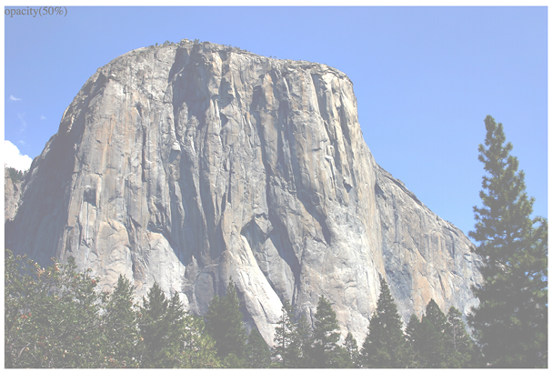

Stunning Aesthetics with CSS
============================


In this lab, we are going to look at a selection of CSS capabilities
for enriching your designs. Every year that passes, CSS introduces more
features that enable us to do in code what was previously only possible
with an image editor.

Replacing images with effects in code is usually a good thing. Not only
does it tend to make things more maintainable and flexible, but it also
results in less page "weight" for the end user, with images almost
always producing a far greater file size than the comparable code.

In this lab, we will cover:

-   How to create text shadows
-   How to create box shadows
-   How to make linear and radial gradients
-   How to make conic gradients
-   How to use multiple backgrounds
-   Using CSS background gradients to make patterns
-   How to implement high-resolution background images with media
    queries
-   How to use CSS filters (and their performance implications)
-   Clipping with clipping paths
-   Masking elements with image masks
-   Mixing the colors of elements with `mix-blend-mode`


Text shadows
============


Let's make a start by looking at text shadows.
Text shadows are a fairly simple way to change the aesthetics of text,
and therefore provide a good starting point. Support for
`text-shadow` is also ubiquitous. Let's first consider the
basic syntax:


``` {.language-markup}
.element {
  text-shadow: 1px 1px 1px #ccc;
}
```


The first value is the amount of shadow to the right, the second is the
amount down, the third value is the amount of blur (the distance the
shadow travels before fading to nothing), and the final value is the
color. Shadows to the left and above can be achieved using negative
values as the first two values. For example:


``` {.language-markup}
.text {
  text-shadow: -4px -4px 0px #dad7d7;
}
```


The color value doesn't need to be defined as a hex value. It can just
as easily be HSL(A) or RGB(A):


``` {.language-markup}
text-shadow: 4px 4px 0px hsl(140 3% 26% / 0.4);
```


You can also set the shadow values in any other valid CSS length units
such as `em`, `rem`, `ch`,
`rem`, and so on. Personally, I rarely use
`em` or `rem` units for
`text-shadow` values. As the length values tend to be low,
using `1px` or `2px` generally looks good
across all viewports.

Thanks to media queries, we can easily remove text shadows at different
viewport sizes too. The key here is the `none` value:


``` {.language-markup}
.text {
  text-shadow: 2px 2px 0 #bfbfbf;
}
@media (min-width: 30rem) {
  .text {
    text-shadow: none;
  }
}
```


It's worth knowing that, in CSS, where a value starts with a zero, such
as `0.14s`, there is no need to write the leading zero:
`.14s` is exactly the same.


If there is no blur to be added to a text shadow,
the value can be omitted from the declaration. For example:


``` {.language-markup}
.text {
  text-shadow: -4px -4px #dad7d7;
}
```


That is perfectly valid. The browser assumes that the first two values
are for the offsets if no third value is declared.

Multiple text shadows
---------------------

It's possible to add multiple text shadows by
comma-separating two or more shadows. For example:


``` {.language-markup}
.multiple {
  text-shadow: 0px 1px #fff, 4px 4px 0px #dad7d7;
}
```


Also, as CSS is forgiving of whitespace, you can lay out the values like
this if it helps with readability:


``` {.language-markup}
.text {
  text-shadow:
    3px 3px #bbb, /* right and bottom */
    -3px -3px #999; /* left and top */
}
```


So, that's how you create shadows around text. What about when you want
a shadow on a containing element?


Box shadows
===========


Box shadows allow you to create a box-shaped shadow around the outside
or inside of an element. Once you understand text
shadows, box shadows are a piece of cake. Principally, they follow the
same syntax: horizontal offset, vertical offset, blur, spread (we will
get to spread in a moment), and color. Only two of the four length
values are required. In the absence of the last two length values, a
value of zero is assumed. Let's look at a simple example:


``` {.language-markup}
.shadow {
  box-shadow: 0 3px 5px #444;
}
```


The default `box-shadow` is set on the outside of the
element. Another optional keyword, `inset`, allows the box
shadow to be applied inside the element.

Inset shadow
------------

The `box-shadow` property can also be
used to create an inset shadow. The syntax is
identical to a normal box shadow, except that the value starts with the
keyword `inset`:


``` {.language-markup}
.inset {
  box-shadow: inset 0 0 40px #000;
}
```


Everything functions as before, but the `inset` part of the
declaration instructs the browser to set the effect on the inside. If
you look at `example_08-01`, you'll see an example of each
type:


Figure 8.1: Outer shadows and inner shadows are both easily achievable

Multiple shadows
----------------

Like text shadows, you can apply multiple box
shadows. Separate the `box-shadow` declarations with a
comma. They are applied bottom to top (last to first) as
they are listed. Remind yourself of the order by
thinking that the declaration nearest to the top in the rule (in the
code) appears nearest to the "top" of the order when displayed in the
browser. As with `text-shadow` declarations, you may find
it useful to use whitespace to visually stack the different
`box-shadow` declarations:


``` {.language-markup}
box-shadow:
    inset 0 0 30px hsl(0, 0%, 0%),
    inset 0 0 70px hsla(0, 97%, 53%, 1);
```


Stacking longer, multiple values one under the other in the code has an
added benefit when using version control systems; it makes it easy to
spot differences when you compare, or **diff**, two versions of the same
file. It can be useful to stack selectors one under the other for that
same reason.


Understanding spread
--------------------

I'll be honest, for literally years, I didn't truly understand what the
`spread` value of a `box-shadow` actually did.
I don't think the name "spread" is useful. Think of it more as an
offset. Let me explain.

Look at the box on the left in
`example_08-02`. This has a standard box shadow applied,
with no `spread`. The one on the right has a negative
`spread` value applied. It's set with
the fourth value. Here is the relevant code that deals with each shadow:


``` {.language-markup}
.no-spread {
  box-shadow: 0 10px 10px;
}
.spread {
  box-shadow: 0 10px 10px -10px;
}
```


Here is the effect of each (element with a `spread` value
on the right):


Figure 8.2: With spread, you can control how much shadow leaks out

The `spread` value lets you extend or contract the shadow
in all directions by the amount specified. In this example, a negative
value is pulling the shadow back in all directions. The result is that
we can just see the shadow at the bottom of the right example, instead
of seeing the blur "leak" out on all sides.


Right, so that's shadows. We will go on to deal with more shadows when
we look at `drop-shadow` as part of CSS filters. For now,
let's move on to gradients.


Background gradients
====================


In days gone by, to achieve a background gradient on an element, it was
necessary to tile a thin, graphical slice of the
gradient. It was a pain to tweak as it meant round trips into a graphics
application, and then when a site was live, you would often experience a
flash of unloaded gradient while the background image was fetched.

Thankfully, such hassle is now nothing more than a memory; with a CSS
`background-image` gradient, things are far more flexible.
CSS now enables us to create linear, radial, and conic background
gradients, and repeating versions of each. Let's look at how we can
define them.


The linear-gradient notation
----------------------------

The `linear-gradient` notation, in
form, looks
like this:


``` {.language-markup}
.linear-gradient {
  background: linear-gradient(red, blue);
}
```


This will create a linear gradient that starts at red and fades to blue.
Unless you tell it otherwise, which we will look at next, it will go
from the top to the bottom.

### Specifying gradient direction

If you want to specify a direction for the gradient, there are a couple
of ways to do this. The gradient will always begin
in the opposite direction to where you are sending
it.

For example:


``` {.language-markup}
.linear-gradient {
  background: linear-gradient(to top right, red, blue);
}
```


In this instance, the gradient heads to the top right. It starts red in
the bottom-left corner and fades to blue at the top right.

If you're more mathematically minded, you may believe it would be
comparable to write the gradient like this:


``` {.language-markup}
.linear-gradient {
  background: linear-gradient(45deg, red, blue);
}
```


However, keep in mind that on a rectangular box, a gradient that heads
"to top right" (always the top right of the element it's applied to)
will end in a slightly different position than `45deg`
(always 45 degrees from its starting point).

It's worth knowing you can also start gradients before they are visible
within a box. For example:


``` {.language-markup}
.linear-gradient {
  background: linear-gradient(red -50%, blue);
}
```


This would render a gradient as if it had started before it was even
visible inside the box. Useful if you want your gradient to begin with
"the end" of the fade from one color.

We actually used a color stop in the previous example to define a place
where a color should begin and end, so let's look at those more fully.

### Color stops

Perhaps the handiest thing about background
gradients is **color stops**. They provide the
means to set which color is used at which point in a gradient. With
color stops, you can specify something as complex as you are likely to
need. Consider this example:


``` {.language-markup}
.linear-gradient {
  margin: 1rem;
  width: 400px;
  height: 200px;
  background: linear-gradient(
    #f90 0,
    #f90 2%,
    #555 2%,
    #eee 50%,
    #555 98%,
    #f90 98%,
    #f90 100%
  );
}
```


Here's that
`linear-gradient` renders:


Figure 8.3: You can add as many stops as you like to a linear gradient

In this example (`example_08-03`), a direction has not been
specified, so the default top-to-bottom direction applies.

Color stops inside a gradient are written comma-separated and defined by
giving first the color, and then the position of the stop. It's
generally advisable not to mix units in one notation, but you can. You
can have as many color stops as you like and colors can be written
as a keyword, hex, RGB, HSL, or any other
color format we looked at in the previous lab.


Having covered linear background gradients, let's now check out radial
background gradients.

Radial background gradients
---------------------------

It's equally simple to create a radial gradient in CSS. These typically
begin from a central point and spread out smoothly
in an elliptical or circular shape.

Here's the syntax for a radial background gradient
(you can play with it in `example_08-04`):


``` {.language-markup}
.radial-gradient {
  margin: 1rem;
  width: 400px;
  height: 200px;
  background: radial-gradient(12rem circle at bottom, yellow, orange,
  red);
}
```


Figure 8.4: We can set a gradient to start at any point. Here, our
"sunrise" gradient starts bottom center

After specifying the property
(`background:`), we begin the
`radial-gradient` notation. To start with, before the first
comma, we define the shape or size of the gradient
and the position. We used `12rem circle` for the shape and
size previously, but consider some other examples:

-   `circle` would be a circle the full size of the
    container. The size of a radial gradient defaults to
    `farthest-corner` if omitted---more on sizing keywords
    shortly.
-   `5em` would be a circle 5em in size. It's possible to
    omit the `circle` part if giving just a size.
-   `ellipse` would create an ellipse shape that would fit
    within the element.
-   `40px 30px` would be an ellipse as if drawn inside a
    box 40 px wide by 30 px tall.

Next, after the size and/or shape, we define the position. The default
position is `center`, but let's look at some other
possibilities and how they can be defined:

-   `at top right` starts the radial gradient from the top
    right.
-   `at right 100px top 20px` starts the gradient 100 px
    from the right edge and 20 px from the top edge.
-   `at center left` starts it halfway down the left side
    of the element.

We end our size, shape, and position parameters with a comma and then
define any color stops, which work in exactly the same manner as they do
with linear gradients.

To simplify the notation: size, shape, and position before the first
comma, then as many color stops as needed after it (with each stop
separated by commas).

When it comes to sizing things such as gradients, CSS provides some
keywords that are often a better choice than hardcoded values,
especially with responsive designs.

Handy "extent" keywords for responsive sizing
---------------------------------------------

For responsive work, you may find it advantageous to size gradients
proportionally rather than using fixed pixel
dimensions. That way, you know you are covered (both literally and
figuratively) when the size of elements changes. There are some handy
sizing keywords that can be applied to gradients.

You would write them like this, in place of any size value:


``` {.language-markup}
background: radial-gradient(closest-side circle at center, #333, blue);
```


Here is what each of them does:

-   `closest-side`: The shape meets the side of the box
    nearest to the center (in the case of circles), or meets both the
    horizontal and vertical sides that are closest to the center (in the
    case of ellipses).
-   `closest-corner`: The shape meets exactly the closest
    corner of the box from its center.
-   `farthest-side`: The opposite of
    `closest-side`, in that rather than the shape meeting
    the nearest side, it's sized to meet the one farthest from its
    center (or both the furthest vertical and horizontal side in the
    case of an ellipse).
-   `farthest-corner`: The shape expands to the farthest
    corner of the box from the center.
-   `cover`: Identical to `farthest-corner`.
-   `contain`: Identical to `closest-side`.

Practically, the two I find myself using most of the time are
`cover` or `contain`. They are merely aliases
for other keywords, but I find their names are self-explanatory and they
are the same keywords you can use for `background-size`. We
look at those keywords again with `background-size` later
in the lab.


**The cheat's way to perfect CSS linear and radial gradients**

If defining gradients by hand seems like hard work, there are some great
online gradient generators. My favorite is
[[https://www.colorzilla.com/gradient-editor/]](https://www.colorzilla.com/gradient-editor/).
It uses a graphics editor-style GUI, allowing you to pick your colors,
stops, gradient style (linear and radial gradients are supported), and
even the color space (hex, RGB(A), HSL(A)) you'd like the final gradient
in. There are also loads of preset gradients to use as starting points.
Still not convinced? How about the ability to generate a CSS gradient
based on the gradient values in an existing image? Thought that might
swing it for you.


Conic gradients
---------------

Where radial gradients pass through any color
stops on their way out from a center point, conic
gradients pass through any color stops *around* a center point. We set
an origin point for the gradient and then specify the color stops as
angles around that center point. This accounts for
the fact that these types of gradients are also
known as **angle** gradients.

Here is an example conic gradient going from white to green and back to
white:


Figure 8.5: A conic gradient goes *around* a point, instead of *outward
from a point*

The code to achieve that looks like this:


``` {.language-markup}
.conic-gradient {
    width: 200px;
    height: 200px;
    background: conic-gradient(at center, green, white, green);
}
```


If you have looked at the syntax for linear and
radial gradients in this lab already, the conventions will be
familiar. You specify the `at` position for the gradient to
start, and then the color stops along the gradient. If you omit the
position of the colors, they will be split equally, so that prior
example is equivalent to:


``` {.language-markup}
.conic-gradient {
    width: 200px;
    height: 200px;
    background: conic-gradient(at center, green 0deg, white 180deg,
    green 360deg);
}
```


The one thing that did catch me out when I first started using them is
that the angle for the stops isn't just written as degrees around a
circle as you might assume; it can also be written as a percentage like
other gradients. Imagine that you wanted to change the prior example to
be solid green halfway around so it looks like this:


Figure 8.6: Stops around the center point are typically set in
percentages

Here is the code you would use; just adding a
`50%` stop on the green or,
alternatively, `180deg`, would produce an identical result.


``` {.language-markup}
.conic-gradient {
    width: 200px;
    height: 200px;
    background: conic-gradient(at center, green 50%, white, green);
}
```


One final trick. We can make solid sections with our conic gradients.
After the first color stop, if you set another color stop and set it to
start at `0deg`, it appears as a solid color. Here is an
example of a single div using a conic gradient to make four different
color sections:


Figure 8.7: A single element using a conic gradient to create color
sections

This works because the subsequent stops also start
at the beginning, but by the time they are visible
beneath the color that is listed before, they are already a solid color.
Here is the full code for that example:


``` {.language-markup}
.conic-gradient {
    width: 200px;
    height: 200px;
    background: conic-gradient(at center, red 0 25%, orange 0% 180deg,
    green 0% 75%, blue 0%);
}
```


I've even mixed and matched the units in there to prove you can, but
it's usually easier to stick to either percentages or angles in a single
gradient---if only for the sake of your own sanity!

Now, if you were a major internet company and wanted to create a nice
spinner, all you'd need would be a `border-radius` of
`50%` and a CSS animation. I'll leave that as an exercise
for you, dear reader.


You can get hard stops in linear gradients and radial gradients in the
same way. Simply use a value of zero as the start of the gradient for
subsequent color stops and it will run "behind" the prior one, creating
a "hard" transition from one color to the next. I've found this
technique very useful when creating bar charts and similar pieces of UI.
For example, imagine a bar chart with a 25/75% split. We could achieve
that like this:

`linear-gradient(to right, goldenrod 25%, hotpink 0%)`


Repeating gradients
-------------------

CSS also gives us the ability to create repeating
background gradients. Let's take a look at how
it's done:


``` {.language-markup}
.repeating-radial-gradient {
    background: repeating-radial-gradient(black 0px, orange 5px,
    red 10px);
}
```


Here's how that looks (don't look for long, it may cause nausea):


Figure 8.8: You can use repeating gradients to create all manner of
visual effects

Firstly, prefix the `linear-gradient` or
`radial-gradient` with `repeating-`. It then
follows the same syntax as a normal gradient. Here, I've used pixel
distances between the black, orange, and red colors (`0px`,
`5px`, and `10px`, respectively), but you
could also choose to use percentages.


There's one more way of using background gradients I'd like to share
with you.

Background gradient patterns
----------------------------

Although I've often used subtle linear gradients in designs, I've found
less practical use for radial, conic, and repeating gradients. However,
clever folks out there have harnessed the power of
gradients to create background gradient patterns. Let's
look at an example from Lea Verou's collection of
CSS background patterns, available at
[[https://projects.verou.me/css3patterns/]](https://projects.verou.me/css3patterns/):


``` {.language-markup}
.carbon-fibre {
    margin: 1rem;
    width: 400px;
    height: 200px;
    background: radial-gradient(black 15%, transparent 16%) 0 0,
        radial-gradient(black 15%, transparent 16%) 8px 8px,
        radial-gradient(rgba(255, 255, 255, 0.1) 15%, transparent 20%)
        0 1px,
        radial-gradient(rgba(255, 255, 255, 0.1) 15%, transparent 20%)
        8px 9px;
    background-color: #282828;
    background-size: 16px 16px;
}
```


Here's what that gives us in the browser, a carbon fiber background
effect:


Figure 8.9: A carbon fiber effect made with pure CSS

How about that? Just a few lines of CSS and we have an easily editable,
responsive, and scalable background pattern.

You might find it useful to add
`background-repeat: no-repeat` at the end of the rule to
better understand how it works.

As ever, thanks to media queries, different declarations can be used for
different responsive scenarios. For example, although a gradient pattern
might work well at smaller viewports, it might be better to go with a
plain background at larger ones:


``` {.language-markup}
@media (min-width: 45rem) {
    .carbon-fibre {
        background: #333;
    }
}
```


You can view this example at `example_08-05`.

So far, we have looked at many ways of creating background images using
just CSS; however, whether that is linear gradients, radial gradients,
or repeating gradients, it is still just one background image. What
about when you want to deal with more than one background image at the
same time?


Multiple background images
==========================


Although a little out of fashion at the moment, it used to be a fairly
common design requirement to build a page with a
different background image at the top of the page than at the bottom. Or
perhaps to use different background images for the top and bottom of a
content section within a page. Back in the day, with CSS 2.1, achieving
this effect typically required additional markup (one element for the
header background and another for the footer background).

With CSS, you can stack as many background images as you need on an
element.

Here's the syntax:


``` {.language-markup}
.bg {
    background: url('../img/1.png'), url('../img/2.png'),
    url('../img/3.png');
}
```


As with the stacking order of multiple shadows, the image listed first
is layered nearest to the top, or closer to the user, in the browser.
You can also add a general color for the background in the same
declaration if you wish, like this:


``` {.language-markup}
.bg {
    background: url('../img/1.png'), url('../img/2.png'),
    url('../img/3.png') left bottom, black;
}
```


Specify the color last and this will show up below every image specified
in the preceding code snippet.

With the multiple background images, as long as your images have
transparency, any partially transparent background image that sits on
top of another will show through below. However, background images don't
have to sit on top of one another, nor do they all have to be the same
size.

Background size
---------------

To set different sizes for each image, use the
`background-size` property. When multiple images have been
used, the syntax works like this:


``` {.language-markup}
.bg {
  background-size: 100% 50%, 300px 400px, auto;
}
```


The size values (first width, then height) for each image are declared,
separated by commas, in the order they are listed
in the background property. As in the preceding example, you can use
percentage or pixel values for each image alongside the following:

-   `auto`: This sets the element at its native size.
-   `cover`: This expands the image, preserving its aspect
    ratio, to cover the area of the element.
-   `contain`: This expands the image to fit its longest
    side within the element while preserving the aspect ratio.

Having considered size, let's also think about position.

Background position
-------------------

If you have different background images, at different sizes, the next
thing you'll want is the ability to position them
differently. Thankfully, the `background-position` property
facilitates that.

Let's put all this background image capability together, alongside some
of the responsive units we looked at in previous labs.

We'll create a simple space scene made with a single element and three
background images, set at three different sizes, and positioned in three
different ways:


``` {.language-markup}
.bg-multi {
  height: 100vh;
  width: 100vw;
  background: url('rosetta.png'), url('moon.png'), url('stars.jpg');
  background-size: 75vmax, 50vw, cover;
  background-position: top 50px right 80px, 40px 40px, top center;
  background-repeat: no-repeat;
}
```


You'll see something like this in the browser:


Figure 8.10: Multiple background images on a single element

We have the stars image at the bottom, then the
moon, and finally an image of the Rosetta space probe on top. View this
for yourself in `example_08-06`. Notice that if you adjust
the browser window, the responsive length units work well
(`vmax`, `vh`, and `vw`) and
retain proportion, while pixel-based ones do not.

Where no `background-position` is declared, the default
position of top left is applied.

Background shorthand
--------------------

There is a shorthand method of combining the
different background properties together.

However, my experience so far has been that it produces erratic results.
Therefore, I recommend the longhand method and that you declare the
multiple images first, then the size, and then the position.


High-resolution background images
---------------------------------

Thanks to media queries, we have the ability to load in different
background images, not just at different viewport
sizes, but also at different viewport resolutions.

For example, here is the official way of specifying a background image
for a "normal" and a "high" DPI screen. You can find this in
`example_08-07`:


``` {.language-markup}
.bg {
  background-image: url('bg.jpg');
}
@media (min-resolution: 1.5dppx) {
  .bg {
    background-image: url('bg@1_5x.jpg');
  }
}
```


The media query is written exactly as it is with `width`,
`height`, or any of the other capability tests. In this
example, we are defining the minimum resolution that
`bg@1_5x.jpg` should use as `1.5dppx` (device
pixels per CSS pixel). We could also use `dpi` (dots per
inch) or `dpcm` (dots per centimeter) units if preferable.
However, despite the poorer support, I find `dppx` the
easiest unit to think about; as `2dppx` is twice the
resolution, `3dppx` would be three times the resolution.
Thinking about that in `dpi` is trickier. "Standard"
resolution would be `96dpi`, twice that resolution would be
`192dpi`, and so on.


**A brief note on performance**

Just remember that large images can potentially slow down the feel of
your site and lead to a poor experience for users. While a background
image won't block the rendering of the page (you'll still see the rest
of the site drawn to the page while you wait for the background image),
it will add to the total weight of the page, which is important if users
are paying for data.


Earlier in this lab, I told you we would look at more shadows when
we got to dealing with CSS filters. That time has come.


CSS filters
===========


There is a glaring problem with `box-shadow`. As the name
implies, it is limited to the rectangular CSS box
shape of the element it is applied to. Here's a screengrab of a triangle
shape made with CSS with a box shadow applied:


Figure 8.11: Box shadows don't always provide the effect you want

Not exactly what I was hoping for. Thankfully, we can overcome this
issue with CSS filters, part of the Filter Effects
Module Level 1
([[https://www.w3.org/TR/filter-effects/]](https://www.w3.org/TR/filter-effects/)).

Here is that same element with a CSS `drop-shadow` filter
applied instead of a `box-shadow` (you can view the code in
`example_08-08`):


Figure 8.12: A drop-shadow filter effect can apply to more than just
boxes

Here is the format for CSS filters:


``` {.language-markup}
.filter-drop-shadow {
  filter: drop-shadow(8px 8px 6px #333);
}
```


After the `filter` property, we specify the filter we want
to use, which is `drop-shadow` in this example, and then
pass in the arguments for the filter.
`drop-shadow` follows a similar syntax to
`box-shadow`, so this one is easy; *x* and *y* offset,
blur, then spread radius (both blur and spread are optional), and
finally color (also optional, although I recommend specifying a color
for consistency).

CSS filters are actually based on SVG filters, which have wider support.
We'll look at the SVG-based equivalent in *Lab 10*, *SVG*.

Available CSS filters
---------------------

There are a few filters to choose from. We will look at each. While
images of most of the filters follow, if you are
reading a copy of this course with monochrome images, you may struggle to
notice the differences. If you're in that situation, remember you can
still view the various filters in the browser by opening
`example_08-08`. I'm going to list each out now with a
suitable value specified. As you might imagine, a greater value means
more of the filter applied. Where images are used, the image is shown
after the relevant code:

-   `filter: url('./img/filters.svg#filterRed')`: Lets you
    specify an SVG filter to use.
-   `filter: blur(3px)`: Uses a single length value (but
    not as a percentage):


Figure 8.13: A blur filter applied

-   `filter: brightness(2)`: With brightness, a value of
    `1` or `100%` is normal; less than
    that, such as `0.5` or
    `50%`, darkens, and more, such as `200%`
    or `2`, lightens:


Figure 8.14: A brightness filter applied

-   `filter: contrast(2)`: A value of `1` or
    `100%` is normal; less than that, for example,
    `0.5` or `50%`, reduces
    contrast; and more, such as
    `200%` or `2`, increases it:


Figure 8.15: A contrast filter applied

-   `filter: drop-shadow(4px 4px 6px #333)`: We looked at
    `drop-shadow` in detail previously.
-   `filter: grayscale(.8)`: Use a value from
    `0` to `1` or `0%` to
    `100%` to apply varying amounts of grayscale to the
    element. A value of `0` would be no grayscale, while a
    value of `1` would be fully grayscale:


Figure 8.16: A grayscale filter applied

-   `filter: hue-rotate(25deg)`: Use a value between 0 and
    360 degrees to adjust the hue of the colors
    around the color wheel. You can use a negative value to move the
    "wheel" backward, and a number greater than 360 just spins it around
    more! Only really useful if you need to programmatically keep adding
    to the hue:


Figure 8.17: A hue-rotate filter applied

-   `filter: invert(75%)`: Use a value from
    `0` to `1` or `0%` to
    `100%` to define the amount the element has its colors
    inverted:


Figure 8.18: An invert filter applied

-   `filter: opacity(50%)`: Use a value from
    `0` to `1` or `0%` to
    `100%` to alter the opacity of
    the element. `1` or
    `100%` is fully opaque, while `0` or
    `0%` would be full transparency. This is similar to the
    `opacity` property you will already be familiar with.
    However, filters, as we shall see, can be combined, and this allows
    opacity to be combined with other filters in one go:



Figure 8.19: An opacity filter applied

-   `filter: saturate(15%)`: Use a value from
    `0` to `1` or `0%` to
    `100%` to desaturate an image and
    anything above `1`/`100%` to add extra
    saturation:


Figure 8.20: A saturate filter applied

-   `filter: sepia(.75)`: Use a value from `0`
    to `1` or `0%` to `100%` to
    make the element appear with a more sepia color.
    `0`/`0%` leaves the element as-is, while
    anything above that applies greater amounts of
    sepia, up to a maximum of `1`/`100%`:


Figure 8.21: A sepia filter applied

Combining CSS filters
---------------------

You can also combine filters easily; simply
space-separate them. For example, here is how you would apply
`opacity`, `blur`, and `sepia`
filters at once:


``` {.language-markup}
.MultipleFilters {
  filter: opacity(10%) blur(2px) sepia(35%);
}
```


Apart from `hue-rotate`, when using filters, negative
values are not allowed.


I think you'll agree that CSS filters offer some pretty powerful
effects. There are also effects that we can transition and transform
from situation to situation. We'll look at how to do that in *Lab
11*, *Transitions, Transformations, and Animations*.


CSS clip-path
=============


The `clip-path` property allows you
to "clip" an element with a shape. Think of clipping just like drawing a
shape on a piece of paper and then cutting around it. This shape can be
something simple like an ellipse, something more complicated such as a
polygon, or something more complex still, such as a shape defined by an
inline SVG path. If you want to view each of these on a page, check out
`example-08_09` in this lab's downloadable code.

CSS basic shapes
----------------

You can use `clip-path` with any of
the CSS basic shapes. These are
`inset`, `circle`, `ellipse`, and
`polygon`, as described here:
[[https://www.w3.org/TR/css-shapes-1/\#supported-basic-shapes]](https://www.w3.org/TR/css-shapes-1/#supported-basic-shapes).

Let's take a look at how we would write each of these.

### clip-path with a circle

With `clip-path: circle()`, the first argument you pass is
the size, and the second, which is an optional
argument, is the position of that shape. So, if you wanted to clip an
element down to a circle 20% of the element's height and width:


``` {.language-markup}
clip-path: circle(20%);
```


If you wanted the same circle `clip-mask` but positioned
60% horizontally and 40% vertically:


``` {.language-markup}
.clip-circle {
  clip-path: circle(35% at 60% 40%);
}
```


Figure 8.23: A circular clip-path applied

Notice the `at` keyword in there?
That's needed to communicate that the lengths after relate to
positioning and not size.


It's important to know that pointer events don't occur for areas of an
element that have been clipped by a clip mask! To extend our "cutting a
shape from a piece of paper" analogy, the bits outside a clip mask are
like the discarded pieces of paper that have been cut away. This is
useful because you won't be getting clicks on an area where you can't
see the subject.


### clip-path with ellipse

With `clip-path: ellipse()`, the first argument is the
*x*-axis radius (horizontal) and the second
argument is the *y*-axis radius (vertical). Just
like `circle()`, you specify positioning lengths after the
`at` keyword:


``` {.language-markup}
.clip-ellipse {
  clip-path: ellipse(100px 50px at 60% 40%);
}
```


Figure 8.24: An elliptical clip-path applied

### clip-path with inset

The `inset()` function for `clip-path` is a
little different. You pass four lengths, and these are how
much you want to inset the mask from the edges.
Just like when you set `margin`, the values go clockwise:
top, right, bottom, and left. Just like `margin`, you can
also pass just two length values; the first will be top and bottom and
the second will be left and right (the three-value syntax works the same
too).

There is also an optional `round` keyword that can be used,
followed by another length; this sets how much you would like each
corner to be rounded by.

Here is an example with four inset values passed and four different
radius values for the corners:


``` {.language-markup}
.clip-inset {
  clip-path: inset(40px 20px 40px 20px round 0 30px 15px 40px);
}
```


Figure 8.25: An inset clip-path applied

### clip-path with polygon

The `polygon()` function for `clip-path`
allows us to describe a simple shape with a series of
comma-separated *x*- and *y*-coordinates. This is
what a triangle written with the polygon function looks like:


``` {.language-markup}
.clip-polygon {
  clip-path: polygon(50% 60px, 100% calc(100% - 40px),
  0% calc(100% - 40px));
}
```


Figure 8.26: A clip-path applied with a polygon

Think of this as a way of describing where to
start cutting (the first argument), where to go next (any subsequent
arguments), and where the last point should be. The polygon then
connects the final point to the first to complete the path.

Each argument is made up of an *x*-coordinate described from the top
left of the containing box (for example, 50% along), and then the
*y*-coordinate (for example, 60 px from the top) in relation to the top
of the containing box. This gives you the ability to let things scale
with percentages or use harder pixel values, depending on your
requirements.

My favorite way to get started with a
`clip-path` polygon is to use Bennett Feely's "Clippy"
website:
[[https://bennettfeely.com/clippy/]](https://bennettfeely.com/clippy/).

There are a bunch of premade shapes to choose from, as well as a GUI for
amending the shape. Highly recommended!

### clip-path with URL (clipping source)

You can also pass the `clip-path` a
**clipping source** via a URL. The URL needs to be
an SVG `clipPath` somewhere in the document.

I made a star shape as an SVG path and added an `id` of
`starSymbol` to the `clipPath` element. With
that in place, you can tell `clip-path` to use that path
like this:


``` {.language-markup}
.clip-url {
  clip-path: url(#starSymbol);
}
```


Figure 8.27: A clip-path applied with an SVG path

You can view each of these
`clip-path` examples in `example_08-09`.

Animating clip-path
-------------------

As if all this clipping malarkey wasn't interesting enough, you can also
animate a `clip-path`, as long as
there remains the same number of points in the shape. For example, you
can animate a triangle into a different shaped triangle, but without
some tricks, you can't convert that same triangle into a star. I say
"without some tricks" because you can effectively do this by hiding a
few points along the lines of the polygon so your triangle has enough
points to animate into a star.

Here's a grab of an extra example I added, `example_08-10`.
This is just to hopefully give you an idea of what can be done by adding
a few of the things we have already learned and a few things we will
learn in future labs together:


Figure 8.28: You can even animate clip-path

This shows two elements with the same background
image being masked with `clip-path`. You can also tint the
image with an overlay like this:


``` {.language-markup}
background: linear-gradient(hsla(0, 0%, 0%, 0.4) 0, hsla(0, 0%, 0%, 0.4) 100%), url('image.jpg');
```


You may be wondering, if we wanted to tint the image with a color, why
don't we just use a background color in the declaration?

The answer is that it doesn't work. When you set multiple backgrounds
with the `background` property, it's not possible to use a
`background-color`, even a semi-transparent one, above an
image, and have the color let the image show through beneath.

However, one proven trick is to create a `background-image`
using a `linear-gradient` with the same semi-opaque color
at either end of the gradient, which creates the effect we are after.

We are then moving the main element around the page with one set of
`keyframes` animations (we will get to animations in
*Lab 11*, *Transitions, Transformations, and Animations*) and
animate the `clip-path` with another set.

I think once you start playing about with these
techniques, you're going to surprise yourself with just what you can
create with relative ease!

There may be occasions when you don't just want to clip what's in an
element, and you actually want to overlay it with a mask. We can do that
with CSS too! Let me show you.


mask-image
==========


You can also mask elements with images, from either an image source with
transparency such as a PNG graphic, a
`linear-gradient`, which we looked at earlier in this
lab, or an SVG `mask` element. You can read about all
the possibilities afforded to us in the specification here:
[[https://www.w3.org/TR/css-masking-1/]](https://www.w3.org/TR/css-masking-1/).

In the meantime, we will just look at a fairly straightforward example
so you can appreciate the kind of effect that is possible and how the
syntax works to achieve it.

Suppose we have an image. I have one that NASA took of Mars. I'd get one
I took myself but, you know, it's a bit of a jaunt.

Now, suppose we also have a PNG image that is transparent except for the
word "MARS". We can use this PNG as a mask on top of our image element.

This is what we see in the browser:


Figure 8.29: A mask image applied

Here is our relevant HTML:


``` {.language-markup}

```


And here is our CSS:


``` {.language-markup}
.mask-image-example {
  display: block;
  height: 1024px;
  width: 1024px;
  margin: 0 auto;
  mask-image: url('mars-text-mask.png');
}
```


The only relevant part of the mask is the `mask-image`
property, which tells the browser what we want to use as a mask on this
element.

Now, the cynical among you might suggest the same effect could have just
been achieved in a graphics package. I'd say you were right, but then
raise you this:


``` {.language-markup}
.mask-image-example {
  display: block;
  height: 1024px;
  width: 1024px;
  margin: 0 auto;
  mask-image: url('mars-text-mask.png');
  animation: moveMask 6s infinite alternate;
}
@keyframes moveMask {
  0% {
    object-position: 0px 0px;
  }
  100% {
    object-position: 100px 100px;
  }
}
```


We will look at animations in *Lab 11*, *Transitions,
Transformations, and Animations*, but what we have
done here is added an animation that moves the background image behind
the mask so that the word "MARS" stays in position while the planet
moves behind. Try doing that in Photoshop!

If we wanted to swap things around and have the mask move and the image
of the planet stay put, it is as simple as swapping
`object-position` in the animation for
`mask-position`.

You can have a play with this example at `example_08-11`.


Be aware that, to see this example, you will need to view
the file from a server. You can run
`npx serve` on the Terminal from the root of the example
folder to install and run a local server there.


Summary
=======


In this lab, we've looked at a selection of the most useful CSS
features for creating lightweight aesthetics in responsive web designs.
CSS's background gradients curb our reliance on images for background
effects.

We've also looked at CSS filters. They allow us to achieve even more
impressive visual effects with CSS alone and can be combined for truly
impressive results.

In the last part of this lab, we looked at creating masking effects
with both images and clipping paths.

In the next lab, we're going to turn our attention to responsive
images. If you work with image-heavy projects, you'll want to pay close
attention. Using the right image for the right job can save users time
and money. And using the right syntax to deliver the right image makes
sure they get it!
